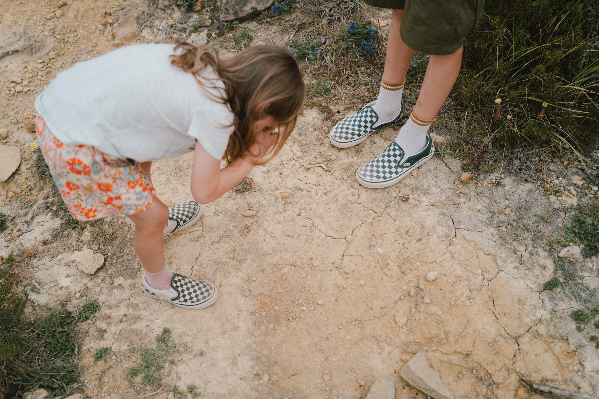

✌ Bonjour,

Si vous êtes nouveaux ici, bienvenue. J'espère que votre été est beau comme le nôtre. On a bien pu **en** profiter. Entre les amis, les voyages, la famille et le gîte, l'été fut intense. Le gîte nous a encore permis de belles rencontres. J'ai aussi enfin pu voir et bouger mon body sur les Sex Pistols. En plus, avec Frank Carter au chant, c'est juste une tuerie. [Leur live au Hellfest](https://www.youtube.com/watch?v=oo5gy_7uljU) est vraiment un plaisir pour se replonger dans ce concert. Même si moi, c'était aux Vieilles **C**harrues. 

J'ai fait l'acquisition d'une petite imprimante photo. J'en avais déjà parlé avec Jérémy et j'ai finalement craqué, je voulais imprimer ce que je voulais à la maison. Du 10x15 uniquement, mais l'idée de faire des collages et des mini prints à offrir aux amis m'a vraiment plu. [Cette vidéo](https://www.youtube.com/watch?v=4Pt0WUv-K3E) résume bien le plaisir que j'y **trouve, je pense**. Et pour créer du fun, j'ai aussi investi dans une presse à gaufrer mon petit logo dont je ne me lasse pas. J'ai pressé mes **cyanotypes** avec. J'ai une super petite série que je vais bientôt mettre sur le [shop](https://shop.yannickschutz.com).

**Cet** été, j'ai eu la chance de pouvoir afficher mes photos à deux endroits. J'ai une exposition autour de mes photos de surf en Californie. Pas trop d'action, surtout la nostalgie des journées passées à la plage. Elle est encore visible [chez Café Lucette](https://www.instagram.com/lucette.cafe/) à Brest. Elle sera décrochée en septembre. Puis j'ai eu la chance d'exposer quelques pièces aux côtés d'autres super artistes en Angleterre grâce à [Low Tide Heartbreak Club](https://www.instagram.com/lowtideheartbreakclub/). Vous pouvez chercher dans [leurs stories](https://www.instagram.com/stories/highlights/18128363362409489/), je posterai quelques photos bientôt sinon aussi. Pour l'expo, j'ai créé [un zine](https://shop.yannickschutz.com/products/beach-days) qui me replonge en Californie directement.

Pour l'exposition, je cherche à la faire tourner. Si vous connaissez des lieux qui seraient intéressés, répondez à cette lettre. Vous pouvez même répondre si vous n'avez pas de lieux, j'adore avoir de vos nouvelles aussi.

Imprimez vos souvenirs avant que le cloud ne les avale. Prenez des notes aussi avant que votre mémoire soit trouée. 

Passez une belle rentrée, 
Yannick

💌
