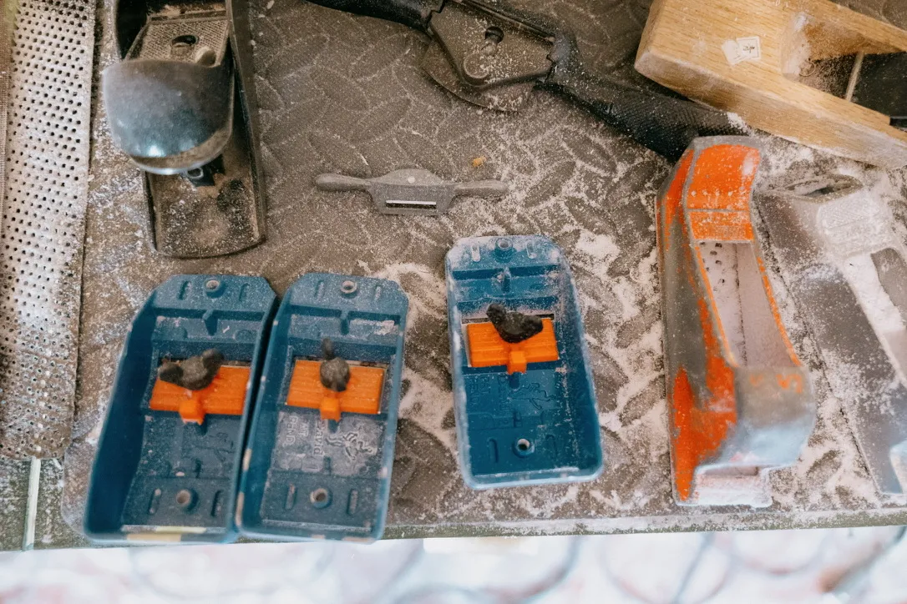

---
categories:
- lettre
date: 2026-02-06
newsletter: true
tags:
- la lettre
emoji: 💌
title: "59 - Encre, vapeur et pixels"
color: red
slug: "59"
resources:
  - src: "*.webp"
  - src: "*.gif"
  - src: cover.webp
    name: cover
  - src: card.webp
    name: card
summary: "Zines presque épuisés, un sauna en bois brûlé, une galerie de photos codée avec une IA et quelques liens pour le week-end."
---

*Hello, moi c'est [Yannick](https://yannickschutz.com). Je me rends compte que ce qui était une mensuelle, voire une hebdomadaire, est devenue doucement une annuelle. Entre deux cafés, quelques sessions de surf et pas mal de photos, la vie continue. Cette lettre, c'est un peu mon carnet de bord public quand ça déborde. Merci d'être là.*

 
 
✌️Bonjour,

Cette lettre aurait pu s'appeler "L'odeur du papier, le bois brûlé et une pile de photos" si j'étais le poète que je pense être.

L'année a été folle et chargée. En attendant un résumé en photos, j'ai listé [100 trucs cools en 2025](https://yannickschutz.com/100-trucs-cools-en-2025/) pour ne pas tout oublier. Niveau photo, j'ai fait un énorme bond en avant sur ce que je voulais. Après n'avoir jamais shooté pour une marque, j'ai fait des photos pour 3 marques l'an passé. J'ai eu cette exposition chez Lucette et chez [Plume d'avion](http://instagram.com/plumedavion.surfboards/) durant son marché de Noël. Merci à tous ceux qui y sont passés d'ailleurs. Je ne sais pas si certains sont ici aussi. Sinon merci ! Puis j'ai quasi vendu [tous les zines](https://yannickschutz.com/shop/beach-days-zine/). Il m'en reste 4. Je mettrai un petit cyanotype avec pour ceux qui commandent via cette lettre et me le disent. Les projets pour cette année se mettent en place. J'espère publier quelque chose encore cette année car j'aime trop l'odeur du papier.

Du côté du gîte, on a vu l'arrivée du sauna. C'était un truc qu'on voulait depuis le début et on a enfin trouvé des artisans qui nous le feraient comme on le voulait. Il est magnifique en bois brûlé. On en profite dès que les hôtes quittent le gîte. La chaleur au bois est tellement douce et agréable. J'aimerais limite avoir le même à la maison. On a eu la joie d'accueillir Lou et Graeme de [Blow prod](https://blowprod.eu). Ils nous ont fait [une vidéo tellement douce](https://www.instagram.com/p/DTevHMYCPoR/) et pleine de poésie. Dès que je peux, je file dans le sauna et j'alterne avec un plongeon dans le bain nordique qui s'est rempli d'eau de pluie alors qu'il était vidé pour l'hiver. On a eu un mois de janvier un rien humide.

J'ai dû apprendre à jouer et travailler avec l'intelligence artificielle cette année. Pour apprendre un peu plus, j'ai commencé à jouer un soir de la semaine dernière avec un projet que j'ai sur mon site déjà. Cette galerie de photos du quotidien. J'ai voulu en faire une version numérique qui ressemble à la vraie vie. [Skeuomorphisme](https://fr.wikipedia.org/wiki/Skeuomorphisme) diraient les gens qui ont connu ce moment sur les téléphones. Mais donc en quelques heures, j'ai pu faire cette galerie de dailies. N'hésitez pas à me dire ce que vous en pensez de [cette pile de photos](https://daily.yannickschutz.com). Je n'aurais pas été capable de le faire tout seul je pense. Dans mon travail, je dois garder un esprit hyper critique par rapport à ce que Claude ferait. Ici, je lui laisse toute la liberté du monde. Je ne sais pas quoi penser, je suis toujours ambivalent par rapport à l'abus d'intelligence artificielle. Mais j'avoue qu'elle est entrée dans nos normes pour certains usages.

J'vais finir par quelques liens que j'ai lus, vus et appréciés ces derniers temps :
- J'ai adoré relire [Breathe de James Nestor](https://www.mrjamesnestor.com/breath-book/) et [son interview](https://www.surfersjournal.com/editorial/james-nestor/) dans The Surfers Journal me convainc juste encore plus. Respirez par le nez !
- [A dad, an old El Camino and a coffee business](https://www.youtube.com/watch?v=Oj5eUuLGfWk) m'inspire à finir ce projet que j'ai.
- J'adore les bouquins comme [Surf Shack](https://indoek.com/products/surf-shacks-vol-1), les vidéos de [Never too small](https://www.youtube.com/@nevertoosmall) et celles [Huckberry Homes](https://www.youtube.com/watch?v=pQjK7O78_B0&list=PLjHRKTS-Q5-DBIKtFTzXdHr355duxbl7J). Celle d'[André Hueston Mack](https://www.youtube.com/watch?v=pQjK7O78_B0) est juste encore parfaite. J'en retiens cette quote : "Make it feel good to you" et je pense que c'est pareil pour toutes ces maisons.

Voilà je vous laisse déjà,

Passez un bon week-end, et j'espère réécrire avant l'an prochain,

Yannick 
💌
