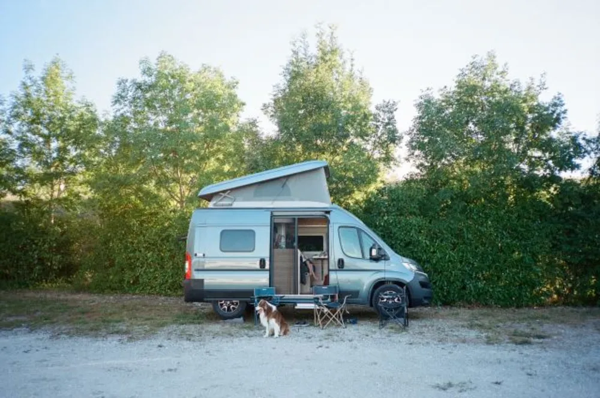

---
categories:
- lettre
letter: "bonjouryannick"
date: 2020-12-19T00:00:00Z
newsletter: true
resources:
  - src: "*.webp"
tags:
- la lettre
emoji: 💌
color: rosewater

title: "7 - Crazy Horse, examen colorectal et rétrospective"
slug: "7"
description: "Si vous ne vous rappelez pas de lui, c'est le gars qui parle de photo, café et autres joyeusetés mais qui est surtout en train de consommer beaucoup trop de bûches de Noël en ce moment."
---

👋🏻

Bonjour, et bienvenue dans cette dernière petite lettre écrite de l'année écrite par Yannick. Si vous ne vous rappelez pas de lui, c'est le gars qui parle de photo, café et autres joyeusetés mais qui est surtout en train de consommer beaucoup trop de bûches de Noël en ce moment. Y'a qu'une saison pour cela. Et puis [cela permet de finir 2020 en beauté](https://www.goodreads.com/user/year_in_books/2020/3062737).
Je me dis depuis quelques années que j'aimerais finir l'année en dormant. Et grâce au COVID et au couvre-feu, je pense bien pouvoir y arriver cette année. M'endormir avant les douze coups de minuit. Avant même que les danseuses du [Crazy Horse](https://media.giphy.com/media/14p0yNxLIwu7Bu/giphy.gif) ne montent sur scène pour un public sans doute purement virtuel cette année. Voilà donc ce que cela fait de devenir vieux. J'ai bien su m'endormir sur un concert de Metallica à mes 8 ans, ce n'est pas le Crazy Horse qui m'arrêtera.

En parlant de devenir vieux, j'ai demandé à mon ophtalmo pour une opération des yeux (🔫 [pew pew](https://gph.is/2nchOeg)). Sa réponse m'a pris de court. "Monsieur, il aurait fallu faire ça plus tôt, maintenant vous allez être presbyte, cela ne sert plus à rien". Et après ça, en deux deux, je reçois un [courier me suggérant de faire un examen colorectal normalement destiné aux plus de 50 ans](https://www.leslibraires.fr/livre/17049350-broadway-roman-fabrice-caro-gallimard). Ce n'est heureusement pas le cas. Mais j'ai atteint l'âge où je pense avoir tous les maux. C'est fait. 2020, "une bonne année et la santé" qu'ils disaient. Pas hâte qu'on se le souhaite pour 2021 qui sera sans doute aussi [belle 🎊](https://www.youtube.com/watch?v=MEODTN06mJE).

J'ai aussi atteint cet âge où j'appelle Cloé "Maman 👵🏻" comme les vieux à force de le dire à Tom. Ça je compte bien travailler dessus, je ne me sens pas prêt à être ce genre de personne. 2021, l'année de la cure. Chacun ses démons. J'ai chassé les sodas de ma vie y'a 5 ans, ne plus appeler Cloé maman, ça devrait le faire. [Petit à petit](https://jamesclear.com/atomic-habits), chaque jour après l'autre. Comme toute habitude que l'on veut changer en gros. Sauf que celle-ci est plus que ridicule.

J'ai rempli deux ou trois 📚 carnets en écriture quasi journalière cette année. Je compte bien continuer. C'est une thérapie plutôt bon marché. [10 euros le carnet](https://www.monsieurpapier.fr/en/carnets-lignes/20677-carnet-m-graminees.html), c'est pas pris en charge par la sécu mais c'est bien plus joli que la plupart des choses qu'ils prennent en charge. Au fur et à mesure, j'ai commencé à y coller des souvenirs aussi. Y écrire autour. Ajouter des morceaux de boîtes de pellicule pour me rappeler de ce que j'ai utilisé sur l'année. [Certaines ont fait de leurs carnets un livre](https://www.elisarouta.com/livre/p/chroniquesduroyaume). J'ai commencé un carnet pour la 📸 photo argentique, même pris un agenda pour noter mes réunions et autres joyeusetés à ne pas oublier. Cela me fait penser que 2021 sera encore plus analogiconumérique que 2020. Un mot valise où la tendance analogique domine le numérique mais celui-ci vient compléter ce premier. Vous voyez le genre, parfois j'ai mon téléphone en main pour une note mais elle finit souvent sur papier. Pareil pour les tâches, en numérique puis distribuées sur du papier pour être faite sans avoir à sortir le téléphone. Enfin vous voyez le genre.

Un petit mot de 👧 Louise: " Cxfc bvythc 76fg Vcvgv4fc54j76m6" Servi comme un entremet, un [trou normand](https://www.instagram.com/p/BzI9GBJgVVL/) de petite Bretagne. Ses premiers mots sur un clavier, elle les a grattés avec ses petits doigts. Vous n'imaginez pas comme elle a déjà grandi, elle. C'est fou, 2020 a beau avoir été une année pourrie globalement, elle est pleine de chouettes moments importants. Comme la naissance pré confinement de Louise. De [super vacances en van](https://yannickschutz.com/un-ete-en-36-poses/), assez de congés au boulot grâce au célèbre congé paternité. Enfin une année bien remplie malgré tout. On a aussi trouvé une serre pour ici et un terrain pour nos projets de néo ruraux 👨‍🌾. Une année chargée émotionnellement. De belles rencontres, de beaux moments, des moments retrouvés et partagés malgré les distances, malgré les restrictions, sans jamais les enfreindre. Pas très envie de montrer le mauvais exemple. Si vous me connaissez, vous savez.

📝 Cette lettre s'allonge et ne ressemble pas aux autres. Une sorte de retrospective. Une sorte de façon de finir 2020 comme il se doit, avec des mots beaux. Histoire de pouvoir attaquer 2021 en faisant l'album photo de 2019 et 2020 car on a pas pris le temps, 2020 l'année des retards. J'ai décidé aussi de disséminer des liens parfois sans rapport dans cette lettre juste pour le plaisir. Ne m'en voulez pas trop. J'espère qu'ils vous occuperont bien. Et profitez bien de ces dernières semaines

A très vite,

Yannick

💌
