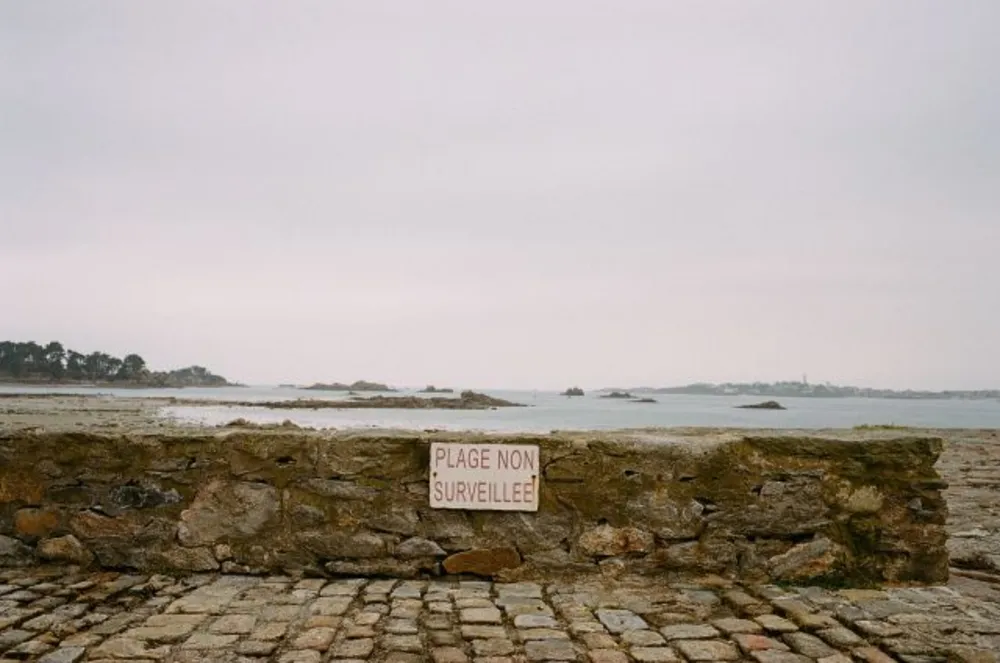

---
categories:
- lettre
letter: "bonjouryannick"
date: 2021-01-02T00:00:00Z
newsletter: true
resources:
  - src: "*.webp"
tags:
- la lettre
emoji: 💌
color: rosewater

title: "8 - Meilleurs voeux, cadeaux et Barbès"
slug: "8"
description: "Moi c'est Yannick, celui-là même qui était couché avant minuit le 31. J'écris ça plutôt avec de l'espoir car là, on est le 30. J'écris cette lettre à l'avance. Prévoyant le petit gars."
---

👋🏻

Bonjour et bonne année à vous, j'espère que les fêtes se sont bien passées pour vous! Au fait, si tu es nouveau ici, moi c'est Yannick, celui-là même qui était couché avant minuit le 31. J'écris ça plutôt avec de l'espoir car là, on est le 30. J'écris cette lettre à l'avance. Prévoyant le petit gars.

Le début d'année, c'est le moment de prendre de bonnes ou mauvaises résolutions pour l'année ou pour les 12 jours à suivre selon votre humeur. J'en ai testé pour vous ces dernières semaines, j'ai mis en vente sur Vinted pour vider mon placard de choses que je ne mettais plus. J'ai aussi cherché un appareil numérique sur un site de petites annonces françaises bien connu pour être, soi-disant, le bon coin. Le but était de ne pas acheter du neuf, si possible. Deux belles résolutions, n'est il pas.

J'ai découvert deux types de personnes qui hantent ces lieux. D'un côté, le gars qui essaye de négocier tout comme si il était parti au souk de Marrakech cet été et qu'il avait fait un BAC +5 en négociation. De l'autre, celui qui met de fausses annonces ou qui ne répond jamais. Pas sûr qu'une seule annonce soit vraie en fait dans cette liste de messages. Donc si vous avez un Fuji X-T3 ou X-T30 à vendre, dites moi. J'aimerais ne pas acheter neuf pour mes scans de négatifs. Je continue bien sûr de chercher en attendant.

Enfin, quelle drôle d'idée ces résolutions. Perso, je les prend souvent en cours d'année, pas le temps d'attendre janvier. Je vais sans doute essayer comme l'an passé de moins passer de temps sur du virtuel, de me reconnecter avec des amis, et d'apprendre, toujours apprendre. Mais ce ne sera pas des résolutions, c'est juste mon plan d'attaque de la vie. On refera de la disette numérique et on mettra les mains dans la terre. On garde le meilleur de 2020, on oublie le virus et on repart. Enfin, on l'oublie pas totalement. Y'a pas encore de vaccin pour tous. On continue les gestes de bienveillance envers les autres. Plus communément nommés gestes barrières.

Tu te demandes comment être plus présent et te reconnecter avec les amis? C'est simple, désinstalle les réseaux sociaux, limite l'usage en utilisant une app qui bloque quand tu abuses. Pour reconnecter, écris un long email plutôt que deux textos. Ou mieux encore, prend ta plus belle plume, ton plus beau papier et écris, écris et ne cesse pas d'écrire. Puis après, c'est une question de volonté. On est des êtres faibles, donc cache la tentation. Cela t'aidera vraiment à ne pas y céder. Tu peux aussi ranger ton smartphone dans une boîte quand tu vois tes potes. Je me conseille moi-même là en fait. Voilà, c'est comme une petite séance de psy ou de life coach mais en virtuel et asynchrone, ca fera quand même 50 euros TTC. Revenez dans deux semaines et si ça ne va pas entre temps, ça arrive, soufflez et recommencez.

J'ai bien débranché sur les deux dernières semaines, je n'ai pas trop à partager en fait. On a passé notre temps à jouer à [Catan](https://www.catan.com) et [Parks](https://59parks.net). Qu'on a reçu de Papa Noël®. On adore. Tom arrive vraiment bien à y jouer aussi, ce qui donne de chouettes parties une fois Louise au lit. J'ai aussi reçu un super [ex-libris](https://morganerospars.com) pour mes livres. Alors, pour les cancres du fond, je donne la définition du Larousse.

> Ex-Libris (n.m): Vignette dessinée ou gravée que les bibliophiles collent au revers des reliures de leurs livres et qui porte leur devise ou leur nom.

Le mien a un joli phare dessus dans le brouillard et mon nom. J'ai tamponné deux, trois bouquins qui sont maintenant prêts à être empruntés! Si vous voulez, je vous ferai une liste de bouquins que j'ai aimé dans une prochaine newsletter ou sur le [blog](https://yannickschutz.com). Même si je suis au milieu des monts d'Arrée, je peux vous les envoyer pour les lire. N'hésitez pas! Un des premiers ayant reçu un coup de tampon était ces [chroniques du Royaume](https://www.elisarouta.com/livre/p/chroniquesduroyaume) d'Elisa Routa dont je vous parlais la dernière fois. Un autre était ce super roème (poème-roman, valise 💥) de Charles Flamand nommé [À l'Ouest](https://www.charlesflamand.com/pour-commander-a-l-ouest). Cela se lit vite, en une fois. Deux, si tu es fatiguée. L'objet est beau en plus, allez voir le [Studio Briand & Berthereau](https://www.briand-berthereau.com), c'est eux qui l'ont fait. Ils ont récemment aussi refait le logo du [Barbès Surf Club](https://www.briand-berthereau.com/projets/identite-surf-club/). On se croirait chez Tati, Quiberon. Un vrai plaisir! Le plein de créatifs au goût salé de la mer. C'est un vrai plaisir. J'espère les croiser tous une fois que l'on pourra se refaire des checks et des hugs. Pas besoin du retour de la bise, non vraiment pas. Je ne sais toujours pas si il en faut une ou deux ou quatre.

J'espère que le petit goût iodé de cette lettre t'a plu. Hésite pas à me le dire si je pars dans tous les sens. J'aime bien ça mais je peux comprendre que cela ne soit pas ton truc. Elle est aussi un rien plus longue mais bon, on s'est pas lu depuis l'an passé.

Bon samedi,

Yannick

💌
