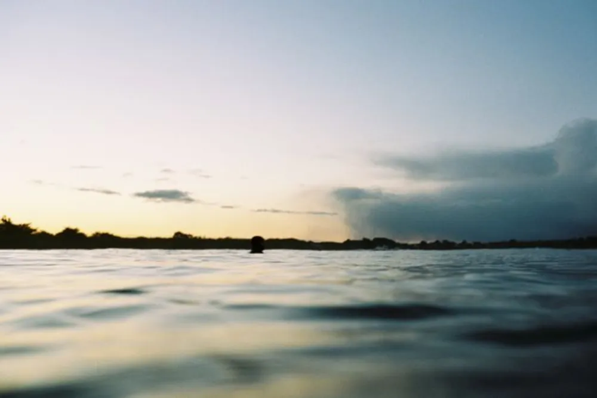

---
categories:
- lettre
letter: "bonjouryannick"
date: 2021-01-16T00:00:00Z
newsletter: true
resources:
  - src: "*.webp"
tags:
- la lettre
emoji: 💌
color: rosewater

title: "9 - Dry January, Covid et Nikonos"
slug: "9"
description: "2021 est au final 2020 + 1. On arrive au nouveau couvre-feu français, on confine à travers l'Europe. En gros, on est bien parti pour une année aussi étrange."
---

👋

Bonjour et meilleurs voeux à vous tous,

2021 est au final 2020 + 1. On arrive au nouveau couvre-feu français, on confine à travers l'Europe. En gros, on est bien parti pour une année aussi étrange. Donc, je vous le dis, apprenez à vivre et briller dans les contraintes. C'est difficile mais c'est essentiel pour votre bonheur. Enfin, je vous force pas hein. Je suis pas là pour ça. Mais je tenais juste à le dire.

J'ai commencé l'année comme beaucoup en faisant un petit [Dry January](https://en.wikipedia.org/wiki/Dry_January). Comme l'an passé, débuter l'année par un disette. Cette année, c'est l'alcool qu'on met de côté. Pas que je pense être alcoolique. Bien que parfois on se demande quelle est la limite. Elles sont aussi mouvantes que le sable sur la plage. Avec le confinement, on a eu un peu facile de glisser une bouteille de vin par-ci par-là. En regardant "Quotidien", j'ai aussi découvert un livre que j'ai envie de lire maintenant [Sans Alcool](https://editions.flammarion.com/sans-alcool/9782080232762) de Claire Touzard. On ne remet que trop rarement en question la consommation d'alcool au quotidien. Et perso, je me sens bien quand j'en bois moins ces temps-ci. Pas encore de rapport d'expert mais ce qui me manque c'est le goût de certains alcools et non pas l'effet. D'ailleurs, je pense que [JNPR](https://www.jnprspirits.com) surfe sur cette vague en faisant pas mal de pub en ce moment. Je pense les goûter. On verra bien. Quelqu'un à déjà commandé?

Le gouvernement lance enfin [une enquête sur la légalisation du cannabis récréatif](https://www.assemblee-nationale.fr/dyn/actualites-accueil-hub/consultation-citoyenne-sur-le-cannabis-dit-recreatif). Qui lui est une drogue douce. La France c'est déjà aligné sur l'Europe pour ce qui est du CBD, donc pourrait on voir une évolution pour la consommation de cannabis? J'en reviens au CBD. Étant facilement stressé, anxieux et nerveux, j'ai eu envie de tester le CBD depuis un moment sans jamais sauter le pas. Mais grâce à une story de [Victoria](https://mangoandsalt.com/), j'ai finalement sauté le pas et commandé sur [Kaya](https://feelkaya.fr). J'ai toujours aimé l'idée de "edibles" plutôt que de fumer. Même si je n'avais jamais testé, j'ai vu pas mal de trucs drôles aux US. Donc me voilà, en train de tester quelque chose pour me relaxer. On verra comment ca se passe. J'avais déjà la méditation dans mes cordes et j'ajoute ce petit extra pour voir. Une sorte de cure de vitamines calmantes sur un mois. Je vous dirai si ça aide ou pas.

Comme quoi, 2021 est vraiment une année spéciale. On sort des sentiers battus. J'ai été à l'eau un premier janvier pour la seconde année consécutive. La photo de début est d'ailleurs extraite de cette session. Première session avec mon appareil insubmersible. Le Titanic de la photo, le Nikon Nikonos V. Je dois encore écrire dessus d'ailleurs. Mais donc oui, pourquoi une année spéciale? Je sors de ma zone de comfort, je tente de nouvelles choses. On va pas mourir idiot non plus. Puis on avance dans nos projets. On a enfin signé l'achat du terrain pour notre projet de ferme à fleurs et de gîte. C'est officiel, on est propriétaire terrien.

En gros, oui le monde est bizarre, oui le monde va mal. Mais on le savait déjà avant le COVID ça. Pas comme si Chirac ne nous avait pas dit sans rien faire au final que "notre maison brûle". Donc, je pense qu'on doit juste accepter ce qui se passe et comme les vagues dans l'océan, trouver le moyen de tirer le meilleur de chacune d'elles. On peut se laisser porter ou la laisser nous emporter. C'est à nous de décider. Purée, je pense que 2021, je deviens un moine zen bouddhiste aussi. J'espère que cela ne vous fera pas fuir. 2021, on trouve des moyens d'apprécier la vie et d'être heureux malgré le beau foutoir que l'on a autour de nous.

Prenez des petites habitudes, gardez les et avancez dans vos projets! J'ai hâte de voir vos projets et vos habitudes. Même les plus petits. Perso, je fais 10 pompes par jour là. Juste pour m'habituer à en faire tous les jours et que cela ne soit plus une "corvée". Sur ce, n'hésitez pas à m'envoyer vos façons de supporter les vagues qui passent qu'elles soient sanitaires, planétaires, personnelles et autres.

passez un bon samedi,

Yannick

🌿
