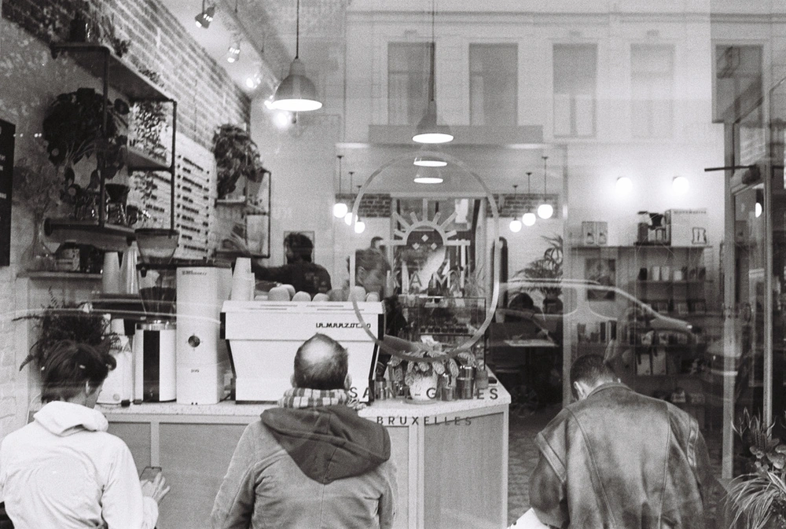

# It is all about coffee anyway isn't it?

- https://markus.is/photographing/little-nap-coffee-stand/
- https://coffeetablemags.myshopify.com/products/brew-introduction-to-brewing-coffee-by-hand
- https://www.suedhang.org/en/product/brew/
## Favorite origins
- African for sure, love the aroma and subtleties
- Some south American are just amazing too .
## Favorite roasters

- [Mok Coffee](https://mokcoffee.be)
- [The Barn](https://thebarn.de)
- [Terres de Cafés](https://terresdecafe.com)
## Roasters I like
- [lomi](https://lomi.cofee)
- [kawa](https://kawa.coffee)
- [Coffee Collective](https://coffeecollective.dk/)
- [Koppi](https://www.koppi.se/)
- [La Cabra](https://www.lacabra.dk/)
## Roasters I need to try
- [Rum baba](https://rumbaba.nl)
- [Moklair](https://www.moklair.com/)
- [Moody](https://cafesmoody.com/)
- [Muda](https://cafesmuda.fr/)
## Favorite subscriptions
- https://thecoffeevine.com/
- https://www.kaffebox.no/
- https://beanbros.co/
## Favorite magazines
- [Standart](https://standartmag.com/)
- [Solo](https://solomagazine.coffee/magazine)
## Favorite gear
- Baratza Virtuoso
- Fellow Kettle
- Kalita 185

