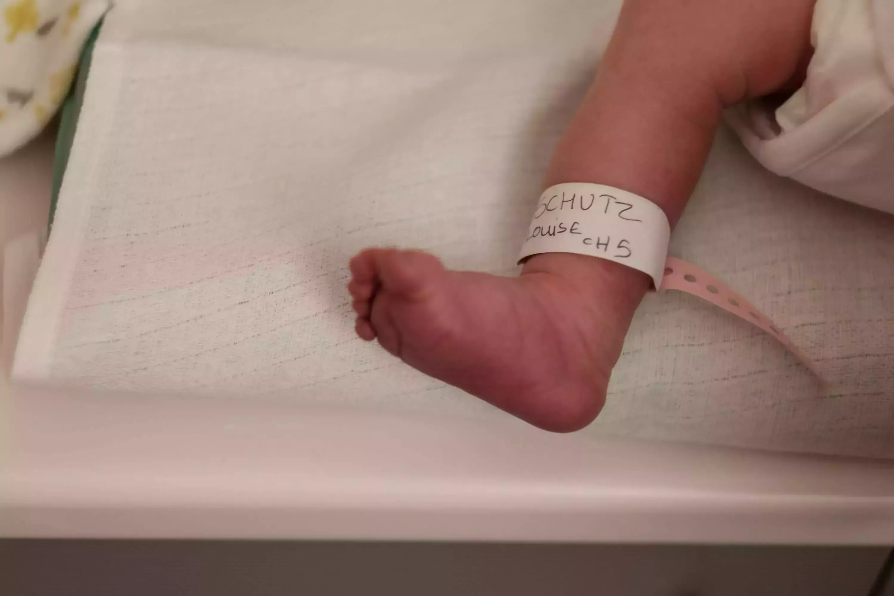
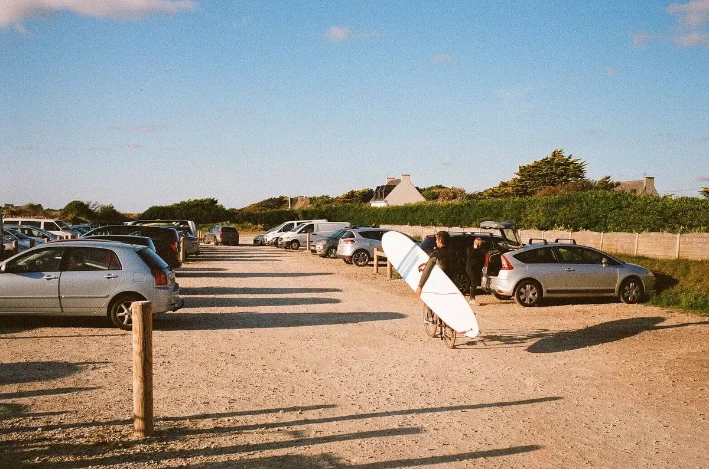

2020, quelle année! J'ai commencé une rétro un peu dans [ma petite lettre #7](https://tinyletter.com/bonjouryannick/bonjour/7). Chaque année, j'aime revenir sur mon année, que ce soit ici ou dans un carnet. Puis revenir sur mon année en photos pour en faire un joli bouquin pour la bibliothèque. Cette année est assez particulière, il faut bien l'avouer.



Elle a commencé par une petite baignade du 1er janvier avec des amis. Elle a aussi commencé sans mon fidèle compagnon de début d'année qui était en réparation. Donc j'ai passé un début d'année sans appareil numérique. Elle a d'ailleurs surtout commencée par [un mois de disette numérique](https://yannickschutz.com/un-mois-de-disette/), ce qui veut dire que mon téléphone était principalement un appareil photo. Ce changement assurera le rythme de l'année, une année plus calme, proche de la terre et ralentie. Beaucoup de questions, quelques réponses. Un autre gros changement aussi juste avant la naissance de Louise, j'ai enfin réussi mon permis de conduire, tut tut.

## Rencontre et confinement

Le mois de mars sera pour beaucoup le mois du confinement. Nous, c'était un mois magique. On sort de la maternité le 2 mars et l'on se retrouve vite confiné à 4. On a de la chance, notre maison a un beau jardin comme vous l'avez sans doute déjà vu. On y passera pas mal de temps. On fera des tours de jardin en poussette pour faire dormir Louise et profiter du soleil. On installe enfin une serre sur le terrain et on se laisse vivre. On essayera de planter avec Tom, mais c'est surtout ce que Cloé plantera qui réussira. J'ai eu la chance d'avoir un congé paternité de 4 mois sur l'année. Tom reçoit ses leçons par e-mail et on a des jeux et [défis à réaliser](https://yannickschutz.com/mandala-du-dimanche/).

## Un été en van

On profitera du déconfinement pour échanger le California pour un fourgon un peu plus gros, Merci les Mignard! [On le rodera en partant vers les Vosges](https://yannickschutz.com/un-ete-en-36-poses/). Elles deviendront un running gag quotidien. On s'avance vers elles mais on ne les rejoindra jamais. On se balade en Champagne au final. C'est bien aussi, le Lac du Der est une chouette découverte, on dort à côté des caves et on remplit le coffre. On ira même voir le village de ce bon vieux général de Gaulle. On ne montera pas voir la croix de Lorraine. Car il faut payer pour se balader à ses pieds, la nature à assez à offrir sans cela. On adore ce nouveau van, on est plus à l'aise tous les 4 avec le chien dedans. On rentre en passant par la Loire, encore une histoire de vin. Un bon Bourgueil bio qu'on a déjà liquidé. On revient en bord de mer, elle nous a manqué. On se rend compte que ce Finistère, on l'a bien adopté. Il nous gagne et on l'adore. On aura la visite de la famille et de quelques amis sur l'été. On partagera notre amour de notre nouveau chez nous avec eux. Cela ne fait que renforcer cette connection avec cette Finis terra.

## Homme libre toujours tu cheriras la mer

En juin, avec Tom [on commence le surf](https://yannickschutz.com/se-mettre-a-l-eau/). Finalement! On adore, un vrai moment père fils. Même si en fait, on ne se voit quasi pas durant les leçons. L'été passe trop vite, pas le temps de prendre une leçon. On reprendra à l'automne. On est pas encore reconfiné alors on en profite. Chaque week-end, à l'eau. On progresse, je tiens debout, je commence à tourner. JB et Jean-Phi de l'[école de surf du Léon](https://www.ecole-surf-leon.com) y sont pour beaucoup, merci les gars. Je m'entraîne à mieux me lever, je lis, je regarde. J'ai une planche en vue. Deux combis. Je craque pour un Nikonos. Je demande de l'aide à [Greg](https://gregorymignard.com) et [Yves](https://yvesquere.com) pour me sentir plus à l'aise dans l'eau. Hâte de reprendre tout cela où je l'ai laissé. La mer est vraiment ma révélation du Finistère et de l'année. Une amie plutôt salée que j'aime voir et revoir.

## Fin du numérique

Avoir été sans le X-T3 au début d'année m'a fait beaucoup me questionner sur son utilité. Je ne suis après tout pas un photographe professionnel et je fais ceci pour le plaisir. Et l'argentique m'amène le plus de plaisir. Cette année aura été l'année du retour à l'argentique. J'ai investi dans un beau Leica M6 et un [Olympus XA](https://yannickschutz.com/olympus-xa/) qui sont devenu mes compagnons de tous les jours. Essais de différents labos, sortir le scanner, puis le revendre. Un projet de scans à la maison en court d'aboutissement. On peaufine le tout sur l'année. Quel plaisir de revenir à mes premiers amours en photo. Cela va bien avec mon envie de ralentir, d'être plus intentionnel.

## Début du projet

Si on a bougé dans le Finistère, c'est aussi parce qu'on avait un projet. Ce projet de changement de vie se peaufine petit à petit. La seconde moitié de 2020 a été le moment où tout est devenu réel. Nous sommes passés devant le notaire pour l'achat d'un terrain d'un hectare qui pourra accueillir nos deux projets. Un projet d'éco cabane et de ferme de fleurs dans les monts d'Arrée. On vous en dira plus l'an prochain. Mais vous pouvez déjà suivre le [compte instagram de Ty Lucie](https://instagram.com/ty.lucie).



## Ensuite

En gros, 2020 a planté plein de graines que nous récolterons en 2021 et au delà. J'ai hâte. Plein de petits projets en tête. Des projets photo, des projets Bretons, des projets d'écriture. Le besoin de retourner à l'océan et cette connection à la terre ne font que s'intensifier. Comme le disait Greg dans [sa rétro](https://gregorymignard.com/2020/), 2020 nous a permis petit à petit de devenir de meilleurs êtres humains chaque jour. On adapte notre consommation, on agit localement comme on le peut et on aligne nos paroles et nos actes. Au final, bien qu'elle fut chaotique de tous les côtés, on a réussi à en tirer le meilleur et la rendre belle malgré tout.

On se revoit l'an prochain les amis, prenez soin de vous durant ces vacances et profitez de vos proches en faisant attention!
