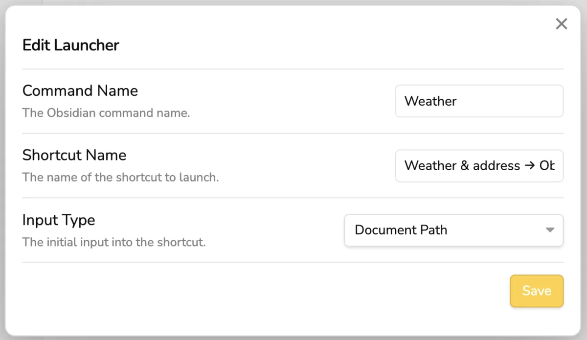

*warning: I moved back to iA Writer, was missing the minimalism, no headaches of it.*

I am migrating all my notes from Day One to Obsidian.
But I found myself missing that small extra part of day weather and address.
I don't know why but I enjoy that part in every note, seeing the weather and some daily information.

So I wanted to recreate it in Obsidian. But I didn't know how to get all of that in JS. 
Luckily, [MacStories](https://www.macstories.net/tag/obsidian/) made this amazing [small plugin](https://github.com/macstories/obsidian-shortcut-launcher) that allows you to launch Shortcuts from Obsidian.
I also added the plugin to use [advanced URIs](https://github.com/Vinzent03/obsidian-advanced-uri) to modify on callback.

And voilà,



My template has `@weather` in it, that gets replaced by this shortcut on the callback.
Basically works with the active file, so no need of the daily, it works with all your files.
Add `@weather` trigger the shortcut and there you go.

This was a fun small experiment to do.

So basically, my daily template looks like this:

```
...
# <% tp.file.title %>

@weather


<%* await app.commands.executeCommandById("obsidian-shortcut-launcher:weather") %>
...
```

And you can find the shortcut here: https://www.icloud.com/shortcuts/eee6ef8f8182430aabfb0abc0464930d

You probably want to change the vault name in the callback URL. I used the `cmd+p` -> `Advanced URI: Copy URI for search and replace` as a starter for the callback url in the shortcut actions. My vault name is an emoji, that is why it has that weird encoded name.

My settings for Obsidian Shortcut Launcher Looks like this:


