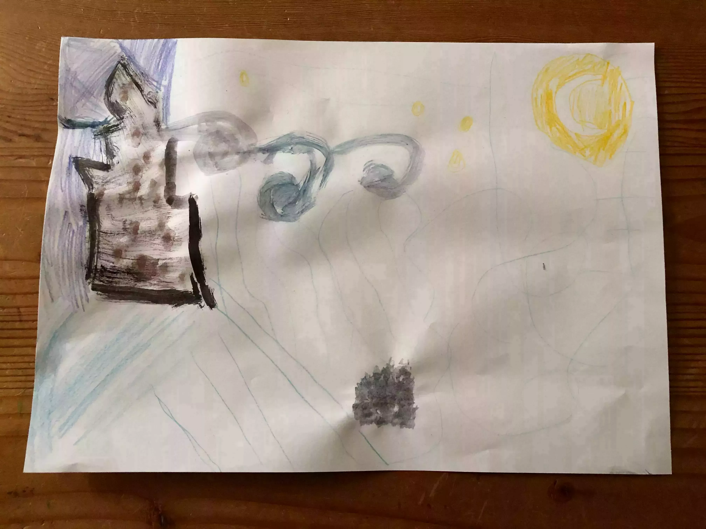

Cela fait maintenant presque un mois que Tom est confiné. Comme beaucoup de petits de son âge, il a commencé à recevoir des mails pour l'apprentissage à domicile. Ses deux maitresses ont énormément d'idées et aident vraiment pour l'apprentissage. Hors des exercices de base, on a eu droit à de chouettes défis variés allant du mandala à la création d'oeuvres en utilisant ce que l'on voulait. On a eu de supers supports en ligne tel que [lalilo](https://www.lalilo.com) ou [Calcul@Tice](https://calculatice.ac-lille.fr/). Vraiment, juste avec cela, l'école est top.

Si je devais transmettre une seule chose à mes enfants, c'est la curiosité, l'envie d'apprendre, l'envie de comprendre. Et pour cela, en ces temps nouveaux, on a commencé à trouver d'autres chouettes solutions. Histoire d'apprendre en s'amusant ou sans s'en rendre compte.

Tom aime la lecture. On a un paquet de BDs, la solution est simple. Commencez avec ce que vous avez et que vous aimez pour leur passer le goût. Il les dévore. On fait bien sûr attention au contenu. Cela complète bien le programme des CP, il apprend à lire et se retrouve à lire souvent sans même se rendre compte que c'est de l'apprentissage en plus.
Pour compléter, on passait à la bibliothèque. On ne peut plus pour le moment.

On a découvert les nouveaux ["c'est toujours pas sorcier"](https://www.france.tv/enfants/neuf-douze-ans/ctps/). Tom les a dévoré. On a donc pu lui faire découvrir [les anciens](https://www.youtube.com/user/cestpassorcierftv), en diffusion libre sur Youtube! Tom découvre donc Fred, Jamy et Sabine. Quel plaisir de pouvoir les revoir.



En fait, France TV a de superbes autres vidéos. Cette semaine, nous avons découvert ["Baam! De l'art dans les épinards"](https://www.france.tv/enfants/neuf-douze-ans/baam-de-l-art-dans-les-epinards/). On a, en suite, décidé de copier les oeuvres. Tom avait choisi "La nuit étoilée" de Van Gogh. Même les parents apprennent dans ces moments-là. Cela donne de super moments d'échange.



Dans l'apprentissage imprévu, comme beaucoup, nous avons acheté Animal Crossing. Cloé et moi sommes de grands fans de la série. On y jouait à notre rencontre, on y joue toujours. Et là, vous allez me dire: "Des jeux vidéos pour les enfants, non!". Mais en fait, j'ai appris énormément sur les poissons, insectes et fossiles dans ce jeu. Tom commence à reconnaitre les papillons du jardin grâce à ce jeu. Et pareil pour les poissons. Je vous le conseille totalement!.

Et vous, ça se passe comment chez vous? [Dites le moi sur Twitter](https://twitter.com/bonjouryannick) 🐥!
