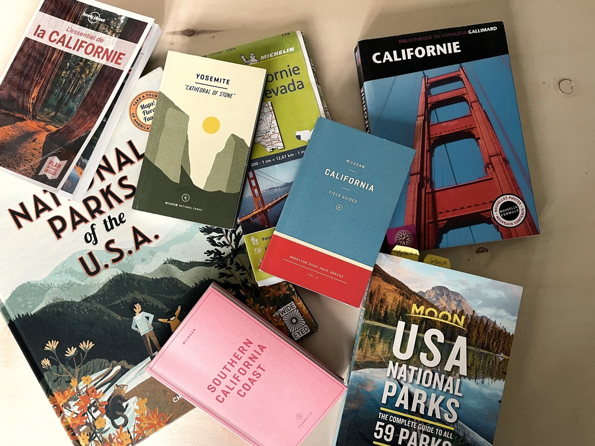

🎶 
*La Californie*  
*Est une frontière*   
*Entre mer et terre*  
*Le désert et la vie*  
🎶 

Préparer un voyage, c'est déjà un peu voyager. Nous partons bientôt pour la côte ouest des États-Unis. Trois semaines de route, de déconnexion et de découvertes. C'est une première pour les enfants et Cloé, cela sera une redécouverte pour moi. J'y suis allé pour le boulot quelques fois, seulement ici je pourrai avoir mes yeux d'enfants et redécouvrir tout cela. On n'a jamais fait d'aussi long road trip. C'est aussi une première. 

Cela fait presque un an qu'on le prépare ce voyage. Les billets sont bookés depuis août. Le trajet a dû être revu une bonne dizaine de fois, la dernière datant d'une semaine. Quand tu te rends compte que c'est le spring break et que tu dois te trouver à Palm Springs ce week-end là. Quand tu te rends compte que tu n'auras pas le temps de voir ceci. Quand tu veux ralentir suffisamment pour profiter avec les enfants. Quand tu veux te faire plaisir. Quand tu te rends compte que ceci ou que cela. Enfin, je vous passe tous les détails mais là, notre carte est prête.

Un an qu'on feuillette guides et sites webs. Un an qu'on prépare des listes sur Maps. Un an que on abreuve les enfants de petits détails, de lieux, d'animaux, d'idées. On peut vous dire qu'on a hâte. Je pense qu'une grosse partie à commencé y'a deux ans avec un bouquin reçu d'un secret Santa sur les parcs nationaux. On avait envie depuis des années et là on s'est dit: "Il est temps". La pandémie finissait ou du moins changeait de forme. Le gîte se concrétise. On s'est dit, si ce n'est pas maintenant, cela sera dans quelques années. On compte bien se consacrer fortement à nos visiteurs après ceci. On espère quand même trouver du temps pour nous encore bien sûr mais vous voyez ce que je veux dire. 

J'avais envie de vous partager un peu les sources qu'on avait utilisées pour ce voyage. Je ne sais pas qui cela peut intéresser mais voilà.

En sites web, on a pas mal bouquiné les sites de [Jesus Sauvage](https://jesus-sauvage.com/californie-family-roadtrip-part-1/), [l'oeil d'Eos](https://loeildeos.com/road-trip-highway-1-californie/) et [les carnets de Traverse](https://www.carnets-de-traverse.com/blog/itineraires-road-trip-etats-unis) qui ont d'ailleurs aussi un [superbe guide](https://www.carnets-de-traverse.com/blog/road-trip-usa-guide) sur l'organisation de road trip aux USA en général. On a pas mal trouvé de trucs à gauche à droite aussi, épluché des vidéos Youtube, plus de recherche que dans les Experts Miami. On avait déjà pas mal d'idées avant ces sites, mais on a volé des morceaux à gauche et à droite pour rendre le voyage encore plus mémorable.

Pour les livres, or le classique [Lonely planet](https://www.lonelyplanet.fr/catalogue/lessentiel-de-la-californie-4ed), on avait commencé par le [guide des parcs nationaux de Chez moon](https://www.moon.com/titles/becky-lomax/moon-usa-national-parks/9781640496224/) (Thanks Joanne!). Un [magnifique livre illustré sur les parcs](https://www.christurnham.com/collections/national-parks-of-the-usa/products/national-parks-of-the-usa-book), parfait pour montrer aux enfants, je vous le conseille bien sûr. Même si vous ne comptez pas y aller, c'est beau à feuilleter et ça fait rêver. Plus tard, on a découvert les supers guides de [chez Wildsam](https://www.wildsam.com). Un vrai plaisir aussi, plein d'anecdotes, de shops favoris, de lieux "secrets" et autres joyeusetés, ils se glissent dans les poches en plus. Et une carte routière permet de voir un beau tracé sur papier, un vrai plaisir aussi pour se projeter au volant sur les routes. Un must aussi juste au cas où.

En attendant, on surveille la réouverture de Yosemite. Le parc a été fermé un peu à cause des conditions météos que la Californie connaît pour le moment. Ces mêmes conditions ont fait glisser le terrain sur la Highway 1. Cela devrait rouvrir pour le 30 mars, on croise les doigts, on continue de se renseigner et d'étoffer le voyage en attendant. Si vous avez eu des énormes coups de cœur, dites nous tout! En attendant, je continue à m'y préparer. 

🎶
La Californie   
La Californie   
La Californie   
La Californie   
La Californie   
La Californie   
🎶

<iframe style="border-radius:12px" src="https://open.spotify.com/embed/track/3SZIYUsyIdkHKhvCksF0uq?utm_source=generator&theme=0" width="100%" height="152" frameBorder="0" allowfullscreen="" allow="autoplay; clipboard-write; encrypted-media; fullscreen; picture-in-picture" loading="lazy"></iframe>
