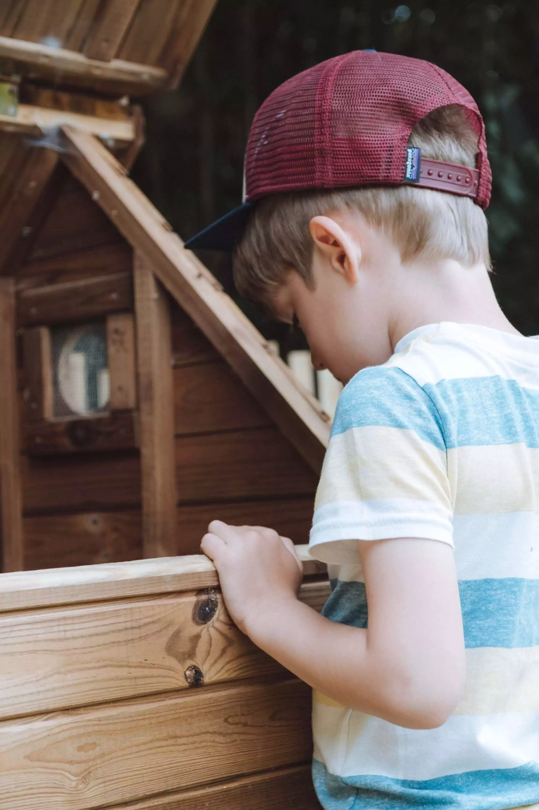

En déménageant, on s'était dit qu'on aurait un jour des poules. L'idée d'avoir des œufs frais nous plaisait vraiment. Alors on a commencé à se renseigner, à lire un peu en ligne. Le web est une source fabuleuse d'information, on trouve tout ce qu'il nous faut.

## 🐔 Combien de poules?

Il faut savoir qu'une poule seule déprime. Donc, il en faut toujours au moins deux. Après, cela dépend de votre terrain. On suggère environ 10m2 par poule.

Nous avons donc commencé par deux poules. Je vous présente Nuggets et Cocotte. Noms choisis par Tom comme vous pouvez le deviner. J'aurais choisi Chicken et Nuggets. On les a trouvées chez [magasin vert](https://www.magasin-point-vert.fr/conseils/tout-savoir-sur-poules).



## 📝 Que vous faut-il pour les poules?

Un poulailler bien sûr et un enclos. Au minimum. Après, il vous faut aussi une mangeoire et un endroit pour boire. On a trouvé notre bonheur chez [Farmili](https://www.farmili.com) pour le poulailler. C'était un peu plus cher qu'ailleurs mais il nous plaisait bien et semblait bien plus solide. Vous pouvez passer par la case DIY si vous êtes suffisamment bons. Le poulailler doit avoir un pondoir et un perchoir. Après, sa taille dépendra du nombre de poules que vous pensez adopter. Le nôtre nous permet d'avoir jusque 4 poules. On pense à peut-être en adopter d'autres mais on verra.

On a installé une clôture de châtaignier autour de nos framboisiers histoire qu'elles puissent picorer. Elles semblent plutôt heureuses et moi ça m'a permis de sortir de ma zone de comfort, car comme vous le savez ou pas, je ne suis pas très bricolo, en installant les poteaux, mesurant le tout et plantant la cloture. Pour finir, la fixer aux poteaux et tout ça. Un vrai plaisir.



Dans les petits accessoires utiles:

- Une paire de gants pour nettoyer le tout
- Des œufs factices pour les inciter à pondre au bon endroit
- Un petit panier pour aller chercher vos oeufs
- Des boîtes pour les garder
- Un crayon ou feutre pour la date. Ca n'est pas imprimé par défaut.

## ⏱ Combien de temps?

Une fois par semaine environ, on nettoie le tout. On enlève les crottes, remplace la paille souillée, remplace la sciure et voilà. Rien de plus simple. C'est ici que vous aurez besoin des gants.

Penser à remplir la mangeoire et remplacer l'eau pour qu'elles se sentent bien. Rien de plus simple. Un rappel et on est bon. Les poules, c'est facile, ca ne demande pas trop d'entretien.

Le matin, on va ouvrir le poulailler pour qu'elles puissent se balader dans l'enclos. Le soir, on les rentre. Bien souvent, elles sont déjà dans le poulailler et on referme juste la porte pour éviter l'entrée des nuisibles.

## 💡 Trucs et astuces

- Le poulailler ne doit pas être en plein soleil.
- Éviter d'orienter l'entrée du poulailler au nord pour éviter les vents froids
- Leur couper un petit bout des ailes pour les déséquilibrer, sinon elles peuvent voler et passer la cloture.
- Les installer dans vos arbustes avec des baies. Elles adoreront s'y cacher et auront des friandises.
- Elles adorent avoir un petit coin de sable pour se rouler dedans.
- Elles ont besoin de bien se nourrir et boire sinon elles ne pondent pas.
- Elles mangent des bouts de coquilles d'huîtres ou d'œufs pour avoir des coquilles bien solides.

## 🔗 Des liens

- [Poules pondeuses](https://poulespondeuses.com/elevage-poules-pondeuses/) - Une vraie source intarissable.
- [Le guide farmili](https://www.farmili.com/content/8-introduction-a-l-elevage-de-la-poule) - Encore plein d'info
- [Des poules dans mon jardin](https://amzn.to/2F9TLFs) Rien ne remplace le papier. Ca se lit au jardin avec plaisir.

Si vous avez des questions n'hésitez pas, si vous avez des suggestions n'hésitez pas non plus.

