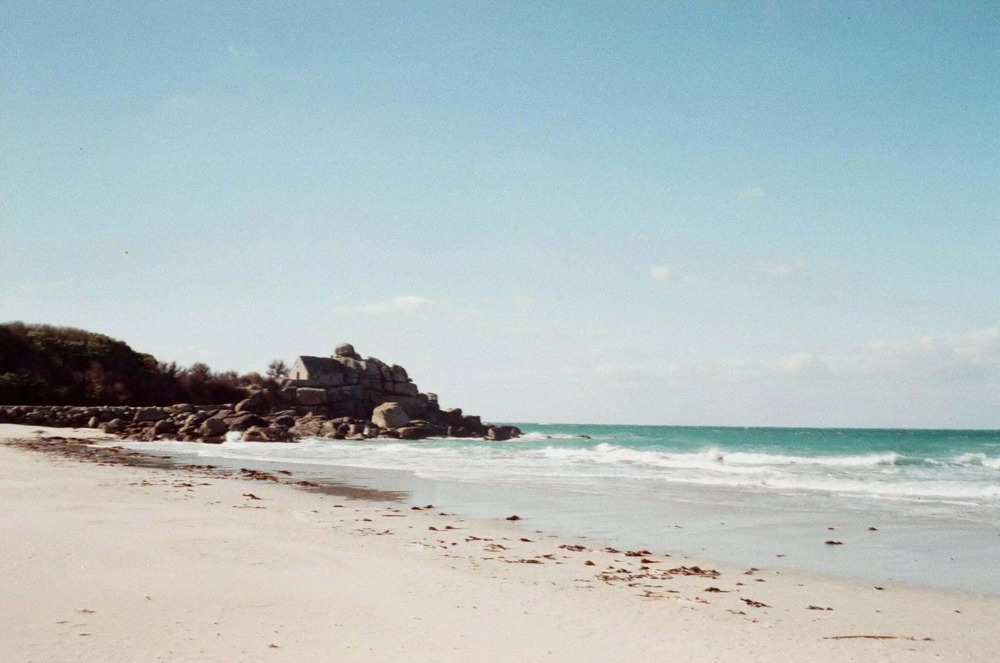

Aujourd’hui, mon père me voit arriver portant un t-shirt [Finisterre](https://Finisterre.com) et il me dit que je suis déjà prêt.

Cela fait deux ans environs que nous avons commencé à mûrir cette idée de partir. Ou? On hésitait. On a d’abord pensé à la Bourgogne, c’est beau et c’est bien situé. On avait envie de changement, de quitter la ville. Une sorte de retour à la terre, certains pourraient dire.

On a écumé pas mal de sites d’immobiliers, j’ai même codé un fouilleur pour quelques sites reconnus! L’an passé, on part à Groix et là, grosse révélation, on étend les recherches à la Bretagne. On descendra visiter quelques maisons des deux côtés et on finit par trouver notre futur chez nous. Un terrain qui nous permet ce retour à la terre, un hameau dans un village de moins de 1000 habitants. Je n’ai jamais connu ça. Mais j’ai hâte.

Voilà c’est officiel, Tom ne fera pas sa 3ème maternelle en Belgique, cet été on va en Bretagne. *“La bretagne c’est bien pour les vacances!”*. Non on vient y vivre. *“Dommage, vous avez raté le sud la”*. Vraiment, j’ai vite chaud. *“Il pleut beaucoup en Bretagne”*. Tu sais d’où je viens?

J’ai vraiment hâte de ce changement. Je verrai moins ma famille et mes amis d’enfance. Mais comme un sage en short en jeans m’a dit un jour “ tu vis ta vie et pour ça je suis fier de toi”. Je paraphrase un peu parce que je n’ai pas de mémoire! J’ai hâte de recevoir ce sage là-bas! Internet me permet de garder le contact avec les amis! Je n’ai pas peur, je suis heureux.

J’ai hâte aussi de vous faire découvrir ce changement de vie. J’ai hâte de vivre ce changement de vie. Je suis fier de faire ce choix! Je suis heureux de vous manquer mais sachez que je ne suis pas loin et que vous êtes toujours les bienvenus!

Ceci n’est pas la fin, c’est le début. Malgré ce que le nom suggère.
