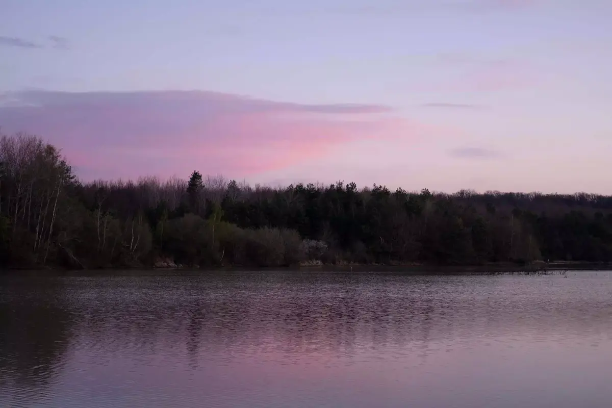
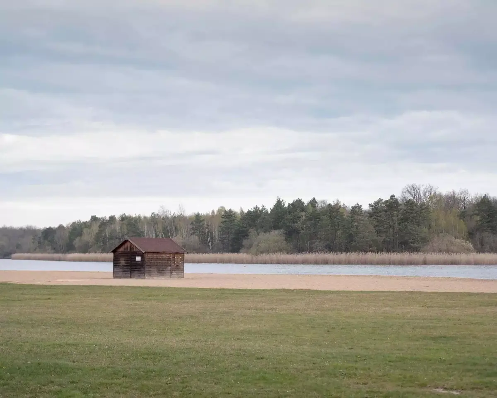
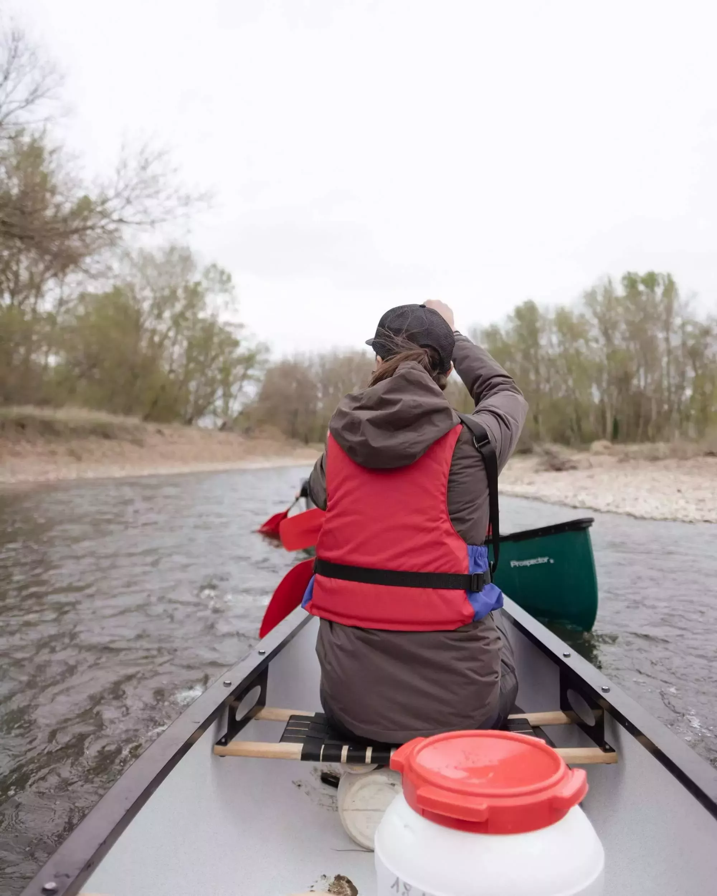
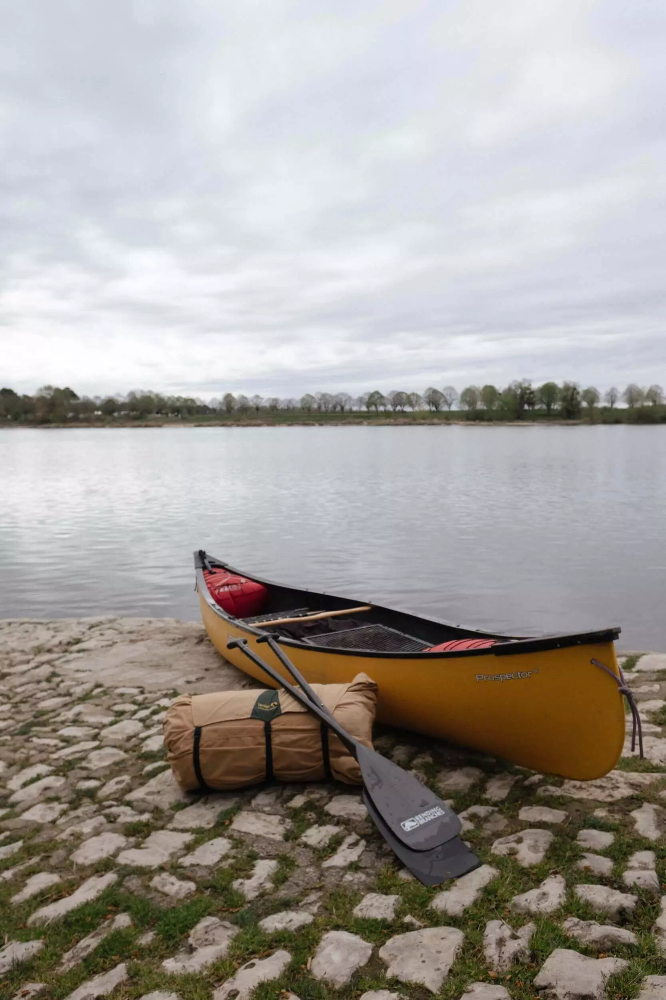

Vendredi, 9h30, J'attend [Grégory](https://gregorymignard.com) sur le parking de la biocoop. Aujourd'hui, je suis leur auto-stoppeur. On part vers la Loire pour passer un week-end en canoë. Leur California se gare, passé les salutations, on se met en route. Quelques heures de route, le temps de papoter sur des sujets variés. Un petit crochet pour déposer sa petite famille chez ses parents, on récupère [Jérémy](https://www.djisupertramp.com) à la gare. On part chasser la pizza et un lieu pour poser le van pour la nuit. On trouvera un super spot près d'un étang, mais on ratera de peu une belle lumière.



Cette première nuit est placée clairement sous le signe de la simplicité. Bon petit repas, lieu sympa et discussions super. Une première heure bleue, quelques photos et pas mal de rires. Couché pas trop tard pour ne pas manquer le lever de soleil le lendemain. Chacun dans son sac et on éteint la lumière.

Peu avant le lever du soleil, on est déjà levé. Une première heure dorée de capturée et en route pour le camp de base de [destination H2o](https://www.destinationh2o.fr). Une chouette petite plage, un lac et des tipis qui se montent. Son camp est monté, démonté pour chaque week-end et varie en fonction de la demande, des grands ou petits tipis. Ici, ce week-end, il y aura un enterrement de vie de jeune homme. Nous on attend les autres personnes pour le workshop photo organisé par [Captain Yvon](https://captainyvon.fr), Grégory et Jérémy. Un groupe équilibré et varié, moitié hommes, moitié femmes, de tous niveaux.



On charge les sacs, emballés dans des drybags, dans les canoës. On les attache à la remorque et on démarre. Petites explications de [Joris](https://instagram.com/jorisadventures) notre guide en arrivant. Et on met les canoës à l'eau. Je suis à l'arrière et je dois diriger notre embarcation. Pas facile au début. On se prend pas mal de berges et pourtant c'est assez large. [Aurélie](https://www.instagram.com/aurel_baroude/) ne m'en tiendra pas rigueur. On rira bien d'ailleurs dans nos galères. Au final, on commence à mieux gérer.



La Loire est vraiment un fleuve magnifique. Il reste assez sauvage et on ne verra que peu de maisons sur les passages que nous ferons. De plusieurs dizaines de mètres de largeur, on passe à beaucoup moins sur certains passages. C'est surtout dans ces passages courts que je fonce dans les berges. j'appréhendais la profondeur mais une fois dedans, je me rend compte que en général, on voit le fond. Et si on ne le voit pas, je suis quand même à l'aise. Vaincre ses peurs est vraiment jubilatoire.



On arrive au lieu de bivouac. On a transporté dans les canoës toute la nourriture, les couchages et le tipi. On peut transporter jusque 400kg par embarcation. Le tipi se monte facilement, le feu se prépare. On papote, le workshop continue avec de chouettes discussions. Ca ne sent pas le cours donné mais vraiment un moment partagé. Ce concept de workshop mélangé à une micro aventure est vraiment un format qui me plait. On capture dans nos boîtiers quelques rayons de soleil au moment de l'heure dorée, Joris nous sert de modèle. L'heure bleue s'en suit et pendant ce temps, notre guide nous prépare un bon petit repas cuit au feu. Ca me conforte aussi dans mon envie d'avoir un brasero dans notre jardin. On continuera à échanger et photographier la nuit.



Au moment du couché tout se passe bien. Mais durant la nuit, je rend compte que mon sac est trop frais. J'aurais du investir dans un sac plus chaud. Je le saurai pour la prochaine fois. Je me retourne pas mal mais ce ne sera pas la pire nuit de ma vie. Réveil matinal, on rallume un feu pour se réchauffer. Je n'étais pas le seul à ne pas être préparé pour la nuit en tipi. Ca me rassure. Un petit déjeuner de roi avant de tout replier et repartir. On finit calmement en se laissant porter sur la Loire. J'espère y revenir. Un chouette week-end chargé de bons souvenirs, de rencontres et de belles photos. Merci Captain Yvon!

