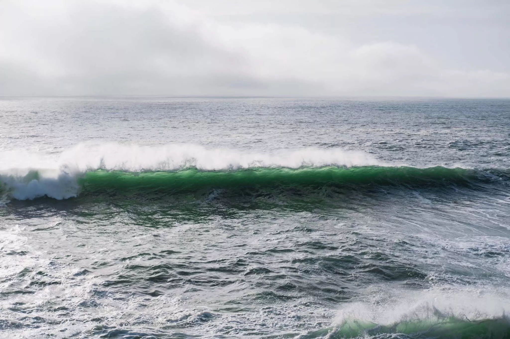
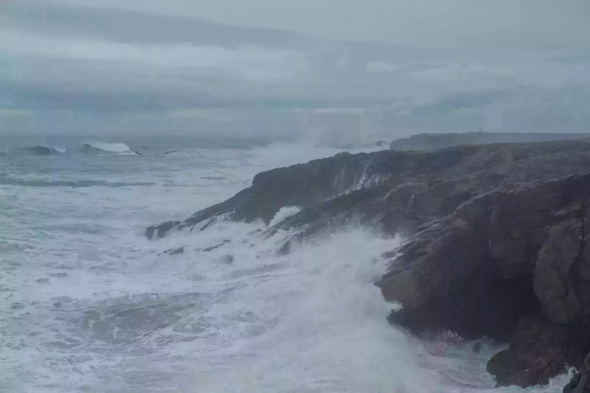

On avait décidé de ne pas partir bien loin. On voulait découvrir notre region d’adoption. On veut voyager différemment, plus lentement. On ferait Carnac, Quiberon, la Pointe du Raz et Crozon. Un road trip en Bretagne sud. Facile et efficace. Du mystique, du sauvage et du classique à découvrir ou approfondir.

## Carnac

On démarre, dans les temps, direction Carnac. Il fait pas trop mauvais, on a du temps avant de pouvoir prendre possession de [notre Airbnb](https://www.airbnb.fr/rooms/11307466). On décide de prendre de l’avance sur le planning et hop, on se retrouve à Carnac pour découvrir ses alignements. Je ne savais pas à quoi m’attendre, je pensais à une rangée de 1000 menhirs, j’avais tort. J’ai bien fait de ne pas faire de recherches avant. C’est impressionnant, une plaine pleine de magie. Comment? Pourquoi? Ils auraient pu nous laisser un mot pour expliquer tout ça. On pensait les faire en deux fois, en fait on a le temps, on continue de marcher. Certaines zones sont laissées aux moutons. Tom court entre les menhirs et cherche celui qui ferait sa taille. On le trouve. Il est temps de se diriger vers notre camp de base à Plouharnel.



## La plage de Sainte-Barbe

Nicolas nous reçoit dans sa maison. Il nous fait faire le tour. Il est enthousiaste et adore sa région. Il nous parle de ce qu’il faut voir et nous propose indirectement aussi ce qu’il vaut mieux éviter. On suivra ses conseils, changeant quelque peu nos plans et on ne sera pas déçu. Direction la plage de Sainte Barbe, on évite les plages au sud, directement accessibles pour les gens venant de l’est. On traverse un désert de dunes. C’est assez envoûtant comme zone, on se croirait sur une autre planète. Quelques surfeurs sur la plage et un chien qui adore creuser. Un bon moment pour finir cette première journée. La météo est grisâtre pour ce début de semaine. Il pleut un peu mais la pluie n’est pas dérangeante.



## La Côte Sauvage de Quiberon

On se dirige vers Quiberon. La côte sauvage porte bien son nom, encore plus en cette période de grande marée. Le bruit des vagues, la musique de l’eau est envoûtante. On se pose et on regarde. On reviendra plusieurs fois voir cette mer qui s’attaque aux falaises. On veut la faire en entière cette côte. On devra revenir pour le faire en une fois. Avec un petit aventurier, on fait beaucoup de pauses. Il aime ce qu’il voit et ça le motive. Quel plaisir de lui expliquer. Encore des vagues, plus de vagues, de l’eau qui explose sur les falaises en un feu d’artifice humide. On s’earrête à la [brasserie Zéphyr](https://www.zephyr-biere.com). Elle nous goûte bien. On prendra une caisse s’il vous plaît.



## La Ria d’Etel

La Ria d’Etel nous est conseillée par notre hôte. On arrive en plein brouillard. Une petite île avec une maison est à peine visible dans cette purée de pois. On traverse le pont en pierre, fait le tour de l’île de Saint-Cado et on imagine la vue. La maison devient un peu plus visible. Faisons une pause pour manger. On reviendra l’après-midi en plein soleil pour faire une balade le long de la Ria entre champs, forêt de pins et mer. Un temps des plus agréable et Tom qui joue au guide et nous demande de lui poser des questions sur tout ce qu’on voit. On lui demande son habituel “On arrive quand?”. Il ne sait pas quand on arrive...



On redémarre vers l’ouest, mais ça sera pour plus tard!
