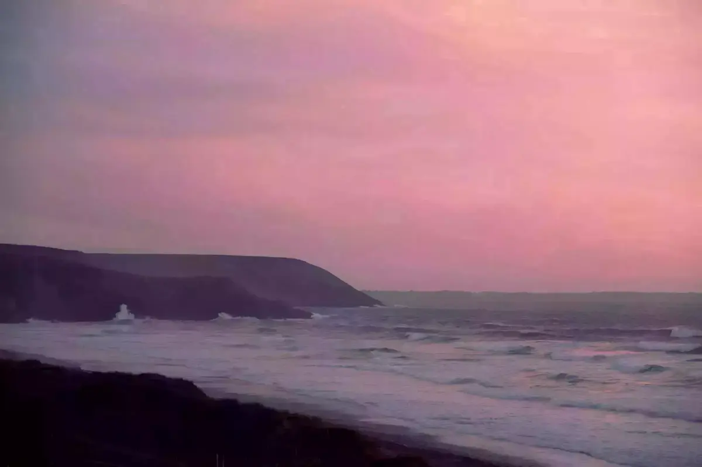

> Homme libre toujours tu chériras la mer

_N'oubliez pas de lire la [première partie](https://yannickschutz.com/bretagne-sud-part-1)_

Départ de notre premier QG en direction de notre camp de base à Crozon. On fait un crochet par la pointe du Raz. Une pause au dernier supermarché avant l’Amérique pour quelques provisions manquantes. Pour le reste, Cloé a eu la super idée de cuisiner des petits plats et les mettre dans des bocaux. La nourriture comme à la maison mais sans devoir cuisiner. Trop bien!

## Pointe du Raz

On se gare et on traverse le "centre commercial de la pointe du Raz". Boucle autour de la pointe, vue sur l’océan de tous les côtés. On aperçoit le phare. On avance et je pense voir le sentier du GR qui continue, on descend, on fait de l’escalade, ce n’était finalement pas là, on remonte. Ca reste une belle aventure pour Tom. Perso, je n’étais pas en reste avec un chien qui voulait sauter au bout de la laisse. On finit la boucle avec une vue d’enfer sur la baie des trépassés. Pourquoi ce nom? Je vous laisse deviner.

## Crozon sud

On reprend la route envieux de se poser et ne plus devoir prendre la voiture quelques jours. On compte bien tout faire à pied sur la presqu’île. On est à 1km de la plage de [la Palue](https://yannickschutz.com/la-palue/), spot de surf assez connu en Bretagne. On va y admirer le coucher de soleil. Il fait bon. Les sentiers sont boueux mais on s’en moque, on a nos chaussures de randonnée pour cela. Arrivée sur la plage, on cherche des trésors. Les plus beaux galets, plumes, coquillages et bois flottés. La mer est haute, les vagues nous jouent des tours. On va se poser sur les restes d’un bunker et on admire le soleil couchant. Le chien court dans tous les sens et en profite un max. C’est génial pour lui et et pour nous.



On continue la découverte des plages le jour suivant, on remonte plus au nord. Les pointes en béton armé de la seconde guerre sont impressionnantes. On explique à Tom leur usage et un peu de cette guerre. On se pose sur la pointe de Lostmarc'h et le vent nous accueille. On admire la vue, on redescend. Une nouvelle boucle jusque [notre base](https://abnb.me/f1bPhdebcV). Je repars voir l'Ile Vierge avant le coucher de soleil. Comme une envie d'encore marcher un bout de [GR34](https://www.mongr.fr/sentier/3/gr-34-le-plus-maritime-des-sentiers-de-grande-randonnee). Des plongeurs s’apprêtent à partir pêcher. Je les observe un peu. Je n’attend pas qu’ils rentrent à l’eau et continue mon tour vers le nord. Du chouette dénivelée de fin de journée m’attend. Des belles teintes rosées aussi. Et cette vue, elle n'est rien qu'à moi.



## Crozon Nord

La pointe de la chèvre et son monument aux marins, on se doit d’aller le voir. On fait une belle boucle, croise pleins de gens et papotons un moment. Une belle journée, de beaux paysages et encore de l’aventure en plein pour le petit bout. On part vers Camaret pour voir la pointe de Pen’Hir et ses petits pois. On découvre aussi une falaise servant de [mur d’escalade](https://www.grimper.com/site-escalade-pen-hir), avec un caillou marqué de mots au sens mystérieux. On finit notre vadrouille et on rentre se poser.

Une semaine déjà, ça passe vite. On a envie de rentrer et on a vraiment aimé cette semaine. Comme quoi, un road trip derrière chez soi, c'est aussi dépaysant que de partir à l'autre bout de la terre. On retiendra ces grosses marrées, ces 50km environ de randonnée avec Tom et surtout le fait que l'on a encore tout à découvrir dans notre nouvelle région.
