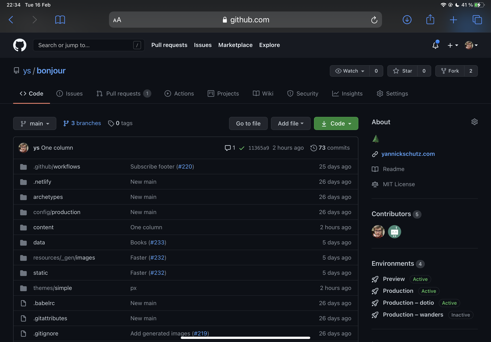
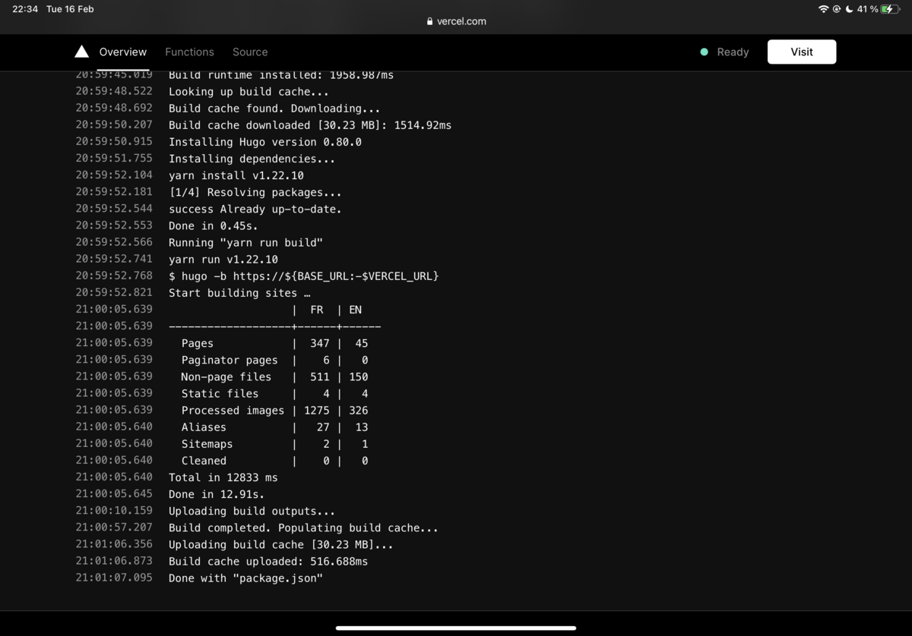

Parfois, je me dis que un petit article sur le derrière de ce site pourrait vous intéresser. Alors, voilà j'écris sur cela. Car en fait, je suis plutôt fier de ce petit bout de code que je vous partage.

J'ai commencé il y a environ 3 ans. Je voulais quelque chose de statique et de simple. Je me suis alors dirigé vers le framework [Hugo](https://gohugo.io). C'est un framework écrit en Go pour ceux qui connaissent. Il permet de facilement créer des sites et des petits blogs. J'ai commencé par faire pas mal de CSS, etc. Tout ça pour avoir un truc propre qui était perso mais avait des fonctionnalités d'affichages qu'on retrouve dans des sites comme [Exposure](https://exposure.co). Je voulais pouvoir raconter des histoires avec des images. Les plus pour moi de Hugo, c'était de pouvoir écrire en Markdown et avoir le thème dans un dossier séparé.

Après avoir envoyé une première version, j'ai partagé mon thème avec [Greg](https://gregorymignard.com) qui voulait aussi s'essayer au statique et quitter Wordpress. C'est aussi vers ce moment là que j'ai commencé à changer des choses car je n'étais jamais satisfait par le résultat. Je suis le genre de personne qui passe du Serif au sans Serif en trop peu de temps, je suis aussi celui qui adore le mono. Oui c'était un passage sur la typographie.

C'est alors que j'ai découvert via des potes designers et front-end la joie de [Tailwindcss](https://tailwindcss.com). J'ai donc viré 99% du CSS custom pour avoir un canvas tout propre et plein de classes CSS. C'est fabuleux à utiliser et super simple. Un peu comme du bowling avec les rigoles bouchées comme pour les enfants. J'ai pu faire évoluer le site vers quelque chose qui me plait encore plus. Même si je continue à changer pas mal de choses. En plus de cela, un [pipeline PostCSS](https://github.com/ys/bonjour/blob/main/themes/simple/postcss.config.js) permet de purger le CSS non utilisé pour ne pas avoir de gros fichiers. La [config Tailwind](https://github.com/ys/bonjour/blob/main/themes/simple/tailwind.config.js) est extensible et m'a permis facilement de rajouter des couleurs et quelques autres changements minimes.

Hugo me permet facilement de rajouter/supprimer des catégories et d'afficher le contenu différemment. Avec le temps, ils ont aussi rajouté la gestion du redimensionnement des images qui m'a permis de ne plus le faire en dehors. Un petit template et voici que toutes mes images sont optimisées sur le site. Je peux vous donner plus de détail là dessus, mais cela me permet de facilement expérimenter et changer les choses.

Mon workflow est simple. Je fais tourner Hugo sur une machine de dev. J'ai un lien en local pour voir mes changements. Je génère les images uniquement lors de la publication de nouvelles images et je les cache (histoire de déployer en moins d'une minute). Je push une branche sur [github](https://github.com/ys/bonjour). De là, [Vercel](https://vercel.com), mon hébergeur, va créer une nouvelle version statique du site sur une URL de preview. J'ai une [GitHub Action de Calibre](https://calibreapp.com/blog/compress-images-in-prs) qui va optimiser toutes mes images pour gagner en vitesse. Je vérifie et merge ma Pull Request. Sur la branche `main`, cela finit en prod sur [yannickschutz.com](https://yannickschutz.com). Aussi simple que cela.

A côté de cela, pour chaque déploiement, une integration fait tourner lighthouse de google sur mon URL pour voir un audit de performance. Vous pouvez aussi le faire via [web.dev](https://web.dev)

Tout mon site est open source et visible sur [github.com/ys/bonjour](https://github.com/ys/bonjour). La contenu bien que présent reste ma propriété. Mon template d'image qui a été sans doute retravaillé 10 fois est [../themes/simple/layouts/shortcodes/photo](https://github.com/ys/bonjour/blob/main/themes/simple/layouts/shortcodes/photo.html). Il peut sans doute être re optimisé, mais ça me suffit.

Je pourrais parler plus en détails de beaucoup de choses, n'hésitez pas si vous avez des questions.

