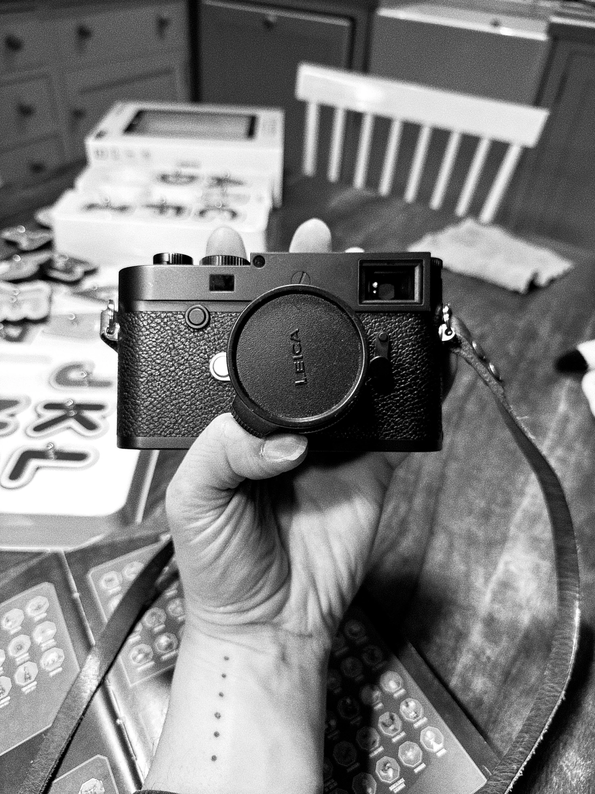

With the new year and fresh thoughts on projects, I decided to dip my toe back into the world of digital cameras. It had been a few years since I really delved into using one. I had some ideas about what I wanted, but I wasn't entirely certain. A friend suggested getting one second-hand from MPB, which I thought was a great idea. I didn't necessarily need the latest generation of anything; I just wanted something that could capture good enough digital images. After all, I'm not a medical device.

So, the quest began. I chose to start by testing the Fuji X-Pro 3, a camera I had been eyeing for a long time. I decided to test it with my Leica lenses. However, to my disappointment, it caused discomfort in my wrists and head. I couldn't quite pinpoint why. Same feeling when I held a Contax G2. I wanted to like this camera. But, it was a physical rejection. Fortunately, thanks to MPB's generous return policy, I was able to send it back.

Next, I tried the Fuji X-H2, which had a lot of appeal to me. My friend Greg offered to lend me some lenses, and I could even use his Aquatech housing if needed. There were many positives about it. Once again, after ordering from MPB, receiving, and testing a few lenses, I felt the same dissatisfaction and returned it. Back to square one.

Then, it got clear, my heart was already set on a camera similar to my M6. I mean, Cloé knew it all along. Could it really be that simple? I've had the Leica M10-P for about a week now, and I think it might just be the solution. I needed a slower camera. Time will tell how it fares in the long term, but I'm enjoying using something that mimics the experience I have with film. Sure, it has a screen and a memory card, and it's not film. But goodness, it's a pleasure to use.

