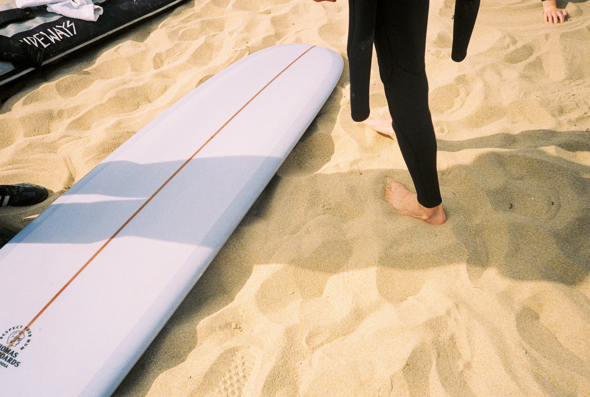

*Texte écrit pour le Gwidel Log Fest, paru sur [Instagram](https://www.instagram.com/p/C2c8BhqL84h/)*

Ce n'était même pas encore mai, mais on ressentait déjà cette atmosphère estivale caractéristique du sud breton. Un avant-goût du bel été à venir. C'était une première pour moi de venir prendre des photos lors d'un tel event. Je dois avouer que je ne savais pas à quoi m'attendre et que je ne connaissais pas grand monde. Une belle opportunité, diriez-vous.

L'ambiance était pleine de sourires, les gens rigolaient, ça discutait dans tous les sens. On comparait les shapes, on observait les planches sans se prendre trop au sérieux. Se prendre trop au sérieux est un mal moderne, mais après le surf A-dreuz, on sait que ce n'est pas le genre de la maison. Le maître de cérémonie le confirme totalement. Nous sommes dans un décalage, mais les orteils vont quand même finir par se retrouver sur les noses.

Je regrette un peu de ne pas avoir pris mon appareil aqua pour tenter de capturer l'essence même du longboard à Gwidel. Mais l'ambiance sur la plage est tellement bonne que cela s'oublie rapidement. Je prends quelques clichés variés, je discute, je découvre le beau monde présent. Je croise des visages familiers et beaucoup de nouveaux.

Il est déjà l'heure de rentrer après avoir apprécié les heats. J'en ai pris plein les yeux, me suis fait des potes, et je sais que je reviendrai pour la prochaine édition. C'était clairement l'esprit bienveillant et accueillant que j'espérais trouver. Avec le Nikonos pour la prochaine.

Pour plus de photos, je vous invite à aller sur [le post](https://www.instagram.com/p/C2c8BhqL84h/?img_index=1)
