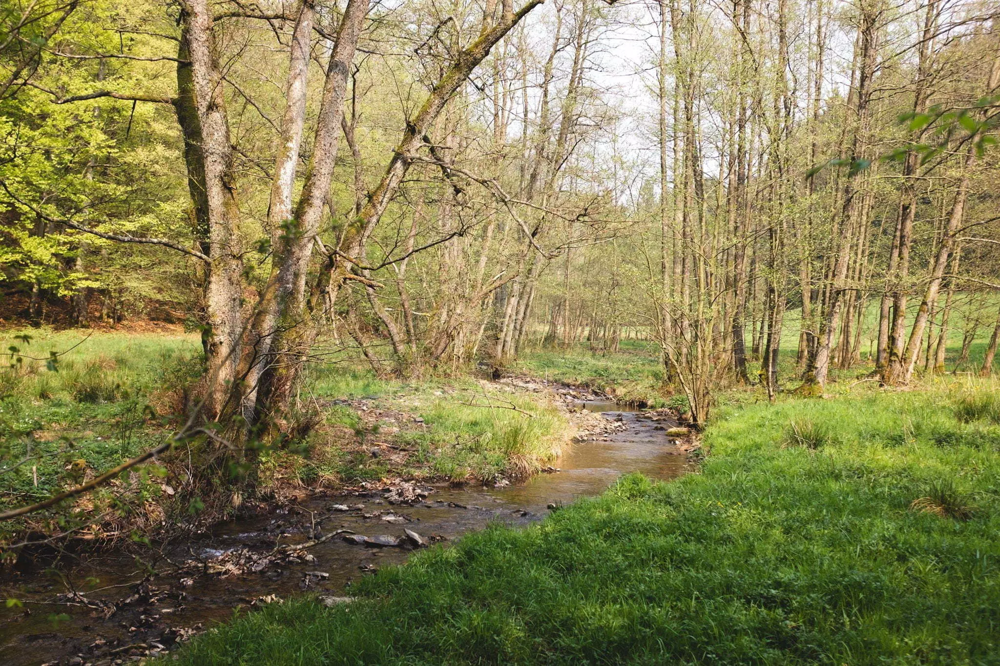
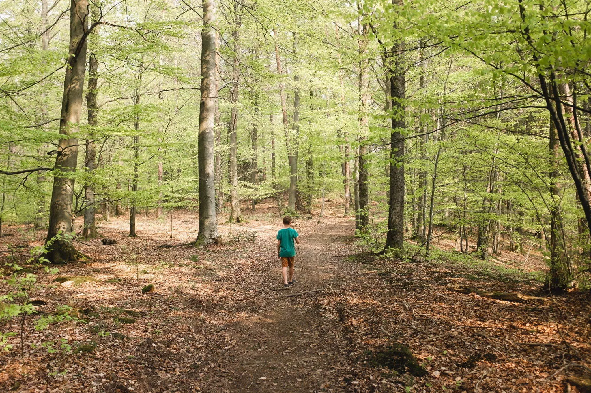
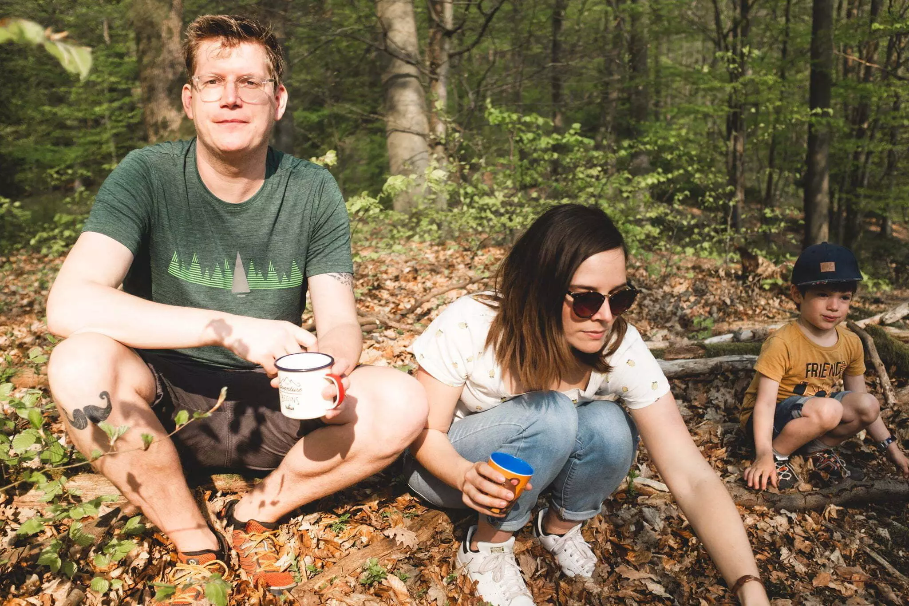

C'est une belle après-midi de printemps, on est invité chez Anne et Martin à l'orée du bois. Après avoir chassé les tritons dans leur mare, on décide d'aller faire une petite balade en forêt.

La lumière est belle, la journée aussi. Martin se plait a faire rêver Tom en lui racontant la forêt, ses animaux et ses raccourcis. On est bien dans les bois et décidons de détacher leur chien. Il flaire quelque chose, ce n'était pas prévu et on le voit filer comme si il était possédé. Martin part à travers bois après lui. On patiente un moment, Tom s'amuse à soulever des bois plus lourds que lui et faire aller ses gros muscles.

On  en profite pour papoter. On entend le chien aboyer au loin. Puis plus rien. Martin revient et on reprend la route. Rien ne sert d'attendre Nelson, il pourra nous flairer quand il reviendra. On se pose un peu plus loin et buvons un coup assis sur des troncs. Des jeux d'approche et d'observation pour amuser les deux Toms. Le temps passe et on s'amuse.



On entend du bruit dans les buissons, Nelson réapparait haletant, il a du bien se dépenser. Il ne nous dira pas ce qu'il a chassé. On reprend notre route. Les bois sont magnifiques. Cette forêt d'Ardenne me manquera en Bretagne. J'en profite pour tester le Fujifilm X-T2 et je suis conquis. Il sera mien.



A la fin de la balade, Anne nous fait découvrir les 50000 abeilles qu'ils viennent d'adopter.
Le barbecue chauffe et on passera une belle soirée dehors à discuter.

