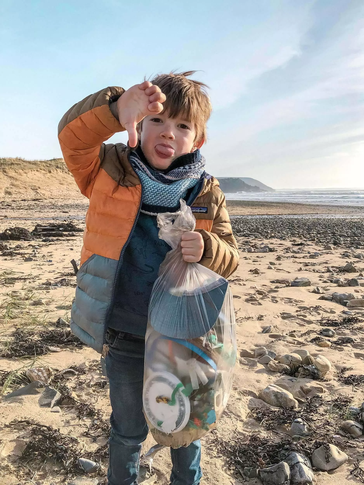

Ce sont les petits gestes qui comptent pour aider l'humain à avancer. Il en faut des gros, c'est sur. Mais il nous faut aussi des petits gestes. Comme disait la compagnie Créole, c'est bon pour le moral. Et vous savez ce qui aide le plus à avancer? Positiver. Les émotions sont contagieuses et je préfère en partager des positives que des négatives lorsqu'on en vient à notre planète.

Alors, on apprend les petits gestes à Tom. Il a besoin de comprendre que la terre va mal, et que c'est de notre faute. Il a aussi besoin de savoir, déjà à cinq ans, qu'il peut avoir un impact positif sur notre belle planète.

Un des petits gestes qu'on a pris comme habitude, c'est de nettoyer les plages. Il suffit de [deux minutes](https://beachclean.net) pour aider nos plages. Plus c'est mieux mais déjà deux minutes suffisent a la rendre plus belle. On a toujours un distributeur de sacs dans notre sac à dos. Un truc en plastique offert par [AS Adventure](https://www.asadventure.com/) qui nous permet de faire des petits sacs poubelles. Du plastique pour enlever le plastique, un peu ironique mais au final, ça marche pas mal. Et dès que l'on voit des déchets, on les ramasse, les stocke et les jette une fois la balade finie. Il y a bien sur aussi les [bacs à marée](https://bacamaree.fr) qui poussent un peu partout en Bretagne et ailleurs. N'hésitez pas à y ramener les bouts de cordes et autres detritus que vous trouvez. Gardez les vôtres, dans vos sacs, et jetez les dans une poubelle une fois la sortie finie. Cela ne demande pas de gros efforts. Si on prenaient tous ces deux minutes et si on réfléchissait avant de jeter quelque chose sur la plage, on y serait encore mieux.

Si vous voulez aussi aider nos océans et plages, n'hésitez pas à aller faire un tour sur le site de [Surfrider](https://www.surfrider.eu) ou [Surfers Against Sewage](https://www.sas.org.uk/). N'hésitez pas à faire des dons ou à donner de votre personne. Votre temps est votre don le plus précieux. La Terre vous dit merci. Et Tom aussi.

