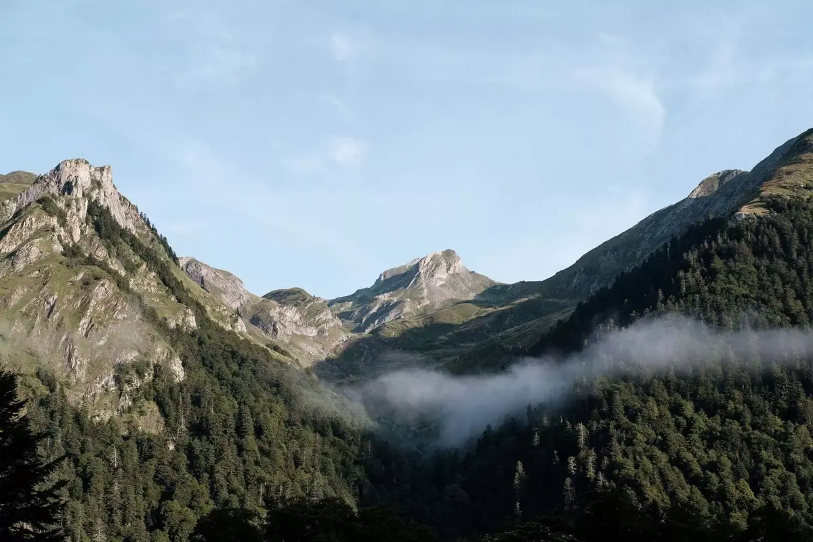
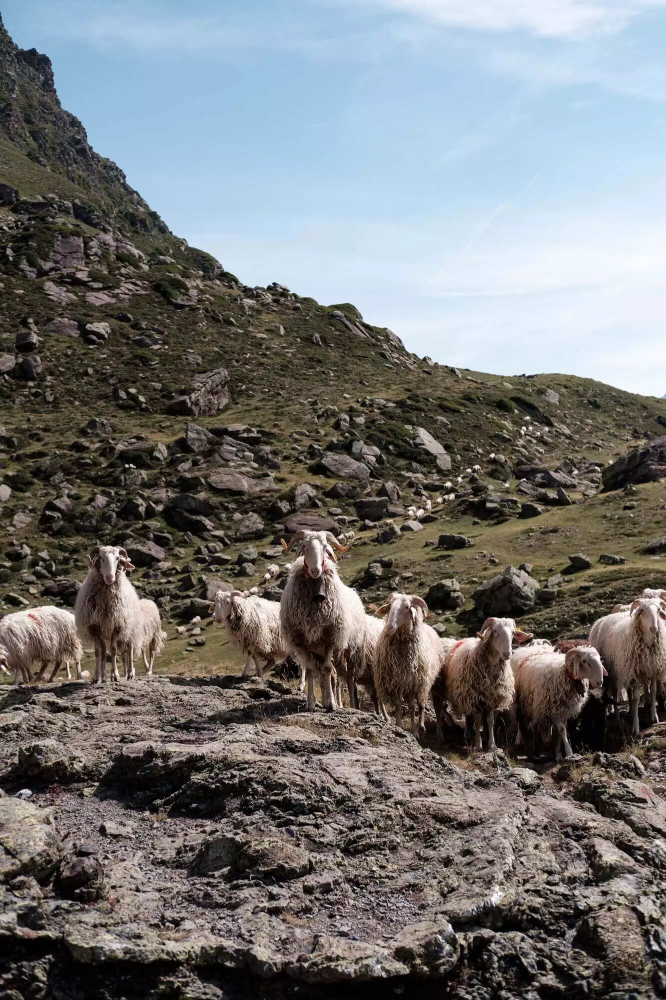
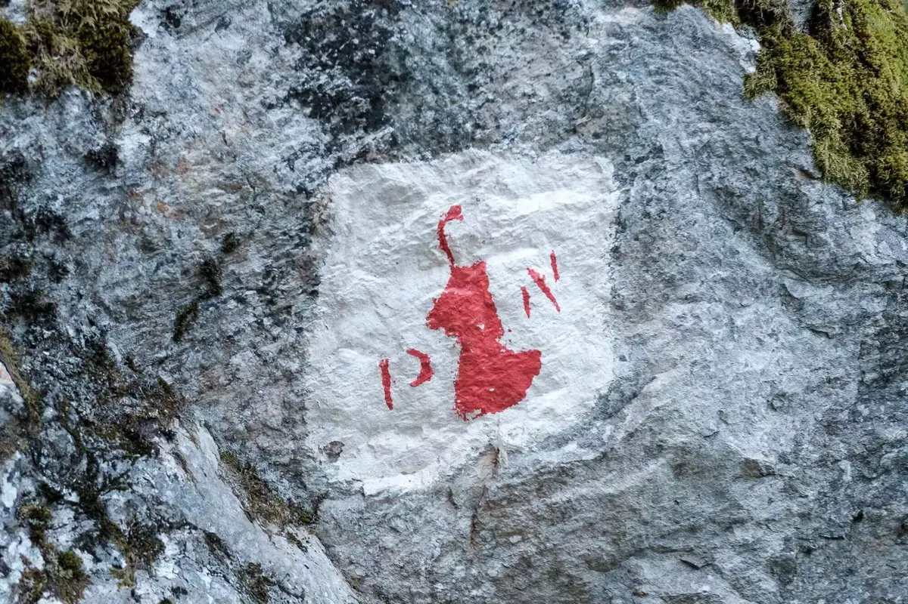

It's 6:30 am, time to get to the parking lot. That parking lot can get full pretty quickly. A guard told us that we needed to be there before 8am if we wanted to get in. We have a full tank and an hour drive ahead of us, we should be all good.

Stop at the bakery. A lady grabs her bread while the waitress is preparing our sandwiches, Shameless. Apparently, she's heading to the same place as us. A race on the small mountain roads between Arudy and Laruns is on! Cloé is full Fast and Furious! Looks like parking spots are in high-demand and people have stopped playing by the rules to get a spot for themselves. 8:05am, we get to the gate. The guard let us go. We made it, they closed the gate a car behind us. Thanks Karma!

Time to grind the beans and get the water hot. A good coffee is mandatory to start the day. A good breakfast will be served to get ready for the hike. You need energy to get up there they said. Looks like the path will be steep. We already got some altitude change during the week with Tom. It doesn't scare us. We are excited! Only downside, we won't be able to continue after the refuge with Oggy. You are not allowed to enter the national park with dogs. It is going to be a round trip.



From Edgar, we already have a scenic view. We start slowly up to a wonderful plateau with cows roaming freely. A great place right before entering the woods and following the cairns to not get lost. Actually, you can just follow people, it is summer and many folks had the same idea. People are cheering on the 5 year old as he passes by.

Once we exit the woods, the panorama is breathtaking and stays that way until we reach the lakes. We get to the first one, the Roumassot lake connected to the second, Miey lake, via a waterfall. After that one, it doesn't take us long to get to the wonderful Gentau Lake and its refuge. We arrive at the same time than a flock of sheeps led by a shepherd's dog they call a "patou". We'll never forget that white ball of fluff who walked around us. The dog will come to us and play with Oggy a little bit. Once we are wool free again, we will stop near the lake facing Jean-Pierre, the pic du midi d'Ossau. Time to eat our sandwiches. Horses will run next to us to the lake for a little sip.



We see people packing their tent. They are getting ready to continue their hike or to wander around the lake. We chat with a couple that arrived via the pic the day before. It is their day off. They described vividly the rest of the loop. It will bring Cloé to convince me to finish it alone while she take walk back with Tom and Oggy. We take a look at the map, we should arrive about the same time where we saw the cows.

Let's go, I leave the refuge behind me after filling my water bottle. Time to climb the steep path into the National park. After the Ayous lakes, you get a set of smaller beautiful lakes. I pass next to many people with binoculars watching birds. I will think about it for next time. The beauty of the nature and landscapes is enough for me this time. I walk faster alone and it is a real pleasure to be there feeling like an ibex jumping from rock to rock. After Bersau lake, time to go down with an ease that surprise me.



After climbing down, my legs are aching a bit and I feel less adventurous. I am glad it is mostly flat til our meeting point. I will see pigs roaming freely and Tom won't believe me. Glad I took a picture to show him. Getting near to the rendez-vous, I see a little bud waving at me. They arrived a bit before me. Time to get back to the car. Actually, one last stop at the small snack serving pancakes and beers. It won't be the best one for someone living now in Brittany (It is a specialty here) but it will be satisfying anyway. Specially because it comes with a nice local beer.

I cannot wait to do it again with Tom, Cloé and our little girl. Why not also sleep up there in a tent, take a swim in the lake when waking up and continuing. This hike was epic!

*You can find this tour in the [Microadventure guide](https://www.lesothers.com/guide-microaventure-france) published by Les Others*
