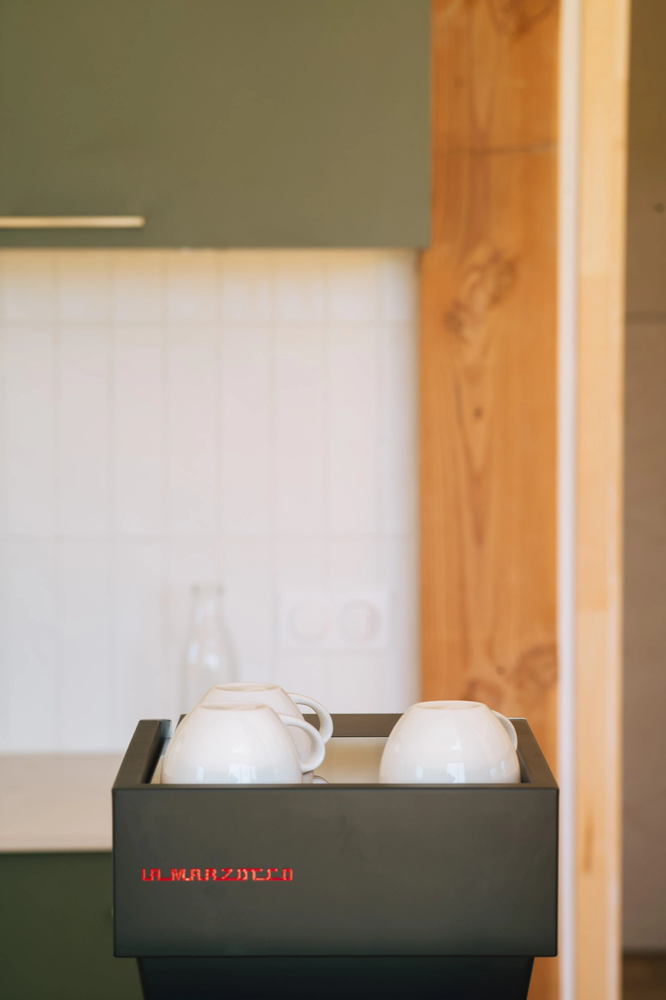

With [Douarenn](https://en.douarenn.fr), I’ve been fortunate enough to catch the attention of [La Marzocco](https://lamarzocco.com/fr/en/). This led to me testing the [Linea Micra](https://lamarzocco.com/fr/en/home-products/espresso-machines/linea-micra/), which was quite a dream for me. The craftsmanship involved in creating these machines, the innovation, the design, all of it is pure magic. 

When I got the opportunity to try it, you can be assured that it was in an amazing environment. Recently, at Douarenn, we began chatting with Antoine from [Café Sable](https://www.sable.cafe/). He recently moved to Crozon and started his own coffee roasting business. He used to be a Barista at l’Alchimiste in Bordeaux before. With that in mind, I asked him to teach me the lost art of steaming milk and latte art. My artistic skills were closer to Pollock's. 

We arranged to meet at Douarenn so he could familiarize himself with the place where people will soon enjoy his coffees. It was a sunny day, and our discussions were quite endless and full of passion. In the end, I learned just enough to become proficient with the steam wand. Now, it's time to put that knowledge into practice. Be ready for way too many pictures of my screwed latte art.



