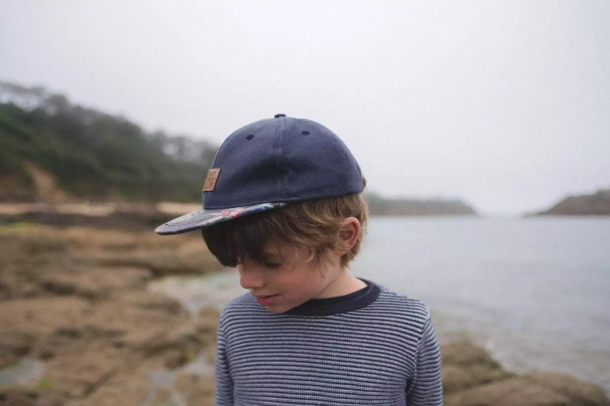
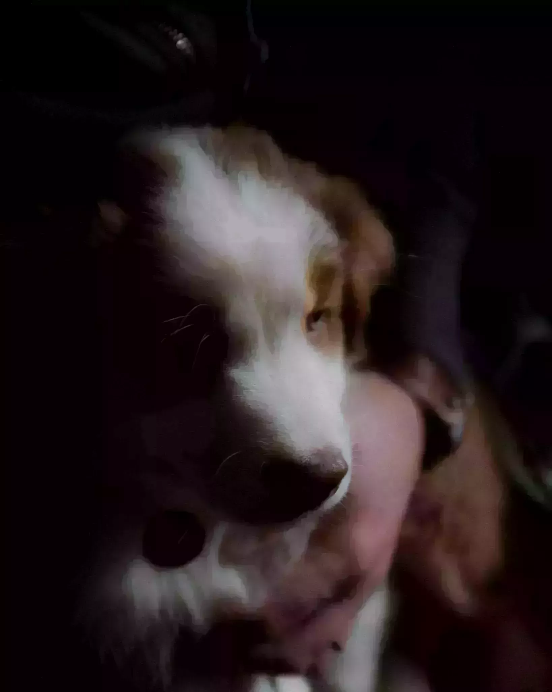

Aujourd'hui, je viens de manger notre première pomme. Ca vous fait un truc quand elle vient de chez vous. Votre production donne ses fruits. C'est assez fou, on les a pas planté. Merci les anciens propriétaires mais quand même. Enfin je mens, j'en ai déjà mangé mais c'était de la compote en fait. Ca fait quand même plus quelque chose quand tu croques dedans.

Un lot de choses se sont passées. Certaines que je vous raconterai d'autres pas. Mais c'est fou le nombre de premières que j'ai eu en étant ici. En une journée, mes premières bottes en tant qu'adulte, j'ai acheté ma première clef à bougie et la bougie qui allait avec, je l'ai changée et ai réparé la tondeuse grâce à cela. J'ai aussi le lendemain tondu pendant une heure trente, et en fait c'était relaxant de se vider la tête.



Les démarches avancent, on a fait de belles petites balades, on a découvert de belles plages. On a rencontré un peu les voisins et on se dit qu'on sera bien ici. La Bretagne n'a pas connu la canicule et on avait bon quand le reste de l'Europe suait. Notre potager se porte bien, il pleut effectivement en Bretagne mais vraiment pas trop en fait. Ca nous a permis de rester un peu à la maison et de profiter du salon. On a aussi pris le temps de faire un feu pour couper le froid. Ca prévoit des hivers fantastiques.

Ah oui et aussi on a agrandi la famille. On a maintenant un petit ami à quatre pattes nommé Oggy, un bébé berger australien adorable. Il aime pas encore ni son collier ni sa laisse, mais nous il a l'air de bien nous apprécier. J'ai hâte de pouvoir faire de belles vadrouilles avec lui. Découvrir la Bretagne en automne à nous quatre ca promet de fantastiques photos et moments. Mais ca sera pour plus tard.

  
