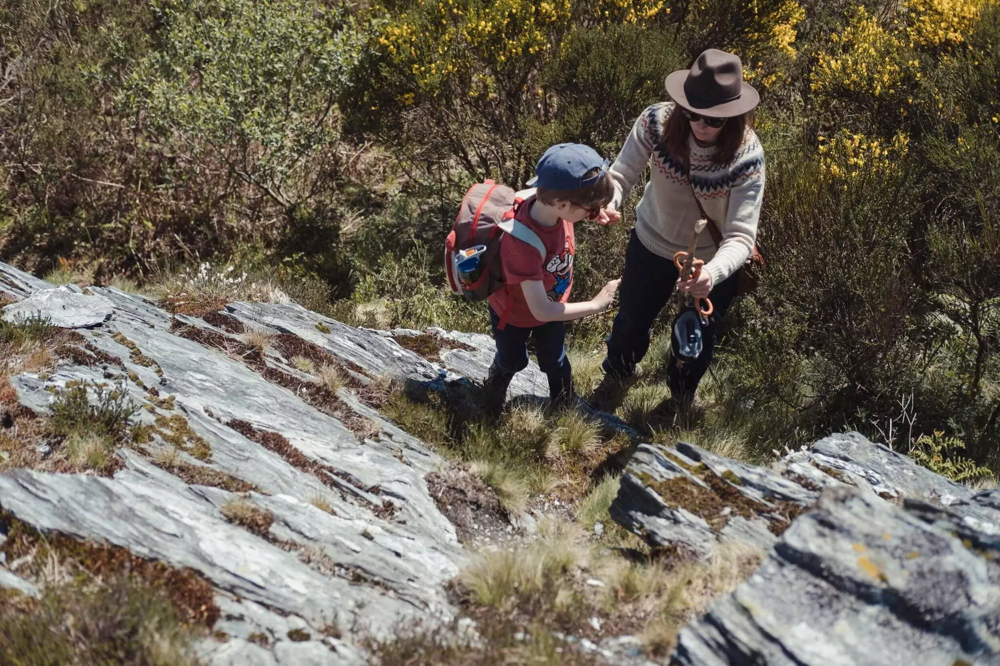

On est déjà fin mai. Le temps file. Le jardin a repris vie. Le potager recommence maintenant que les Saints de glace sont passés. On a hâte de pouvoir recommencer à consommer nos produits. Pierre notre voisin nous a proposé de planter nos tomates dans sa serre. Tom recommence à grimper aux arbres et trouve de nouvelles cachettes secrètes. Nous on a ressorti le barbecue, en fait on l’a pas vraiment rangé. On a sorti aussi les fauteuils de jardin. Quel plaisir de passer autant de temps en plein air.

J’ai aussi eu l’occasion de prendre le vélo pour amener et aller rechercher Tom à l’école. Les petites routes de campagne, malgré le faux plat constant, sont vraiment agréables. Ça me fatigue bien mais je pense que je manque juste d’entraînement. On verra en milieu de belle saison.

Le printemps, c’est aussi le renouveau des balades. On a pu aller faire 10km dans les Roc’h. Une balade de 10 ans comme on dit à Tom, un kilomètre par an. Il était fier, nous aussi.

C’est vrai que l’on se balade toute l’année. Qu’il pleuve ou pas. Mais c’est carrément plus agréable de pouvoir se poser et pique niquer en cours de balade. Ça permet de rallonger le temps passé dans ces magnifiques lieux de Bretagne. Toujours aussi agréable de vivre là où d’autres vont en vacances.



On arrive au parking qui est déjà bien plein. C’est vrai qu’il est déjà 10h. Deux filles sortent des chevaux pour une petite chevauchée.
La première partie de la balade commence au parking au pied de roc’h Trevezel. On y grimpe puis on file vers le sud. On ne montera pas au sommet cette fois-ci. Il est déjà grouillant de monde. On a une vue à 360° juste fabuleuse. On peut voir la côte quasiment. D’un côté les petits villages et les bocages typiques du centre Bretagne. De l’autre le lac réservoir de Saint-Michel et le Yeun Elez. Ce dernier doit encore s’offrir à nous lors d’une future vadrouille.

Il est déjà midi. On marche bien mais c’est l’heure de manger. On a pu se poser en haut d’un rocher. Oggy restait et observait, bon chien. Ce rocher abritait une drôle de bouteille cachée sous une pierre. On aurait dit un grog qui traînait la pour au cas où. On profitera de la vue avec un sandwich au jambon. Petit moment parfait qui valait trois étoiles au Michelin

La balade est principalement en bord de route dans sa seconde partie. Ce qui est beaucoup moins agréable. Nous passons par Botmeur. Charmant petit village d’où partent pas mal de randonnées. D’ailleurs quand on passe, un groupe se prépare sur la place du village. Ce groupe nous rattrapera d'ailleurs. On fait des pauses pour regarder les vaches qui nous suivent dans leur pré, quelles curieuses. On s’arrêtera aussi pour papoter avec un couple en van, qui s’était arrêté pour manger. Cela me donne envie. Cela ne saura tarder.



Oggy a attrapé une sorte de conjonctivite durant la balade. Pas très agréable pour lui. Mais, il a juste adoré se rouler dans les hautes herbes pour frotter son œil. Il a sans doute dû courir trop vite. Quelle flèche cet animal. Encore heureux qu’il écoute de mieux en mieux. Il était détaché la plupart du temps quand on était pas sur la route. Même si il file parfois loin, il revient toujours et nous cherche si il ne nous voit pas.

Ces 10km étaient vraiment agréables sous ce soleil de printemps. Même si comme à mon habitude, j’ai fini avec des coups de soleil. J’ai hâte de découvrir d’autres endroits pour d’aussi belles boucles.
J’ai aussi hâte de revenir sur les roc’h au coucher du soleil et à l’heure bleue.


