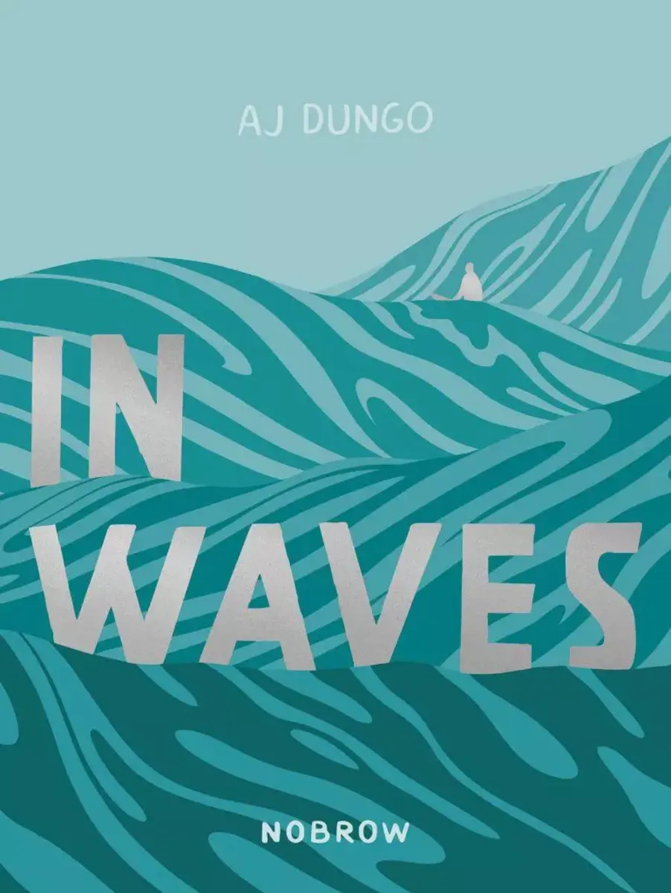
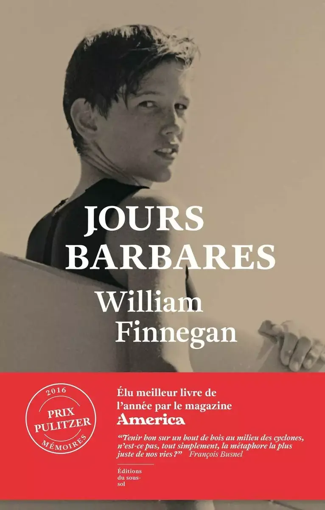

J'adore lire. Je voyage beaucoup par la simple lecture. Je me motive à faire et me surpasser rien qu'en lisant. J'ai lu de chouettes livres sur [le surf avant de m'y mettre](/se-mettre-a-l-eau). Ces livres m'ont poussé à l'eau. Je me suis dit que vous faire une petite note sur deux de mes favoris vous ferait plaisir. C'est l'été, on a tous besoin d'un bouquin à mettre dans le sac pour ces vacances au jardin.

## [In waves](https://www.librairiesindependantes.com/product/9782203192393/) - AJ Dungo

Un roman graphique frais et beau. Une magnifique histoire de surf et de deuil. On y parle de comment supporter la perte d'un être qui nous est cher. Le surf comme métaphore. Les vagues vont et viennent, le but c'est de rester debout et de ne pas se laisser emporter. AJ Dungo intègre intelligemment une petite histoire du surf dans l'histoire de sa relation avec Kristen et son combat du cancer.
Les couleurs sont celles de l'eau, de l'océan mais aussi de la nostalgie. Son dessin vous emporte facilement dans les vagues.

## [Jours barbares](https://www.librairiesindependantes.com/product/9782757871317/) - William Finnegan

Une super biographie qui nous fait voyager de à travers le monde. Une chasse aux vagues à laquelle nous invite William Finnegan. Son portrait nous permet d'entrevoir une vie différente des envies standards de ce monde. Une vie pleine de passion racontée de manière intimiste. Une de ces histoires qui m'a tant donné envie de me lever tôt, de mettre la planche sur la voiture et d'aller attraper des vagues. Le temps d'un livre, j'ai fait le tour du monde. Même si le monde a totalement changé entre-temps. Je m'y suis vu. C'est ce genre de bouquin. On comprend pourquoi il a eu le prix Pulitzer. J'ai même envie de le relire en français.

Voilà, c'était court mais j'espère toujours ne serait-ce inspirer que l'un de vous. Si vous me lisez :)
