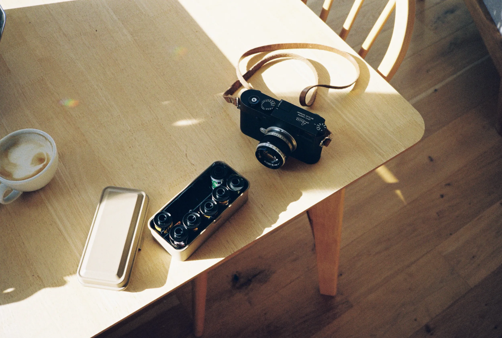

Cela va bientôt faire un an que j'ai repris le numérique. Je ne m'y fait pas encore totalement mais clairement cela à changé ma pratique de l'argentique. Un peu comme un cheat code, j'ai avancé dans ma pratique en pouvant refaire des erreurs. Je me permet plus d'expérimentation depuis que ce boîtier m'a rejoint.

Il m'a suivi dans tous mes voyages de l'année et ne m'a jamais déçu. Je l'ai trimballé au Maroc, sur les côtes atlantiques et en Californie. En combo avec le M6, il est parfait. Une petite pochette peak design dans un tote bag et me voilà avec deux boîtiers et trois objectifs. Je peux jouer les plans larges avec le numérique et rapprochés à l'argentique. Interchanger et avoir mal à l'épaule le soir. Car ces deux briques pèsent leur poids... 

Je peux aussi prendre que le numérique et un point and shoot et c'est le kit ultra léger parfait pour moi. J'y pense d'ailleurs pour le prochain voyage. Histoire de ne pas me détruire les épaules. Car c'est quand même utile comme partie du corps, je trouve. Je ne sais pas si vous avez déjà essayé de vous en passer pendant une journée, mais c'est plutôt compliqué. Cela tient bien les bras en place.

## Alors? C'est comment?

Ce Leica M10-p est un plaisir à utiliser. Son rendu est magnifique, le bruit en basse lumière est même agréable. Il tient bien la charge et est un super compagnon pour une journée de shoot. Tant pro que perso, je me plais à le balader partout. Il me fait questionner l'argentique car il a pour moi les avantages du M6 et la facilité du numérique. 

Être en full manuel est compliqué dans certaines situations, mais cela me permet de ralentir. Penser, mesurer, poser, déclencher. La différence de l'argentique, c'est que je vois la photo de suite. Je peux corriger plus simplement. Je ressemble à un homme des cavernes qui a découvert le feu en disant cela. J'en suis conscient. Mais en même temps, être en full manuel permet de faire des erreurs qui parfois sont de belles surprises. Faire des erreurs, c'est apprendre et si en plus tu apprends et tu as une surprise, c'est comme quand tu as la meilleure surprise dans les Kinder. 

C'est appareil ne fait pas de vidéo. C'est un fait. Pour certains c'est un point négatif, pour moi un détail. Je ne fais quasi pas de vidéos. Je préfère donc que mon appareil ait tout misé sur la photo. Je sais que ils peuvent faire les deux, c'est un parti pris. 

Autre avantage Leica, c'est la taille des optiques. Je peux partir avec un 35mm, un 50mm et un 90mm dans la peak design S sans aucun souci. Je pourrais même avoir deux optiques de montées et une dans la poche. C'est hyper compact pour des objectifs avec une sacrée ouverture. Mis à part mon 135mm qui ressemble à un gigantesque canon. Je pourrai vous en parler plus de ces optiques dans des articles futurs je pense. Je les ai utilisé tant sur le M6 que sur le M10-p mais aujourd'hui, je ne suis pas là pour elles.

Niveau esthétique, c'est une magnifique brique. La peinture noire commence un peu à se patiner et révèle un magnifique cuivré dessous. La face arrière n'a que quelques boutons et tout est facile d'accès. Les molettes de vitesses et d'ISO sont agréables et bien situées et la molette de compensation d'exposition juste facile à jouer avec pendant la prise de vue. J'adore qu'ils ait gardé le design de la plaque pour accéder à la batterie et à la carte SD. Certains détestent, moi j'adore. 

J'avais failli chercher son frère, le m10-d, sans écran histoire d'avoir l'histoire la plus pure du numérique mais en vrai, j'adore le focus peaking sur l'écran. Cela me permet d'être plus rapide parfois que la classique surimpression de deux images dans le viseur. Un peu de technologie aide parfois. J'adore le télémétrique quand même et je suis plus souvent le nez sur le viseur que sur l'écran. Par contre, le m10-p a un écran tactile. Et pour le sens du toucher, il n'y a pas que les doigts malheureusement. Parfois, mon nez me joue des tours et bloque la photo. 

Il a parfois un bug étrange où il se freeze totalement et je dois alors sortir la batterie pour tout relancer. C'est arrivé deux trois fois. Je ne m'en inquiète pas. Je vois que ca arrive sur plein de Leica, c'est plutôt surprenants mais je me demande si d'autres marques ont pareil ou pas. Bon, j'ai fait une recherche Kagi et d'autres marques ont pareil. Cela semble être l'appanage de l'électronique. Un point pour mon M6.

Les fichiers sont un plaisir à éditer même si je me prend toujours autant la tête lors de l'édit. Je pars sur une base assez agréable à l'oeil qui ne requiert pas beaucoup d'ajustements niveau de la balance des blancs ou des courbes. C'est surtout l'ajout d'un preset que je fais en masse puis des micro ajustements. Je n'ai jamais été un grand fan de l'édition photo. Du moins, je n'aime pas y passer un long moment. Et c'est parfait avec les DNG de ce boîtier. L'appareil a un WIFI intégré et l'app iPhone marche vraiment bien comparé aux apps que j'ai pu tester par le passé. Une belle intégration en voyage permet de décharger puis d'envoyer dans Lightroom en un clic. Je m'en sers souvent plutôt que de sortir la carte SD. 

## Si tu pouvais conclure, ça serait pas mal

C'est un appareil plutôt agréable à utiliser. Est-ce que tu peux faire les mêmes photos pour moins cher? Sans aucun doute. Même si je trouve que Leica a ce petit je ne sais quoi que les gens détestent entendre venant des propriétaires de Leica. Ce n'est clairement pas un appareil à mettre dans toutes les mains. Il n'est pas forcément fait pour un débutant, ni pour la plupart des photographes qui préfèreront les DSLRs. Je comprend totalement, mais moi j'y ai retrouvé une acceptation du numérique que je ne trouvais pas ailleurs. Pas faute d'avoir essayé comme vous pouvez le lire dans mon article sur la [quête digitale](/digital-quest) (il est en anglais). Parfois, il m'est difficile de choisir entre lui et le M6 pour sortir. Mais je ne regrette jamais lorsque je le prend.


