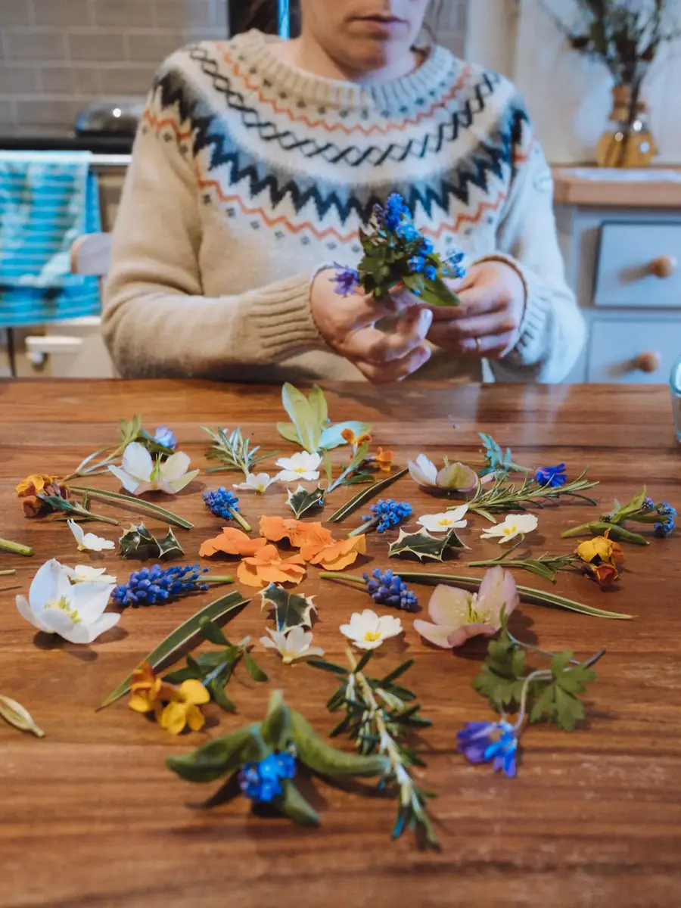
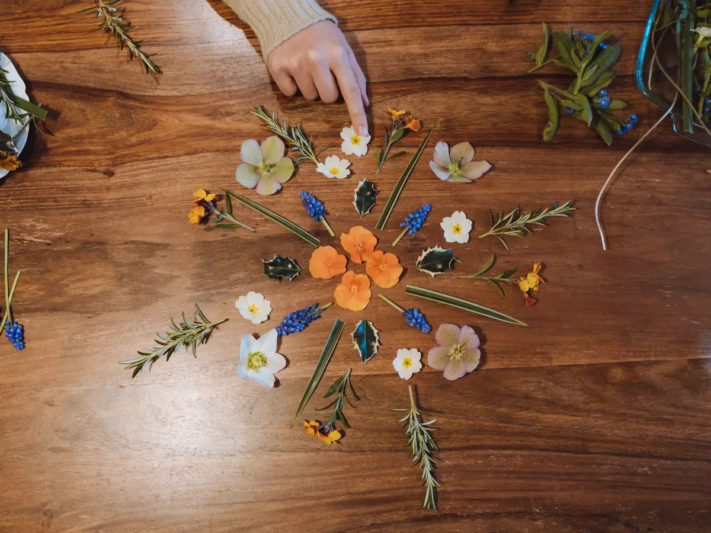
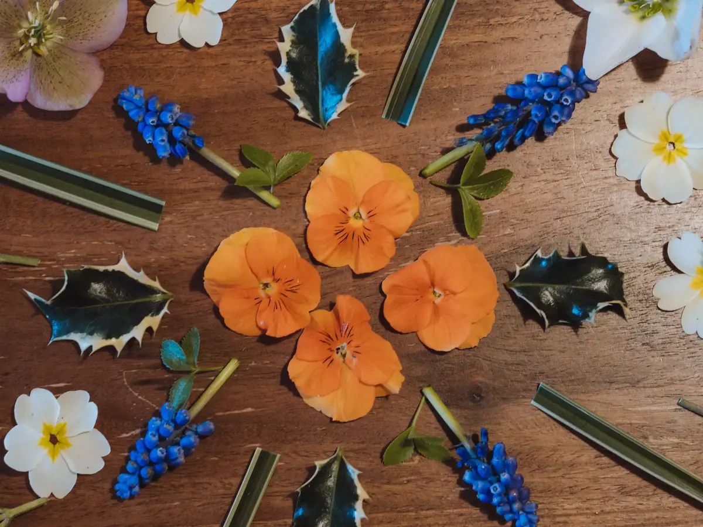

**Mandala**: n.m. _Dans le tantrisme hindou et bouddhique, diagramme symbolique représentant l'évolution et l'involution de l'univers par rapport à un point central._

 

C'est dimanche, on lit l'e-mail de Gaetane, la maitresse de CP de Tom.

L’école s’adapte. Tom reçoit des e-mails de ses deux maitresses. Elles redoublent d’inventivité pour amuser les enfants en plus de les faire apprendre.
Sa maitresse de CP a eu l’excellente idée de lancer des défis aux familles. C’est amusant, la semaine dernière, c’était une recette de cuisine. J’ai eu droit à de bonnes gaufres de Liège.

Cette semaine, c’est la création d'un mandala naturel. Défi accepté et relevé.

Après un bref passage au jardin, Tom et Cloé reviennent le panier chargé de plantes, fleurs et feuilles. Le matériel est prêt. Plus qu’à créer.

Tom va chercher son appareil photo, il copie son paternel et décide aussi d’immortaliser ce chouette moment de création. Cloé suggère et découpe, Tom prend le temps de placer. Une moment amusant à observer.

L'école continue le dimanche, on aime apprendre, on aime jouer, on aime créer. Au final, l'école ne s'arrête pas aux leçons. Vivement le défi #3.

Les mandalas, alignements et autres créations natures me rappellent fortement [un compte instagram](https://www.instagram.com/coldatnight/) que je suis. [Sian](https://www.instagram.com/coldatnight/) vit en Angleterre avec son mari et sont propriétaires de [Fforest](https://www.coldatnight.co.uk). Ils sont un peu une inspiration pour nous. C'est beau, c'est simple et proche de la nature, je vous le suggère fortement!







**Un grand merci à Gaetane et Marina, maitresses à l'école de Berrien.**
