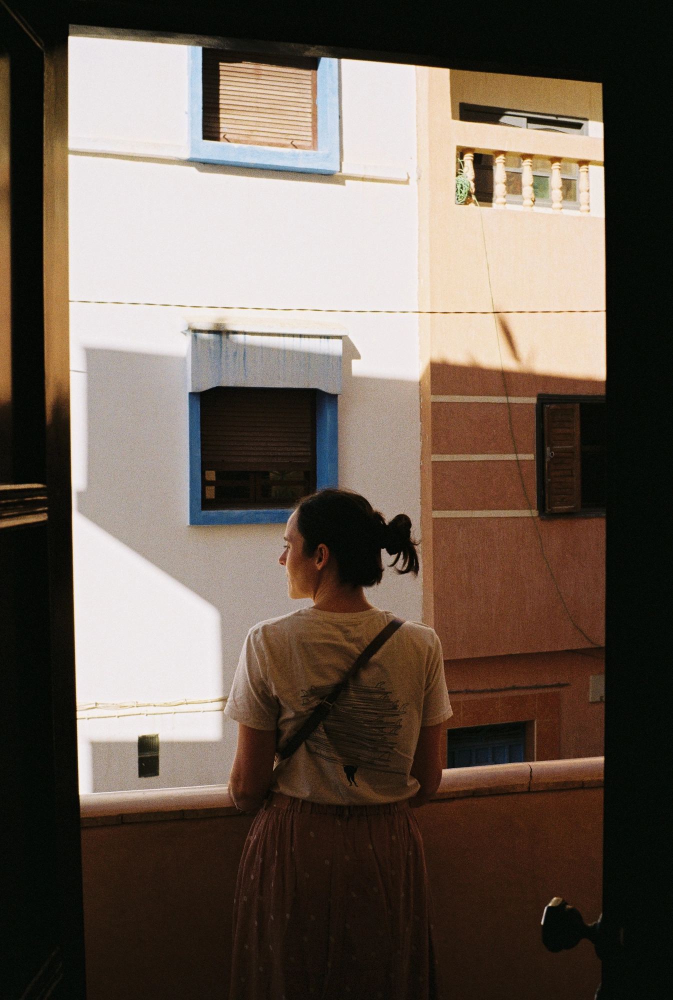

Les mois noirs, en Bretagne, on te dit que si tu arrives à les passer, tu pourras rester sans souci en Bretagne. On la fait les premières années. Là, cela fait deux ans que l'on se permet un break de vitamine D. Cela fait longtemps que Cloé veut voir le Maroc. Donc on a décidé d'y passer le nouvel an. 

Le Maroc, c'est plutôt étendu. C'est un pays aux milles visages. On a donc dû choisir. Une semaine là-bas, on a pris une maison pour quelques jours dans la médina de Essaouira. Puis on est descendu deux jours sur Tamraght avant de rentrer. Voilà, tu sais tout. Tu peux t'arrêter ici si cela te chante.

... Sinon, je vais t'en dire un peu plus. 

On a été émerveillé par le pays. Mais pas seulement. La bienveillance des gens est fabuleuse. Ils ont le coeur sur la main. Toujours un mot ou un quelque chose pour les enfants. C'est authentique et pas surjoué pour le commerce, comme on l'entend parfois. Enfin surtout où nous nous sommes arrêtés. Je ne peux pas te dire comment c'est à Marrakech. Je peux juste te dire que notre chauffeur nous a dit de passer chez lui pour manger quand on viendrait à Marrakech. Désolé chauffeur, si tu lis ceci, je pense que on ne passera pas de suite, trop d'autres choses à découvrir.

La route de la côte, on l'avait faite de nuit à l'arrivée. Sortir de Agadir fut un challenge en soi. On espérait la faire de jour histoire d'apercevoir la mer, mais le soleil se couchant tôt en hiver, on a seulement pu voir la lune se refléter dans la mer et les lumières du port d'Agadir. Après 3-4h de route, nous étions à Essaouira. On a été surpris de la quantité de contrôles de police sur la route. Toujours est-il que l'on remercie notre chauffeur pour nous avoir offert des bananes et de l'eau. Ca creuse 4h de route. 

On a eu la chance de trouver via [I love the Seaside](https://ilovetheseaside.com), un [super Riad (5 columns)](https://www.5-columns.com) dans Essaouira. On est arrivé de nuit, c'est envoûtant et dépaysant d'un coup. On y a flâné plusieurs jours. On était sans voiture. C'est un risque que l'on a pris. Au final, ça l'a fait. A revenir, on louera sans doute une voiture... Ou bien même, on descendra en van. Les ruelles de la Médina sont un plaisir fou pour toute photographe. Mais aussi pour toute personne qui aime découvrir, se perdre, se laisser porter. On y a bien sûr acheté trop de tapis et j'ai aussi trouvé un café Kenyan dans un café de spécialité qui était vraiment le bienvenu. Oui, je voyage avec un kit à café. 



On a pu profiter du couché de soleil depuis une terrasse d'un café à la déco complètement folle, se perdre dans le vieux port à observer les pêcheurs, prendre un café dans un petit bar, voir les enfants prendre les 7000 chats de la ville en photo, manger sur une autre terrasse avec une vue sur la médina à 360 degrés. Même, si il a fallu monter 7 étages à pied d'abord (Respect aux serveurs d'ailleurs). Vraiment Essaouira, c'est un petit havre de paix. On a bien sûr aussi dégusté des tonnes de patisseries locales, fruits frais, pains, tajines, thés à la menthe et autres deliciosités. 

On a profité d'une des journées pour aller visiter une fabrique d'huile d'argan 100% tenue par des femmes. On a commencé par une ballade dans une forêt d'arganiers d'abord. Avec un guide fantastique qui vaut vraiment le coup si vous passez par là. Il travaille avec des familles qu'il connait depuis des années pour nous faire découvrir la beauté naturelle de son pays. Il nous a fait visiter une vieille sucrerie du 16e, a parlé pierres et cailloux avec Tom, et nous a emmené chez l'habitant pour prendre le thé, partager et rire. Un vrai moment gravé dans nos mémoires. Merci encore à toi, à vous!



On avait décidé de ne pas faire les 4h entières jusque l'aéroport au retour. Trop peur d'un quelconque imprévu. On a donc refait la route jusque notre second point. De jour pour notre plus grand plaisir. Des vues à couper le souffle. D'un côté la montagne, de l'autre la mer. On croise des spots de surf connu, coucou Imsouane. On croise des dromadaires dans une remorque, des belles droites, des belles gauche, une tortue sur le bord de la route, des vieux vans ford. Un plaisir constant pour les mirettes. 

On passera deux nuits entre les montagnes et la mer en bord de route quasiment à Tamraght. Un vrai coup de coeur que ce petit village. Une ambiance ouverte, certains diraient bourgeois bohème. Juste pouvoir se poser, traverser, aller à la plage. On sent que le coin change. Les hôtels 5 étoiles se construisent et bouchent la vue, entre les vieilles Renault 4L, il faudra bientôt plisser les yeux pour se rappeler comment c'était. Cela fait déjà 6 mois en fait, je dois plisser le cerveaux pour me rappeler. On a essayé de surfer, la planche avait un souci, la combinaison aussi.



Le Maroc, on y pensait depuis un moment et franchement, on aurait pas dû attendre autant. Quel plaisir. On y reviendra vite, on le sait déjà. Et cette fois là, on surfera un bon coup.

