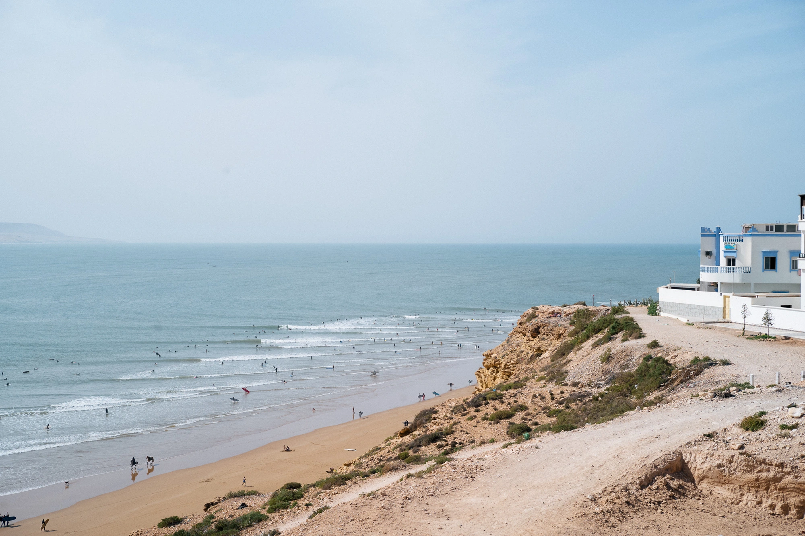
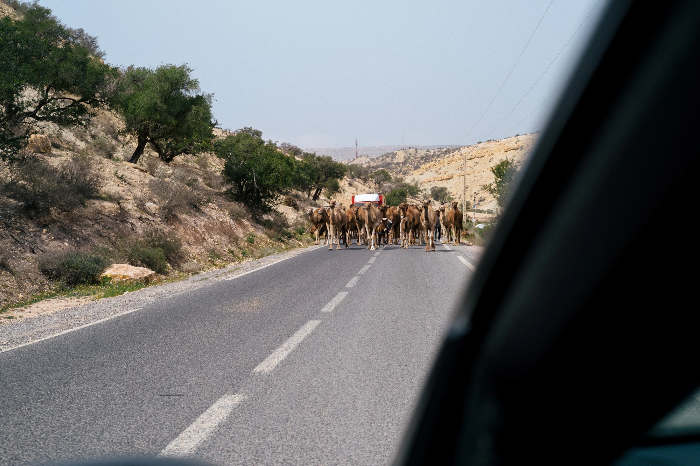
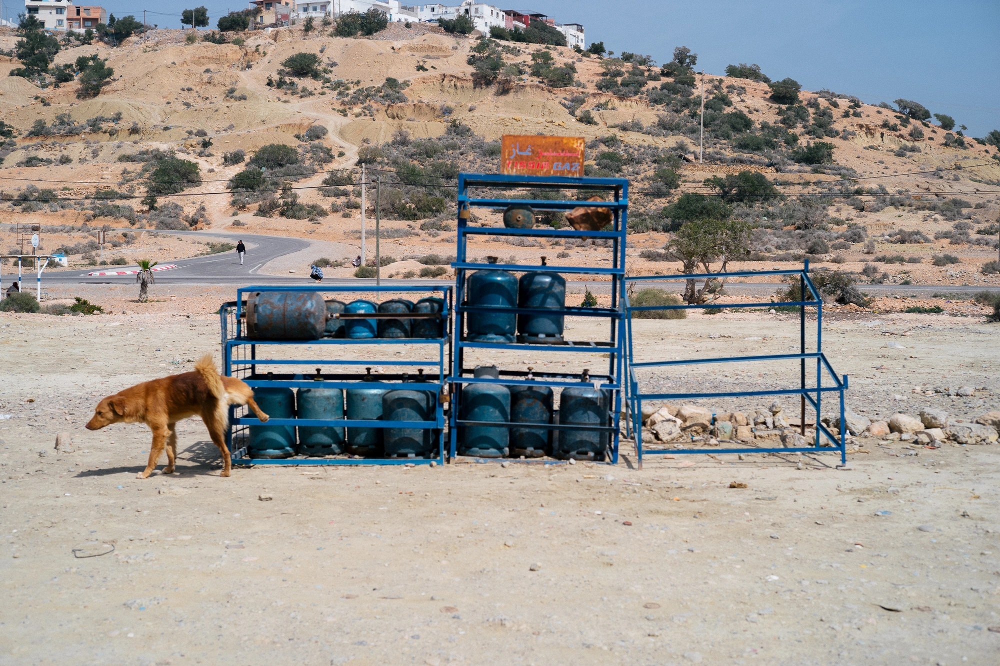

Fin février, on a fuit les mois noirs pour un peu de soleil. On a fait un mix de Imsouane et Tamraght. Le Maroc, c’est top. On a découvert un endroit fantastique pour dormir. Je vous conseille totalement le [Beldi Berber Camp](https://www.booking.com/hotel/ma/berber-beldi-camp.fr.html). On a adoré les tentes berbères, sa situation à deux pas d’Imsouane, le calme qu’il y règne et un staff super sympa! Bon, on avait quitté un bon coup de vent en Bretagne pour en retrouver un là-bas. Mais c’était avec le soleil et les sourires, donc ça marche. Fatima, qui bosse là, me disait préférer la pluie. Je pense que c’est parce que elle ne l’a pas comme en Bretagne parfois... Je lui laisse quand même le bénéfice du doute. Sa cuisine était fabuleuse! 



On a découvert Imsouane pour la première fois. Je ne l’ai pas connue avant la destruction d’une partie des bâtiments rasés récemment. Je me rappelle m’être soulevé en entendant parler de cette éviction par le gouvernement Marocain. Depuis, j’ai eu le temps d’en parler avec les locaux un rien justement et d’avoir une contre balance au classique des news qui force à la réaction émotionnelle. Je vous laisse lire [cet interview](https://climateandboardsports.substack.com/p/no-wanted-to-surf-when-the-bulldozers) d’un local. Comme toujours, rien n’est noir, rien n’est blanc, tout est gris. Surtout le ciel Breton. Je me demande quel visage Imsouane aura la prochaine fois que je la croiserai... Ici, elle avait une drôle de cicatrice à fleur de peau qui nous a peut-être permis de la connaître avec moins de monde que d’autres. Mais le cortège de tours opérateurs du surf qui déposent les gens à la journée était quand même déroutant et la vague était peuplée. J’ai quand même adoré la surfer. Si tu ne surfes pas, y’a moins de choses à faire de suite. 

On a redécouvert Tamraght, pour plus de deux jours. C’était notre camp de base. Un beau Riad avec une petite piscine pour fatiguer les enfants en fin de journée. On a pu rayonner un peu partout autour. Vivre de superbes aventures. Je vais vous en raconter une qui mérite particulièrement votre temps. 



Un matin, nous décidons d’aller jusque Paradise Valley. Une vallée avec des magnifiques trous d’eau et une petite oasis qui donne envie de se poser et profiter. C’est aussi une belle petite marche qui se mérite. Je vous laisse voir les lieux par vous même, ce n’est pas ce qui nous intéresse aujourd’hui. Le plus intéressant est ce moment d’arrivée au parking au retour et où je ne retrouve pas les clés de la voiture. Au contraire de Baffie, elles n’étaient pas dans l’autre poche. Je repars donc faire la randonée en mode `x2`. Je demande à tous les petits restaurateurs si personne ne leur en a filé. J’arrive quasi au bout du trajet (qui est un aller-retour) et là, un couple de français me demande si je cherche quelque chose... Oui, mes clefs de bagnole... Il s’avère que trois quarts d’heure avant, ils les avaient donné à un couple qui remontait vers le parking. Me voilà soulagé, je peux remonter. J’étais, je vous l’avoue, un rien extatique à ne pas devoir appeler Hertz... Les restaurateurs partagent mon enthousiasme au retour. Un me dit même qu’il a eu un appel du gardien du parking. Ce dernier à mes clefs... J’arrive cuit au parking, les enfants sourient, Cloé aussi. Un mot écrit dans la poussière du pare brise arrière nous dit que le gardien a bien les clefs. Quelle belle aventure. 

Au retour de cette mésaventure, on se retrouve bloqué face à un troupeau de chameaux (venez avec vos bosses, tout est chameau pour moi). J’arrête la voiture et laisse la magie s’opérer. Ils nous passent autour avec leurs bébés, dresseurs et ânes. Un moment magique qui n’aurait pas eu lieu si je n’avais pas perdu ces clés de voiture. Parfois, on dépense une heure pour retrouver ses clés pendant que les enfants jouent à la plaine de jeux. Tout le monde est gagnant sauf les gens pressés au final. Le Maroc nous apprend vraiment bien que ralentir est la clé. 

Je pourrais passer des heures à vous en dire plus sur ce voyage. Parler des autres mésaventures que l'on a eu. Mais en vrai, l'important c'est de comprendre que les mésaventures sont aussi des aventures. On en ri déjà, on les a bien vécu et surtout, c'était pas la majeure partie du séjour en fait. Sur les jours restants, on flânera dans des souks, on mangera de bons petits plats, on profitera de la plage, on admirera une punto passer une piste sur le sable. Des tonnes de vieilles peugeots, de vieux vans et de vieilles 4L peupleront mes photos. On partagera des iced latte, Tom prendre un kids latte. On s'est laissé porté par le soleil, on a pris notre temps pour s'imprégner de la façon de vivre locale. Je ne peux que conseiller le Maroc aux familles. Les gens sont tellement accueillants et bienveillants. On est rentré depuis une semaine et Louise demande encore si ce qu'elle entend c'est l'appel à la prière. Je pense que ce pays l'a marquée. Et nous aussi. 

Vous pouvez aussi en apprendre plus sur les cafés que l'on a visité dans le [bonjour 51](/bonjour/51).
