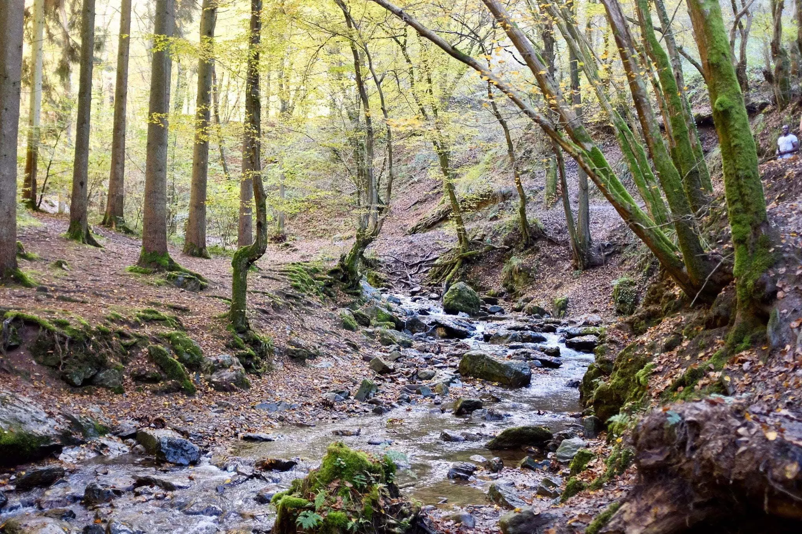
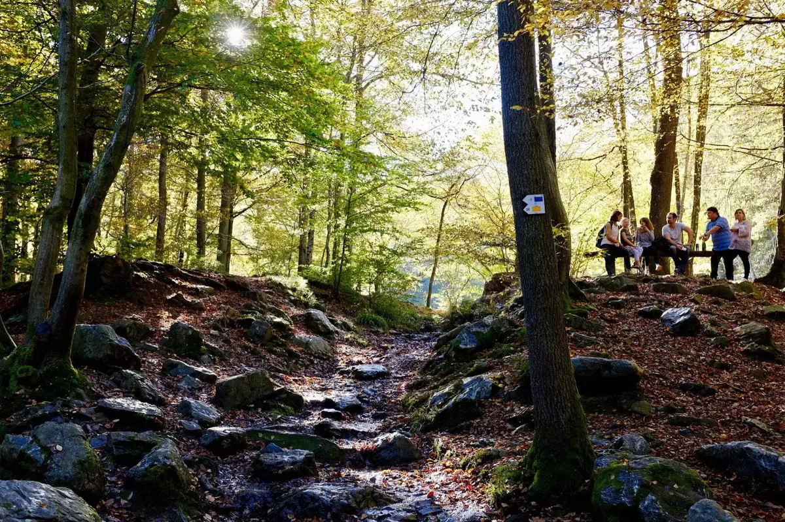
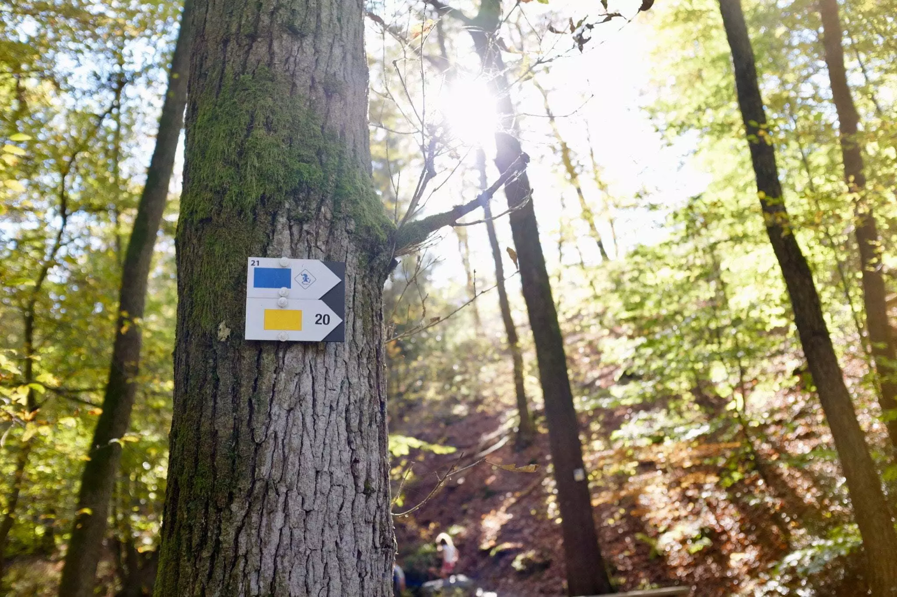

Ce n'était pas notre première tentative de l'année pour la célèbre balade du Ninglinspo. La fois précédente due à son succès, nous n'avions pu profiter de la balade car le parking et les bords de routes débordaient de voitures. Il est vrai que depuis quelques années, ce cours d'eau fait le plaisir de plus en plus de personnes. Grâce à cette notoriété, des aménagements ont eu lieu, principalement des poubelles et la rénovation des ponts. Cela n'empêche pas de retrouver pas mal de déchets en dehors des dites poubelles. Cela n'enlève heureusement rien à la beauté des lieux.




Nous avons commencé par remonter le cours d'eau. Cette première partie magnifique est commune à la plupart des boucles possibles. N'ayant jamais fait plus que cela, j'étais impatient d'en voir plus.

Cette fois-ci, nous décidons de faire la grande boucle. Mais assez vite, vu la clémence de la météo, nous nous rendons compte que les lieux sont envahis et que le calme n'est pas au rendez-vous. De plus, nous sommes arrivés tard et Tom n'était pas au plus haut de sa forme. Arrivés à l'embranchement où nous devons décider, nous choisissons un retour vers le parking.



En chemin, nous détectons les rectangles jaunes et décidons de les suivre plutôt que de prendre le chemin forestier. Nous nous renfonçons dans les bois et grimpons pas mal pour finir sur une vue de toute la vallée. Cela valait le coup, même si en chemin j'ai eu droit à une belle glissade qui m'a valu un pantalon plein de boue.




La descente, une fois le sommet atteint, est assez raide. Elle nous a fortement surpris et nous a poussé à porter Tom par moments et ainsi éviter des glissades possibles. Une autre possibilité, que nous n'avons pas choisi, était de faire demi-tour. Certaines personnes que nous avons croisé l'ont fait.

Nous regagnons via cette pente le chemin forestier que nous avions quitté pour suivre la piste des rectangles jaunes. Repassons le long du Ninglinspo et regagnons le parking. Nous n'avons pas pris le temps de nous poser pour un goûter ou un verre en terrasse et avons regagné la voiture garée un peu plus loin le long de la route. Le parking était encore une fois rempli.

Nous y reviendrons vite. Nous avons vu qu'un gîte pouvait se louer là-bas, il est à moins de cent mètres du début de la balade.

### Informations

Des chaussures de marches imperméables sont conseillées.

Distance: 4km

Durée: 3h Beaucoup de rochers glissants et de pauses jeux.
