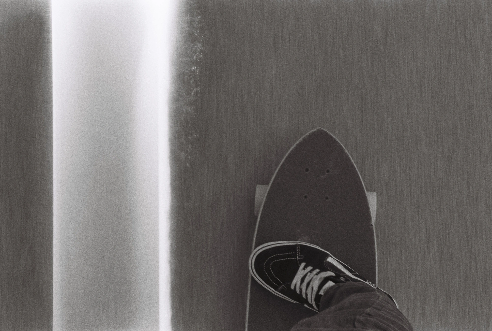
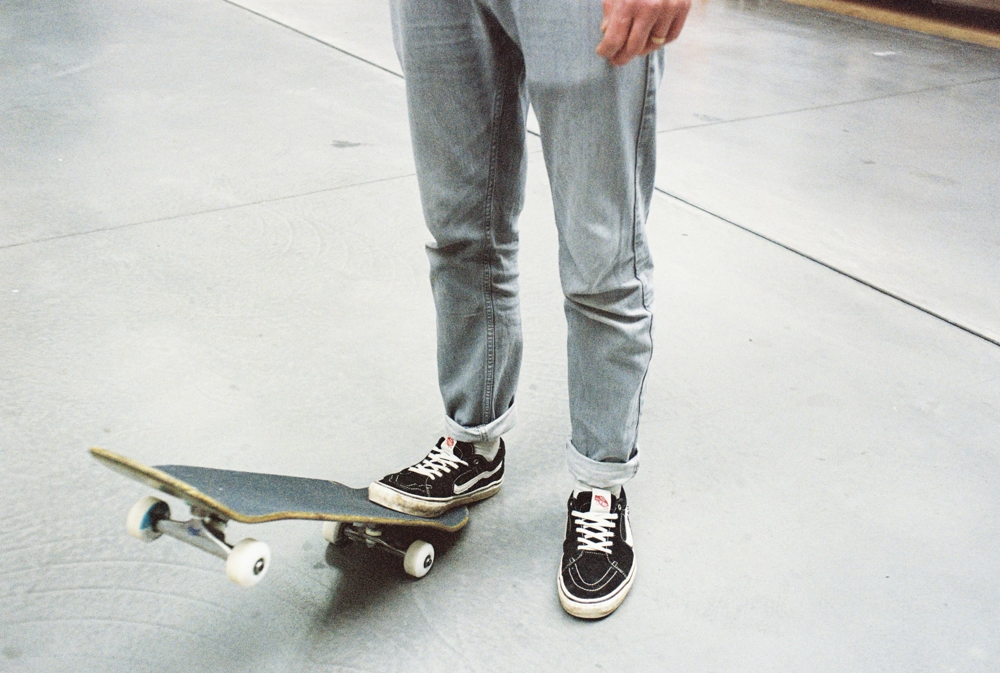

Tony Hawk Pro Skater est sorti juste avant le bug de l'an 2000 en Europe. J'avais 15 ans. J'avais attrapé un disque démo quelque part. Était-ce dans un magazine ou autre ? Je ne sais plus. Ce dont je me souviens, par contre, c'est de ces journées à taper des ollies, heelflips et autres dans les rues. Essayer de sauter 3 marches et tomber. Redescendre à la maison, prendre la manette et enchaîner les tricks toute la nuit. Un rêve devenu réalité.

Le jeu vidéo me permettait de faire ce que je n'arrivais clairement pas à faire dans la rue. Et encore moins en rampe... C'était aussi un moyen de découvrir des lieux que je ne connaissais pas, de m'approprier des spots que je ne skaterais jamais. Et [la bande son](https://www.tylersontag.com/thps/) était une vraie tuerie. Des pépites punk, rock et autres.

Je pense que la culture skate a eu un impact immense sur mon approche de la vie. Que ce soit l'esprit DIY et punk des premiers designs qui m'inspire dans la création de zines. Ou alors simplement l'esprit glisse qui me poussera sur une planche de surf des années plus tard. Le fisheye qui m'inspire pour commencer la photo. Tous les aspects me fascinent. Je ne suis pas forcément les acteurs, mais le monde globalement, que ce soit les réactions de l'arrivée de Nike SB ou des JO. Je garde toujours un œil dessus.

Que je ne sache pas claquer un 3-6 flip ne change pas grand chose. C'est l'esprit et la culture. J'ai toujours ma board, avec des nouvelles roues adaptées aux routes un rien crasseuses du coin. J'ai pris des roues de cameraman. Je la sors encore assez régulièrement. C'est toujours un plaisir. Je continue de fréquenter des skate shops, de regarder des vidéos. Avec Tom, on a commencé à regarder [les vieilles VHS](https://are.na/bonjour-yannick/skateboarding-still-not-a-crime) sur Youtube. Les plus récentes aussi. J'ai récemment écouté un épisode de [3h du nine club avec Jason Lee](https://thenineclub.com/blogs/episodes/jason-lee?_pos=1&_sid=373ebada4&_ss=r). 

C'est marrant de voir comme des skaters que j'appréciais sont toujours dans ma vie via d'autres mediums. [Jason Lee](https://www.jasonleefilm.com) et [Ed Templeton](https://ed-templeton.com) sont deux photographes que j'admire. Les photos de Ed Templeton, je me souviens encore de les découvrir dans Sugar magazine. Plus récemment, je découvre le boulot de skaters ou photographes de skate dans des arts divers, que ce soit la photo, la musique, la vidéo, le surf ou l'art graphique en général, cela m'attire toujours.

Les univers se croisent et ne se ressemblent pas. La [musique](https://umyeaharts.squarespace.com/music/ray-barbee-tiara-for-computer-lp) de [Ray Barbee](https://www.instagram.com/r.barbee/) est un vrai plaisir, ses photos au Leica M6 aussi, vous vous doutez déjà de mon amour pour cet appareil mythique. Après les photos de skate, Thomas Campbell a produit des [vidéos de surf de Thomas Campbell](https://yewtu.be/search?q=sprouts+thomas+campbell) qui sont une référence. Il tourne quasi tout en 16mm. Ses livres photos de skate ou de surf sont un plaisir à feuilleter.  Un univers hyper créatif et plutôt bienveillant.

Sur la Nintendo Switch, récemment, j'ai recommencé à jouer à THPS. J'y prend toujours autant de plaisir. J'ai découvert que je n'étais pas le seul. Au détour des internets, je découvre [Simple Magic](https://simplemagic.substack.com/about) de [Cole Nowicki](https://colenowicki.com). Un condensé d'actu skate toutes les semaines. Vraiment bien écrit. Et au bout de sa lettre, je découvre qu'il est en train d'écrire un livre sur THPS. Je clique sur pre-order, je le lirai sur Kindle, je découvre que plein de gens en fait on eu ce coup de coeur skate, jeux vidéos. Je découvre l'impact du jeu sur les gens. Je découvre aussi ce super documentaire sur le jeu, [Pretending I'm a superman](https://thpsfilm.com). Merde, quel plaisir de replonger dans tout ça. La bande son me fait toujours partir aussi vite et taper du pied.

Le skate a eu et a toujours un énorme impact sur ma façon de vivre, de créer. C'est un plaisir de pouvoir vous partager tous ces liens. Peut-être que cela vous parlera, ou peut-être que non. Mais si, comme moi, chaque lieu est analysé et vous vous demandez quels tricks vous pourriez faire là. Si vous skatez ou avez skaté, j'espère que cela vous a plu.

Je m'étendrai peut-être plus tard sur les bouquins de skates, les magazines, vidéos, designs, et autres. Je voulais juste vous parler de l'impact que le skate a eu sur moi dans un premier temps. Je m'en vais claquer un ollie ou deux dans la rue. Je vous parlerai peut-être des passages vers Dogtown, au skate park de Venice ou sur l'[embarcadero](https://yewtu.be/watch?v=hXrdZ5kWRqs) de San Francisco...
