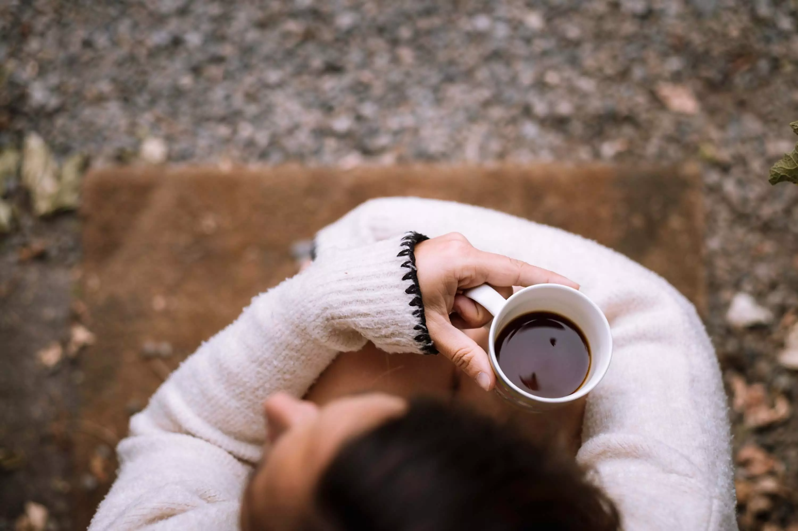

## Petite histoire toute personnelle du café

J'ai grandi en n'aimant pas le café, j'ai toujours apprécié les patisseries au moka mais pas le café lui même. Rien de bien spécial en soi. Puis comme beaucoup de jeunes, j'ai été happé par le marketing de la sirène à double queue de Starbuck. Les boissons que je commence à apprécier n'ont de café que le nom. C'était principalement des desserts sucrés. Beaucoup de chantilly, de sucre et d'arômes.

Vite, je commence à chercher où aller boire un meilleur cappuccino que ceux de Starbuck. Je vivais alors à Bruxelles. C'est là que j'ai découvert la troisième vague du café en occident. Tout cela grâce à [Or Coffee](https://orcoffee.be). Bossant de n'importe où, je commence à y passer trop de temps. Ni une, ni deux, je finis avec un [Aeropress](https://aeropress.com) à la maison. Un beau début. Je goûte toutes sortes de cafés, tout ce que l'on me propose dans les coffee shops de Bruxelles.

## Matériel pour un bon drip maison

Pour pouvoir en boire avec Cloé, je passe au [v60 de Hario](https://www.maxicoffee.com/hario-v60-verre-transparent-tasses-p-5567.html). Un kit avec [moulin Hario](https://www.maxicoffee.com/moulin-cafe-manuel-hario-skerton-plus-p-80037.html) et une [balance Hario](https://www.maxicoffee.com/balance-chronometre-hario-p-5463.html), elle aussi. Depuis, j'ai testé l'espresso à la maison, le Kalita, et sans doute beaucoup trop de manières de faire mon café.

Aujourd'hui, j'utilise principalement le v60 avec maintenant un moulin de chez [Baratza Virtuoso](https://www.maxicoffee.com/moulin-cafe-virtuoso-baratza-offre-cadeaux-p-6756.html) qui me suit depuis plus de 5 ans.

J'ai un kit spécial van et camping aussi. Mais cela sera sans doute pour une autre histoire. Cela a été une longue recherche pour un encombrement minimum et un café qui me satisfait quand même.

## Les brûleries

Les goûts et les cafés ne se discutent pas. Après avoir goûté beaucoup de cafés d'un peu partout, j'ai mes brûleries favorites vers lesquelles je me tourne en général. Même si j'aime toujours en goûter d'autres.

J'ai longtemps eu un abonemment chez [Kaffebox](https://www.kaffebox.no/#kaffeabonnement) ou [the Coffeevine](https://thecoffeevine.com). Ceux-ci m'ont permis de pouvoir goûter des tonnes de choses. J'y retourne parfois pour quelques mois.

J'ai la chance de pouvoir visiter les États-Unis grâce à mon boulot et je ramène en général quelques paquets de brûleries locales. Une liste exhaustive est possible mais peu utile. Je n'ai pas documenté tous les cafés que j'ai goûté au fil des années. Je serai néanmoins heureux de vous en parler.

Ces derniers temps, je varie entre [Mok](https://mokcoffee.be) et [The Barn](https://thebarn.de) qui sont deux valeurs sûres qui livrent rapidement. Je n'aime pas manquer de grains :) Je prend souvent un kilo du poor boy blend de Mok qui bien équilibré pour un coût moindre que les paquets de 250g que je prend en parallèle en général. J'ai longtemps favorisé les cafés éthiopiens mais ces derniers temps, mon favori est un Kenya AA.

Tout ceci nous amène à notre début de printemps 2020. Le début du beau temps me fait refaire du coldbrew maison. Chaque matin, quelques tasses de slow coffee au v60 aussi. Je me suis dit alors que partager ma recette vous aiderait sans doute.



## Recette de Coldbrew

J'utilise, en général, la [bouteille coldbrew Hario](https://www.maxicoffee.com/hario-filterin-bottle-cold-brew-marron-pour-extraction-cafe-froid-700ml-p-16043.html). Elle est simple et rentre bien dans mon frigo. Mais n'importe quoi peut marcher, même un filtre à café et un élastique.

- 50g de café en grains
- 700ml d'eau à température ambiante

1. Moudre le café comme pour un chemex.
2. Mettre le café dans le filtre
3. Ajouter l'eau à la bouteille.
4. Laisser reposer pendant environ 10h.

Pour être franc, j'ai testé entre 8 et 24h. 10-12h est le meilleur point selon moi. En général, je le fais juste avant de me coucher et retire le filtre au petit matin.

Rajoutez un glaçon à votre verre, versez le café et apprécier ce moment calme.

## Recette de drip coffee au v60

Chaque matin, même rituel, je fais couler deux tasses de café pour moi et Cloé. Beaucoup de variantes dans la manière de le faire mais en général, c'est quasi la même chose chaque matin.

- 30g de café moulu à votre préférence, entre 14 et 20 sur mon baratza.
- 450ml d'eau chauffée entre 85C et 92C. (On suggère en général 200F, perso, je préfère l'eau moins chaude)

1. Mouiller le filtre, cela vous évitera un goût de papier.
2. Verser le café
3. Verser le double de poids en eau, laisser reposer 30 secondes. (Le bloom)
4. Ajouter de l'eau pour arriver à environ 300ml d'eau en moins d'une minute.
5. Attendre un peu
6. Verser ce qu'il manque calmement.
7. Se poser
8. Apprécier.

Voilà, vous savez tout. Quelle est votre façon de faire favorite? Votre café favori? Qu'est ce que vous voudriez savoir d'autre? Dites moi [tout sur Twitter](https://twitter.com/bonjouryannick) 🐥!
