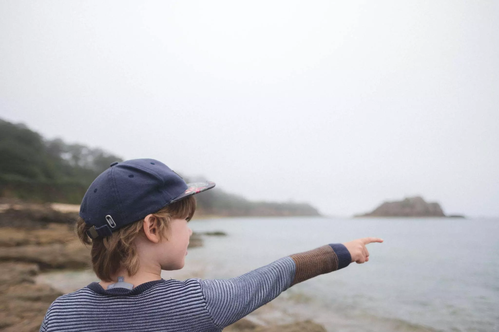
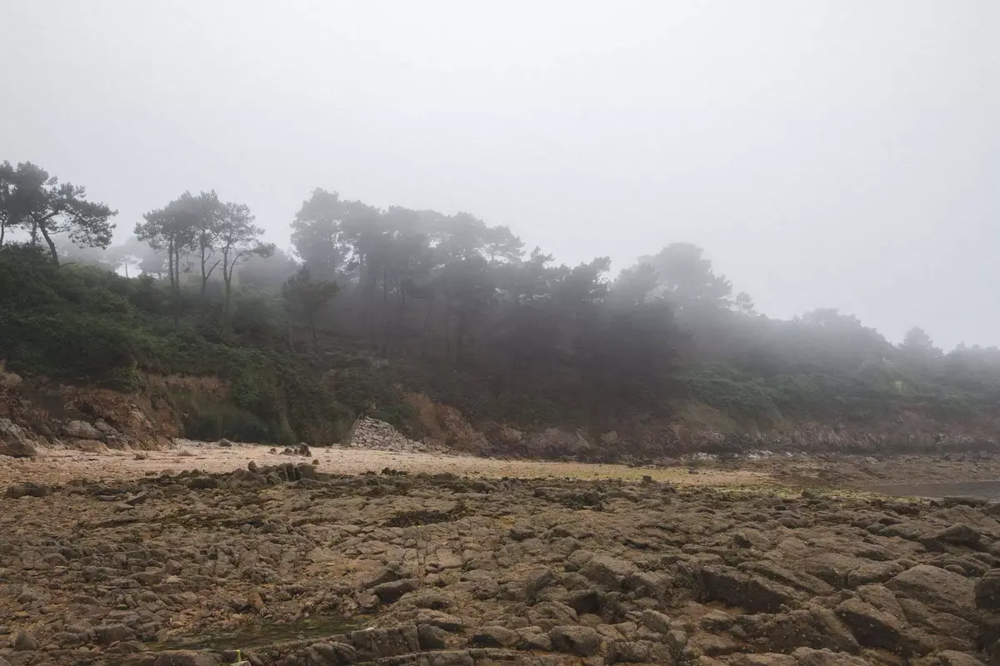
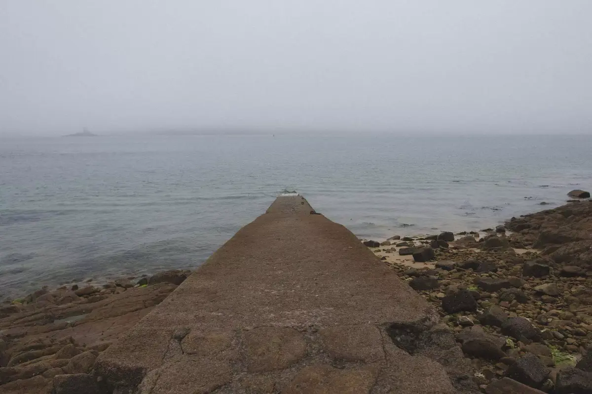

> 48°27’42.436"N, 3°48’52.736"O

Une petite plage à l’abris des gens et du vent, plus connue sous le nom de plage de Tahiti.

On y arrive par un petit chemin de randonnée, on pourrait aller jusque la pointe. Une brûme digne de ce nom et le château du Taureau à peine visible. Le phare va et vient à travers le brouillard. Une ambiance proche de ce que l'on voit dans les clichés du Pacific North West.



La marée descend et on peut accéder à une petite île à pied. On traverse pieds nus et on grimpe au sommet. On en fait le tour ensuite et on profite. On repart tranquillement avant que cela ne remonte.

La pêche à pied y bat son plein et nous donne envie de revenir avec un panier. Il nous faudra un outil pour le calibre mais c'est sûr, On viendra les cueillir. Malgré le manque de soleil quelques personnes sont à l’eau on aimerait les rejoindre.



On y revient un jour de soleil pour marcher le long du GR34. C'est un autre endroit. On voit l'autre rive, le chateau de l'Île Noire et tout ce qui l'entoure.
On marche jusque Carantec, on fait une boucle. On arrive du coté ostréicole. On découvre les bassins a huîtres et le matériel. Au bout, avant de repartir, une petite boutique ouverte, on y vend huîtres de tous calibres et autres crustacés. La dame est mariée a un liégeois. Encore des belges... À croire que l'on compte envahir la région. Ces huîtres sont délicieuses, surtout avec ce vin blanc. On y reviendra aussi.

