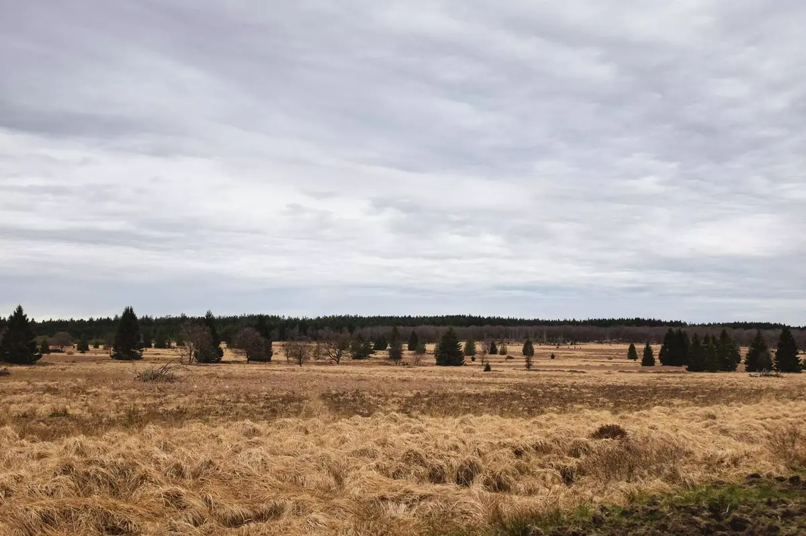



Le soleil dort encore mais nous sommes déjà en route. Notre petit bout n'est pas là, on décide de se lever aux aurores et de commencer la saison des balades en force. [Une balade 16km](https://www.ostbelgien.eu/fr/fiche/hiking/balades-21-petergesfeld) nous attend, la météo est au beau fixe et on compte bien se dégourdir les jambes.

On décide de choisir une des [balades de rêves](https://www.ostbelgien.eu/fr/randonnee/excursions-d-une-journee/balades-de-reve) proposées par l'office du tourisme des cantons de l'est. Elles sont bien renseignées ce qui nous permet de partir sans aucun souci.



Notre point de départ: Petergensfeld, à la frontière allemande.
On se gare et on est parti. On rentre dans les bois après avoir traversé le village. On longe un joli cours d'eau sur des chemins de forêt qui ont ce son sourd si caractéristique. Les grenouilles ont pondu, on y voit des centaines d'oeufs en chapelet.

Le soleil aurait du se lever. Le ciel est gris. On ne verra pas beaucoup ses rayons mais on est bien au calme. On ne croisera que deux personnes sur cette vadrouille. La forêt est nôtre.

On croisera les ruines d'un petit hameau agricole qui fut déserté pour préserver les eaux du barrage de la Vesdre. Juste après cela, on rentre dans un paysage de fagnes à perte de vue que l'on ne fera que longer.

Retour dans les bois, la pluie fait son apparition petit à petit. D'abord discrète, elle se fera plus intense une fois que l'on aura plus d'arbres au dessus de nous. On finira la balade trempés jusqu'aux os. Elle n'était pas censée s'inviter.

