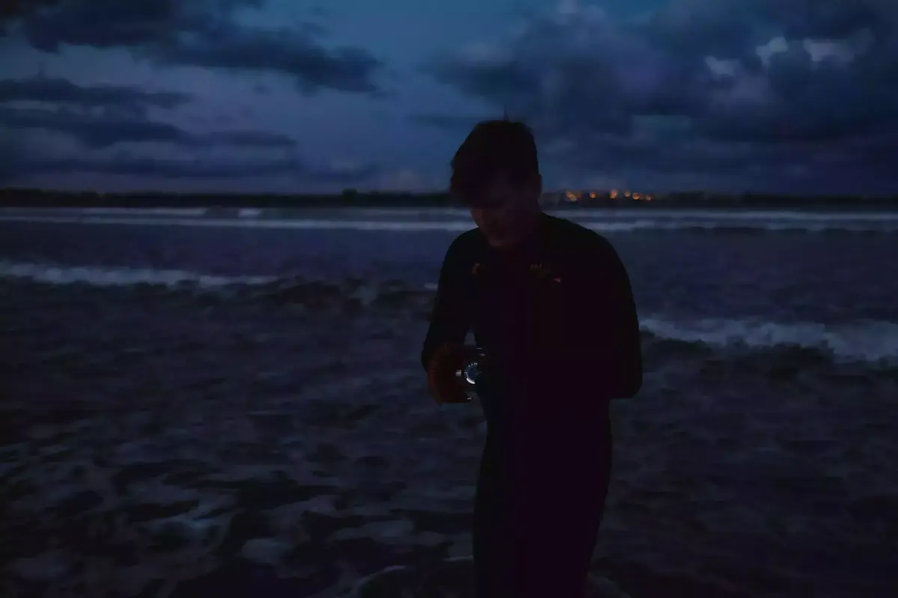

On a commencé l'année d'une belle manière avec Grégory. Rendez-vous 8h au Dossen qu'on s'était dit. On ressort la [combi 5/4](https://srface.com/shop/mens-wetsuit/?currency=EUR) qui n'a pas encore eu le temps de bien servir avec le confinement. Première Dawn Patrol pour moi, première nage avec des palmes, premier roll au [Nikonos V](/nikonos-v). C'était une Portra 400, de chez Kodak. Comme si il fallait vraiment le préciser. On verra si j'ai réussi quoi que ce soit. Il fallait le tester, je ne savais même pas si il tiendrait le coup dans l'eau. La pellicule en est resortie intacte et non humide

Il faut plusieurs fois du courage pour un si beau moment. D'abord pour sortir du lit dans l'air frais de 6h30. Comme d'hab, quand je dois me lever tôt, une nuit étrange a précédé le lever. Je me suis réveillé à 2, 3 puis 4h. De multiples réveils qui sont du à la peur de rater le réveil. J'ai bien fait d'ailleurs je l'avais réglé pour le lendemain. Ensuite, quand tu dois enfiler ta combi et que la température ressentie est sans doute négative ou pas loin. J'avais déjà froid dans ma parka. Mes doigts étaient déjà engourdis alors que je n'avais pas encore touché l'eau. Mais il faut se changer, on le fait vite. Une fois enfilée, on se sent bien. Je tente la cagoule que Greg m'a passé, mais elle essayera de me faire vomir. Tant pis, elle restera au sec. Bien fait pour elle.

S'asseoir au bord de l'eau, enfiler les palmes, marcher à reculons vers son destin. On voit le ciel sortir doucement de la pénombre. Le soleil sort lentement de derrière un gros nuage de pluie au loin. On y va. Cette sensation de l'eau fraîche qui vous gèle la tête, ice cream headache. Avec une cagoule ça irait sans doute mieux. C'est pas ma faute si ma tête est grosse. Les vagues sont petites et j'ai pied. Cela m'aide pas mal à continuer à combattre ma crainte de l'eau. Une sorte de thérapie par le choc, mais petit le choc. J'essaye de faire comme si je n'avais pas pied pour m'entraîner et m'habituer aux palmes. Pas simple mais bon, on s'amméliore. C'est vraiment ennivrant de sentir les vagues passer et essayer de les capturer. Je n'ai que 36 essais. Je me relaxe et me concentre. Je suis bien dans cette combi qui m'aide à flotter et ne pas me les geler. Je me sens de plus en plus à l'aise en voyant la pellicule défiler. Le froid ne me gène même plus tant que ça au cerveau. Sauf quand j'essaye de plonger un peu.

Clairement, un moment que j'attendais depuis un bon bout de temps. Quoi de plus beau que le premier lever de soleil de l'année pour combattre une crainte et se faire plaisir. 2021, tu es prometteuse dès les premières lueurs. On n'a pas nagé plus de 300 mètres, j'avais toujours pied mais c'était réelement magique pour moi. Cette connection à la mer, cette nouvelle tradition de la baignade du premier. Vraiment, l'eau salée est ma meilleure drogue. Merci à l'océan et Grégory pour cette agréable première dawn patrol

Ah oui, j'oubliais, il faut encore une fois du courage. Quand tu enlèves ta combi, que tu as la peau humide et que l'air est toujours sous zéro. J'avais prévu un coup de boost, un thermo de café bien chaud m'attendait. Le poncho aussi était indispensable à ce moment-là.

Pour le [résultat du Nikonos](/nikonos-glaz), faudra attendre encore un peu. Je viens d'envoyer le film à développer. L'attente est dure mais vaudra je l'espère le coup. Le début d'une belle série.

*Ce post est extrait de mon journal papier & les photos sont de [Grégory](https://gregorymignard.com)*
