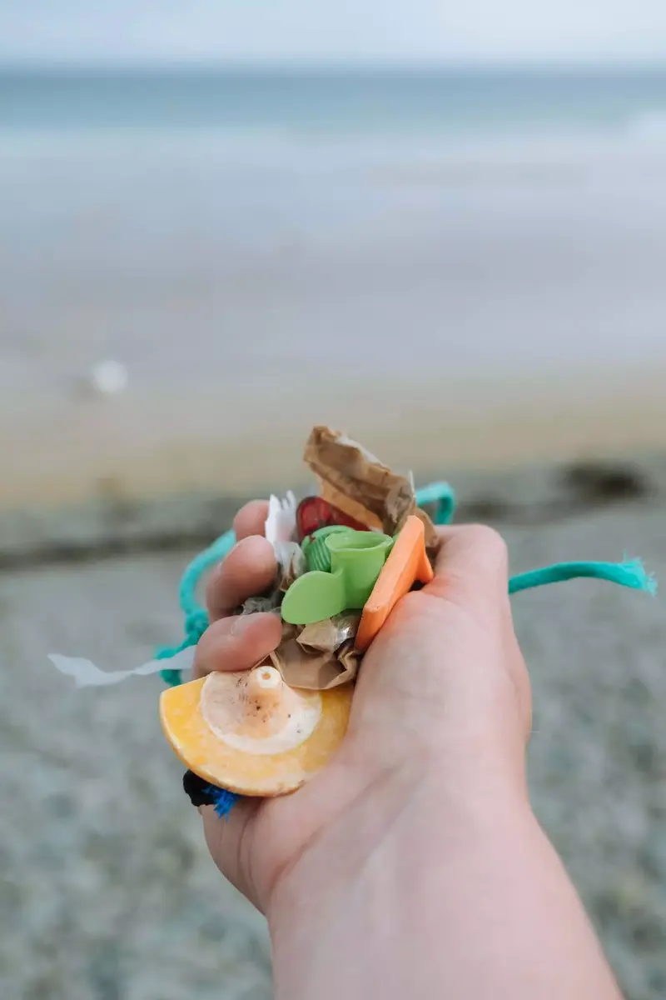

La Terre va mal, ce n'est plus à questionner. On en est responsable. Maintenant, plusieurs choix s'offrent à nous. Ne rien faire, cela semble sans doute idiot. Se plaindre de ce qui a été fait, pas mieux. Critiquer ceux qui ne sont pas parfaits, cela n'aide sans doute pas. La meilleure solution est d'agir. Personne n'est parfait. Nous ne pensons pas l'être. Mais une chose est sûre, on fait notre part.

Je pourrais vous parler de nos choix de vie, des choix au quotidien ou autres actions. Mais aujourd'hui pour la journée de l'environnement, j'ai plutôt envie de vous parler de nettoyer la nature. Que ce soit sur la plage ou dans les forêts. Comme vous le savez, on partage notre vie avec un petit bout de 5 ans que nous avons décidé de sensibiliser pour ne pas qu'il soit aveugle face à tout cela. On a donc mis en place quelques petites choses qui facilitent un micro activisme au quotidien et en vadrouille.

Choisir de partir avec moins d'emballages et partir avec un sac à déchets permet de ne pas en laisser trainer. Ne laissez même pas les déchets que vous pensez naturels. Une peau de banane ou des épluchures d'oranges n'ont rien à faire en forêt ou sur la plage. Respectez les lieux comme si c'était votre maison car au final c'est notre maison. Répétez "Leave no trace" cinq fois avant de partir et à chaque fois que vous sortez des choses de vos sacs.

Avoir un sac à déchets permet surtout aussi de ramasser ceux que les autres laissent. Cela ne coûte rien et si on le fait tous, bientôt les sentiers seront plus propres et les plages aussi. Au revoir les bouchons de bouteilles, les mégots de cigarette, les mouchoirs et tous ces petits déchets que l'ont fait tomber par mégarde. Oui, oui mégarde, on ne pense pas que le monde le fait exprès de détruire cette seule planète que nous avons...

## Par où commencer?

Il ne vous faut pas de gros matériel. Rappelez-vous de mettre un sac dans votre sac qui servira au déchets. N'hésitez pas à embarquer aussi une paire de gants de travaux ou jardinage pour ne pas avoir peur de ramasser des déchets qui ne sont pas les vôtres.

Si vous vous sentez seul, n'hésitez pas à rameuter vos amis ou à vous joindre à un événement local de nettoyage. Si vous ne savez pas où en trouver, suivez des groupes comme [Un océan de vie](https://www.unoceandevie.com/fr/), [Initiative océane](https://www.initiativesoceanes.org), [J'agis pour la nature](https://jagispourlanature.org/facons-dagir/je-ramasse-des-dechets) ou autres.

## En bref

Il suffit vraiment de deux minutes. Mais si vous le pouvez, donnez plus. Les Boy Scouts ont une superbe devise qui est "leave it better than you found it". "Rendez-le meilleur que l'on vous l'a donné", cela marche pour tout. Au final, consommez moins. Le meilleur déchet n'est pas celui que l'on jette dans une poubelle mais celui que l'on ne crée pas.

## Quelques liens pour aller plus loin

- [Tous promeneurs citoyens](https://www.onf.fr/onf/forets-et-espaces-naturels/+/30::tous-promeneurs-citoyens.html) par l'ONF.
- [Soutenir Surfrider](https://surfrider.eu/nous-soutenir/) pour les aider à continuer.
- [Ocean campus](https://fr.oceancampus.eu) par surfrider.
- [Leave no trace](https://lnt.org) en anglais mais une belle source.
- [Organiser un ramassage sur une plage](https://www.initiativesoceanes.org/fr/organize)
- [Participer à un plogging](https://www.finistere.fr/Agenda/Plogging-sur-la-plage-de-la-Torche-a-Plomeur) (jogging ramassage de déchets). Celui-ci est dans le Finistère mais vous devriez en trouver par chez vous.
