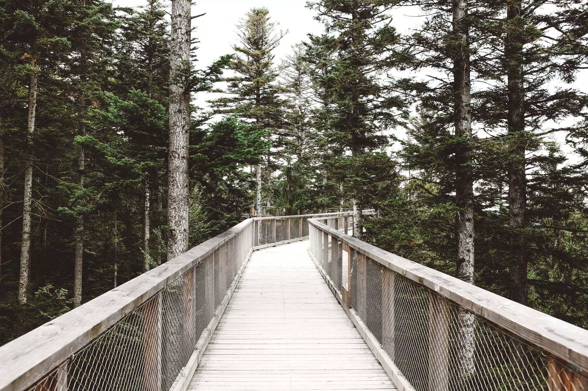
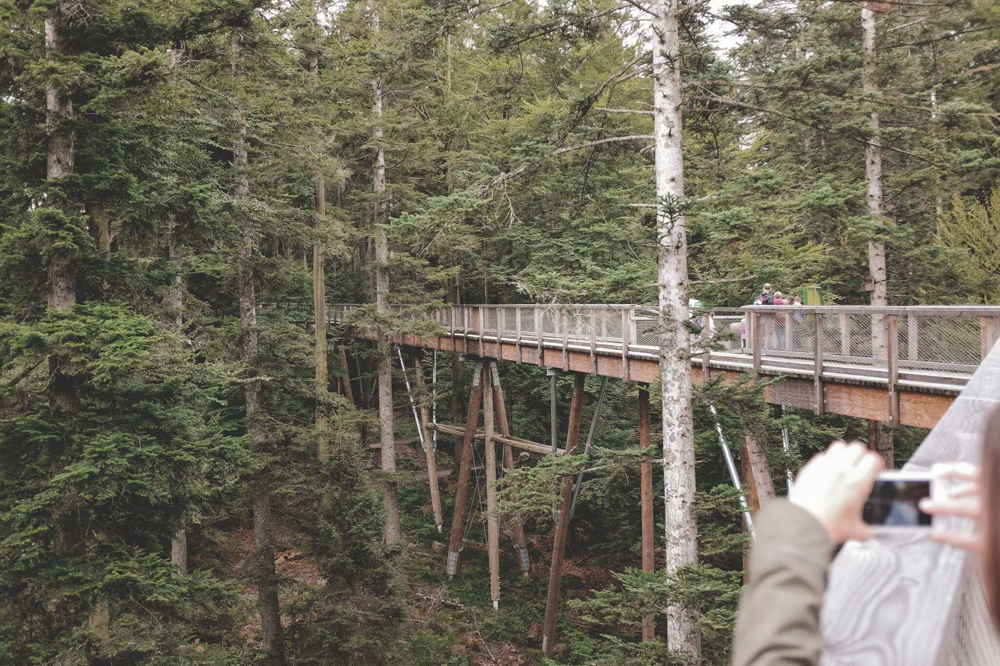
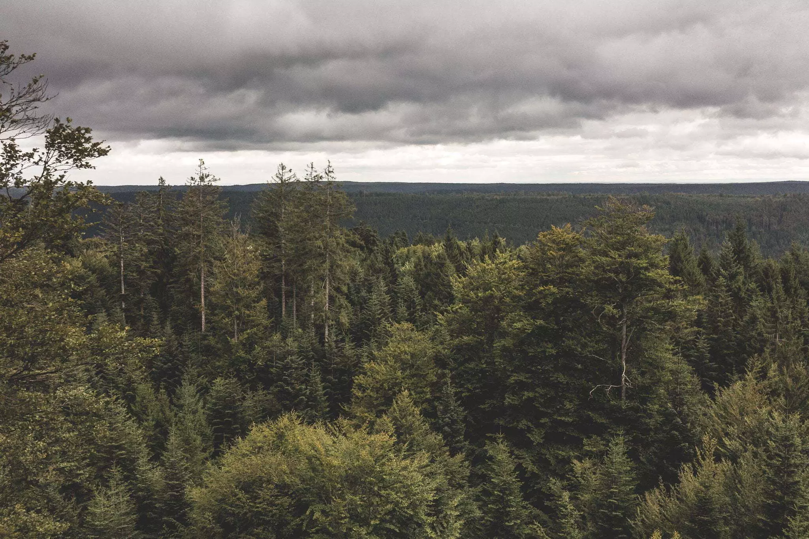
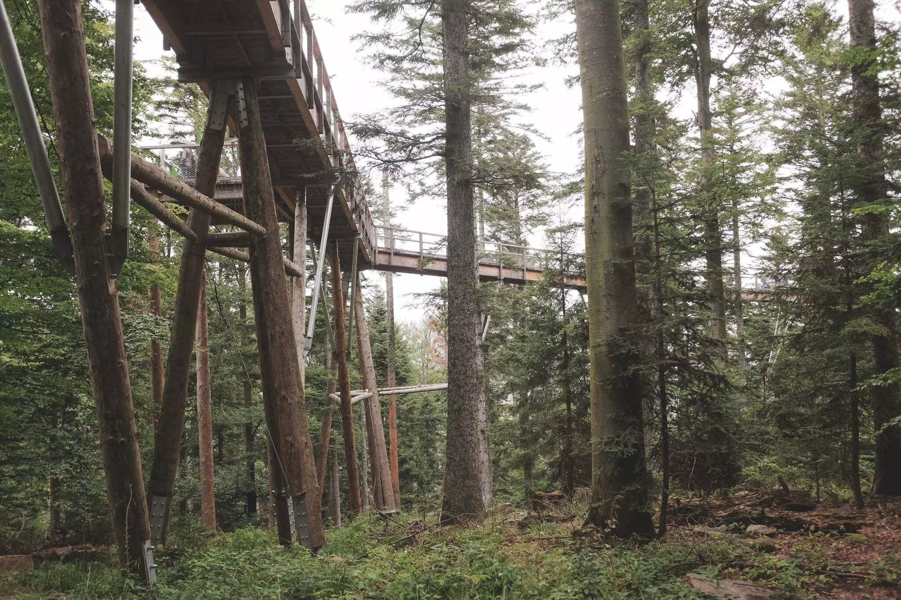
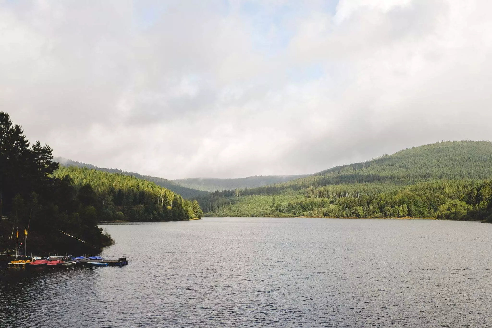
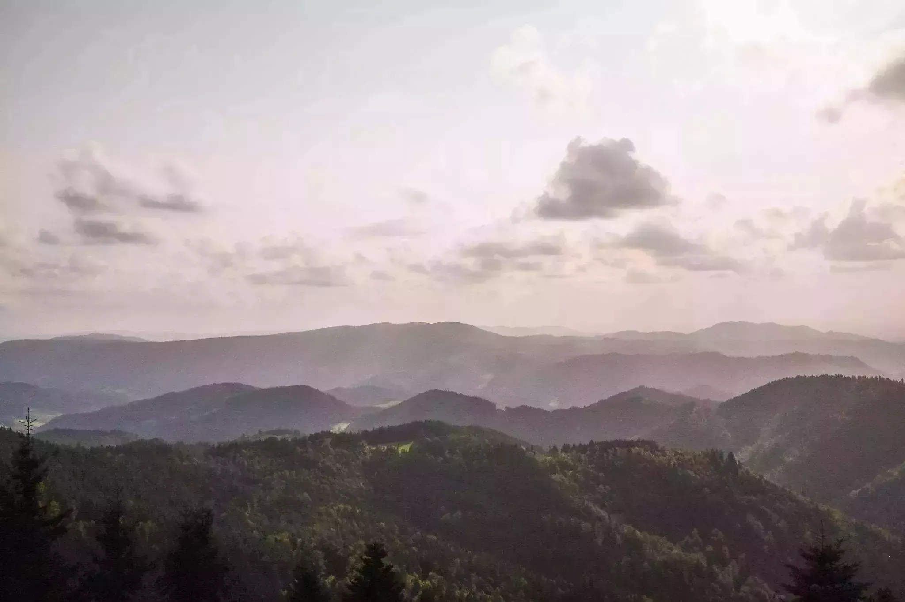
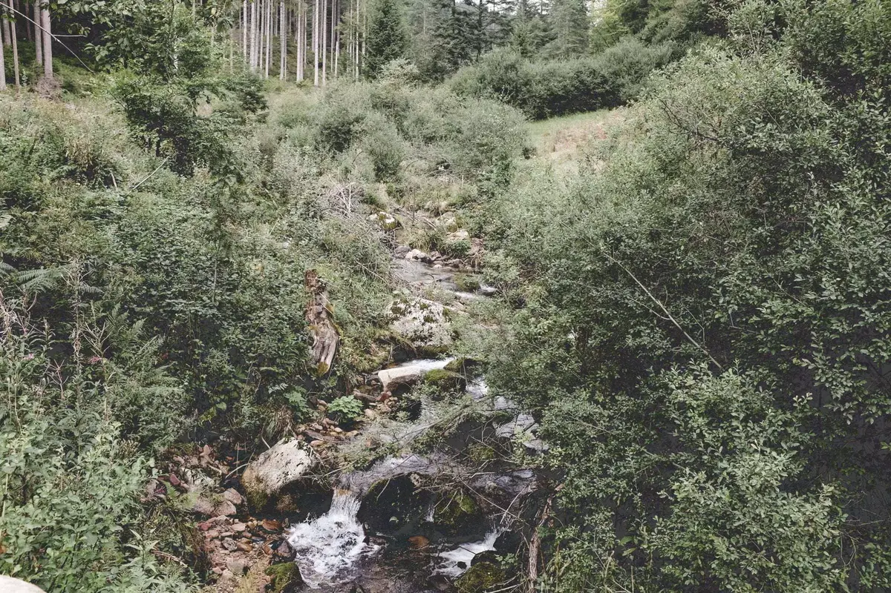
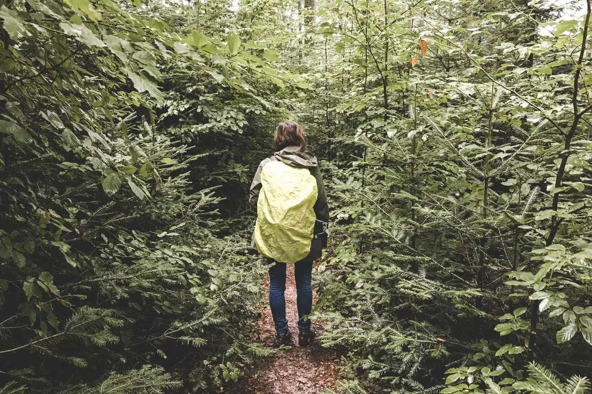

Après le stress d'un mariage, nous avions envie de nous reconnecter un peu avec la nature. Nous décidons de partir visiter le nord de la forêt. Quelques recherches et réservations et nous voilà partis. Depuis Liège, il faut compter 4h de route. C'est sans compter sur une autoroute fermée qui nous rajoutera trois heures de trajet et un PV. Rien qui ne puisse entâcher le moral.




Au petit matin, [Baumwipfelpfad Schwarzwald](https://www.baumwipfelpfad-schwarzwald.de/schwarzwald/) marquera le début de nos marches. Nous marchons un peu et empruntons le funiculaire vers la canopé. Une passerelle en bois de 1250m nous amène à la tour qui surplombe les arbres. Un toboggan permet de redescendre, mais il faut 6 ans minimum. Tom est un peu déçu, mais c'est vite oublié. On fait la course pour redescendre. On continue sur les chemins de randonnée pour la journée. La météo n’est pas avec nous, des averses viennent nous tenir compagnie plusieurs fois sur la journée.










Direction le [parc national](https://www.foretnoire.info/), on s'arrête en chemin le long du barrage de Schwarzenbach à Forbach. Une belle balade avec des incursions dans le parc et Tom sur mes épaules pour les 7km de vadrouille. Nous reprenons la route pour le seul hôtel du parc national. Un petit tour autour de celui-ci nous donne une vue sur les ballons des Vosges.





Le lendemain, direction [Mummelsee](https://www.seebach-tourismus.de/). La légende veut que une créature vive dans ce lac. Nous verrons, à la place, la charcuterie locale et les coucous du magasin. Une balade grimpant jusqu'au sommet nous fera redescendre par une pente rocailleuse plutôt ardue pour Tom. Des dizaines de petits amas de pierres nous accueillent ensuite. Nous en ajouterons un.





En route pour [la roulotte](https://www.ferienhof-hirschfeld.de/) où nous passerons nos dernières nuits, nous nous arrêtons pour faire une balade de 2km pieds nus à travers bois. Le [Barfusspark de Dornstetten](https://www.barfusspark.de/) aura été plus frais que espérer mais c'était amusant. Il y a plein de sols: du bois, de la boue, du verre, de l'herbe et même de l'eau un peu trop froide. De quoi passer un bon moment avec ou sans des enfants.



Nous passerons les deux dernières nuits à la ferme dans une roulotte sans eau courante, sans toilettes et sans douches, de quoi se dépayser un max! Les fenêtres donnent sur les vaches et moutons. Dorothée est une hôte fantastique avec les enfants et ce malgré la barrière linguistique. On aura même l'occasion de nourrir les vaches et aider dans la ferme. Il est possible de promener les moutons mais nous n'avons pas eu le temps. Tom veut y retourner.

Dorothée nous conseillera un lieu de balade avec une belle cascade. La balade commence à côté d'un enclos à biches. On marche le long d'un petit cours d'eau jusque la Sankenbachsee. On tourne autour pour trouver le chemin de la cascade. On grimpera et passera au dessus d'elle pour redescendre via les sentiers jusque le parking où se trouve notre voiture.



Durant tout le séjour, la météo fut plutôt capricieuse. Des averses assez fréquentes n'enlèvent rien au charme de la région. Nous avons eu l'occasion de goûter le fameux gâteau, le jambon et n'avons pas manqué de voir quelques cliniques. Le retour se fera sans encombre.



