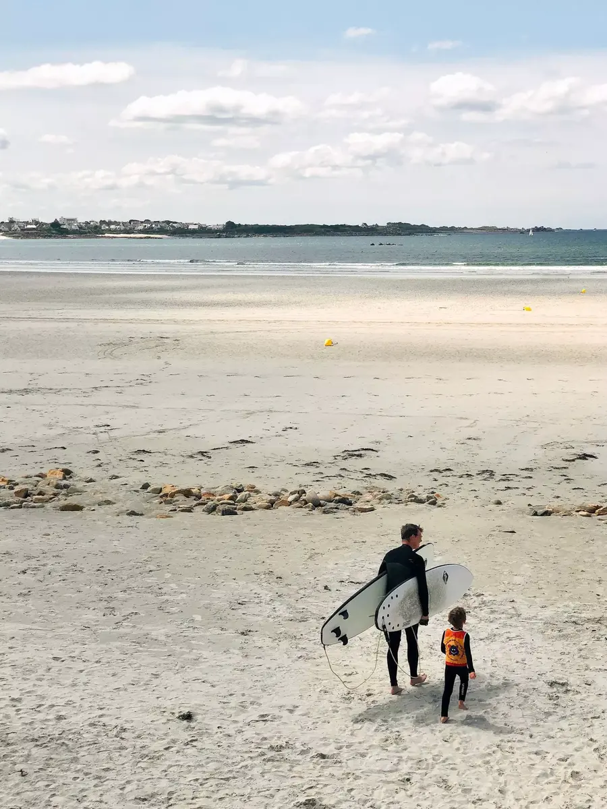

J'en ai lu des livres d'océan, de marées, de surf. J'ai admiré les vagues de Tehaupoo et me suis quasi brûlé les pieds sur son sable. J'ai observé depuis la côte ces hommes et femmes domptant les vagues, où plutôt des vagues laissant ces hommes et femmes glisser sur elles. Je m'y suis vu. J'en ai rêvé. Encore plus depuis que nous sommes installés si près de l'océan. J'ai finalement enfilé cette seconde peau de néoprène. J'ai mis de la crème solaire sur le nez, le visage et la nuque. Et je suis rentré à l'eau avec cette board de 8 pieds.

Tout a commencé samedi matin avec Cloé qui m'annonce que l'après-midi, Tom et moi aurons notre premier cours au Dossen, avec l'[école de Surf du Léon](https://ecole-surf-leon.com). Je suis nerveux mais surtout excité et impatient. Cette combinaison, je viens de la recevoir. Elle est comme neuve et je ne l'ai enfilée qu'une fois à la maison pour l'essayer. Est-ce que j'aurais voulu attendre plus? Pas du tout, cela fait deux ans que j'attend ce moment.

On arrive au Dossen, j'enfile ma [combi](https://srface.com), je rencontre JB, il me tend une planche. Il nous donne les recommandations de base, nous explique les bases et nous laisse nous débrouiller à l'eau. Je regretterai ne pas avoir pensé à la crème solaire. On ne fait cet oubli que une fois.

Je dois avouer que ces deux premières sessions ont été plutôt laborieuses. Je ne trouve pas toujours mon équilibre, mon corps fatigue, je bois la tasse. Mais une chose reste, l'envie de remonter sur la board. Je me lèverai quelques fois mais finirai assez vite sous l'eau. Qu'à cela ne tienne, on reviendra vite.

Mercredi, les conditions sont top. J'ai pris ma matinée au boulot. Je ne veux pas rater ça. On est un plus petit groupe. On retourne à l'eau. Je trouve mon équilibre et profite un max. J'arriverai à bien prendre quelques belles vagues. Je ferai quelques beaux plongeons, et ferai rire Cloé qui verra ma planche s'envoler.

Tom progresse super bien. Même sans lunettes, je le vois glisser tranquillement debout sur sa planche. Il se retourne, je distingue un sourire de loin et je lui répond, en tendant le pouce vers le haut. Il me dira le nombre de vagues prises. Monsieur a compté.

Quels moments. Je n'ai qu'une hâte, y retourner. Cinq leçons de prévues et on ne compte pas s'arrêter là. Je ne sais pas quelle sera la suite mais elle se passera clairement dans l'eau. Je vais devoir trouver une combi pour Tom, des planches en mousse pour nous deux. Trouvez des spots pour débutants, etc. N'hésitez pas à partager vos recommandations sur [🐥 Twitter](https://twitter.com/bonjouryannick) ou autres.

Pour plus d'infos sur le Surf dans le Léon:
- [Norzh Léon Surf club](https://norzhleonsurf.fr)
- [École de Surf du Léon](https://ecole-surf-leon.com)
- [Le Dossen](https://le-dossen.com)
