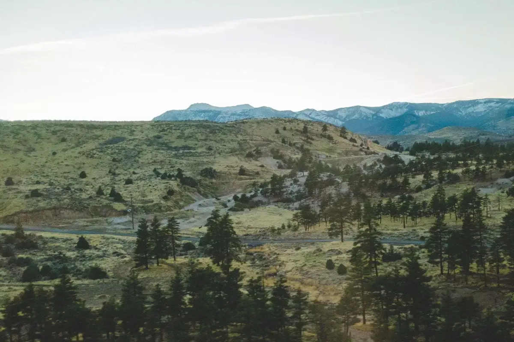

Mon boulot me permet de voyager, d’habitude je vois San Francisco. Cette fois-ci, l’avion atterrit à Reno. Je découvre une autre Amérique. On prend un bus direction South Lake Tahoe. J’ai l’impression d’être dans un de ces romans du Midwest où les gens voyagent en car. On arrive au bord du lac au crépuscule, on ne fait que le distinguer.



Jet lag et lumière me sortent du lit. On décide de partir se balader à pied et de descendre jusqu’au lac. On découvre plein de petites maisons et on coupe par les bois. Nous voyons quelques plaques nous apprenant que nous sommes en forêt nationale. C’est un début impressionnant. On se rapproche du lac tout se referme. Des lots de propriétés privées bloquent l’accès. On fait un détour et découvre enfin le lac. Il semble sans fin, les montagnes viennent séparer le ciel de l’eau à l’horizon. On se pose pour un verre et on rentre se reposer.



Réveil beaucoup trop tôt, Je tourne dans le lit. Je décide d’aller marcher et découvrir. Je sors Gaia GPS et erre dans les rues. Je décide d’aller jusqu’au Nevada par le haut de la ville. C’est amusant de se dire que un autre état est si proche. Je découvre aussi les pommes de pin locales, grandes comme ma main. Les chemins grimpent bien. J’espère croiser au loin un ours, mais je rentrerai bredouille. Toutes les poubelles sont bear proof, entendez résistantes aux ours. Mon collègue s’est déjà réveillé la nuit avec des ours à sa porte. On espère avoir bien verrouiller ces nuits-là. Cette semaine, je ne verrai que des écureuils.



Une journée normale, on se ballade, on papote sur sa terrasse entourée d’arbres et on s’étonne du manque de neige cette année. Là où normalement se trouvent les pistes de ski, on voit la terre et l’herbe. On finit dans une brasserie face à ces pistes, un pub allemand où l’on sert des currywursts. Cloé me rappellera encore que j’ai fait 12:00 d’avion pour manger les spécialités de la région de mon enfance. On rentre à pieds. Les rues ne sont pas éclairées la nuit. On se retrouve face à un ciel étoilé comme on en voit peu en Belgique. Je suis captivé. Perdre un peu de ce sens accentue mon ouïe. C’est fabuleux à vivre.





Dimanche, on embarque le chien d’un ami direction Pope beach. On se ballade le long du lac dans le sable avec de beaux arbres et une vue à couper le souffle encore. On est hors saison, on ne croisera pas grand monde le long du lac. Le reste de la semaine sera orientée travail.



Le dernier jour, on entend que la neige doit arriver. On va visiter Emerald bay. On grimpe depuis South Lake Tahoe. Le froid s’accentue mais les vues et lieux traversés en valent la peine. Emerald bay abrite Fannette Island. Une petite île qui aurait dû abriter le corps du capitaine Dick Barter si celui-ci n’avait pas péri en mer. On y voit les ruines d’une Tea house où la propriétaire du domaine, sur la terre ferme, venait prendre le thé quotidiennement.



On doit reprendre la route, 10 cm sont tombés. Le car mettra les chaînes pour nous ramener jusqu'à Reno. Une fois la montagne passée, on retrouve des étendues désertiques. Je savoure ces paysages et me laisse aller à des rêveries de road trip à travers ce continent.

