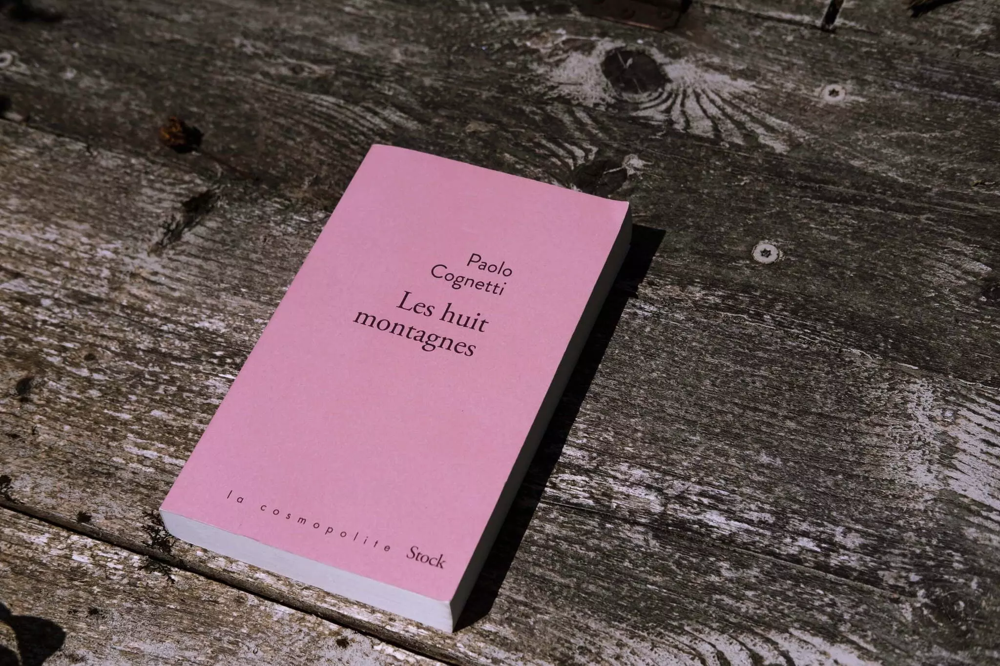
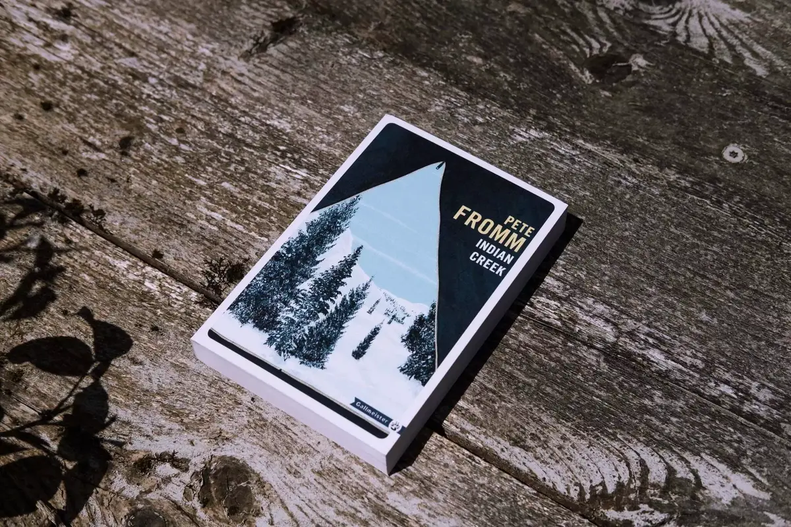
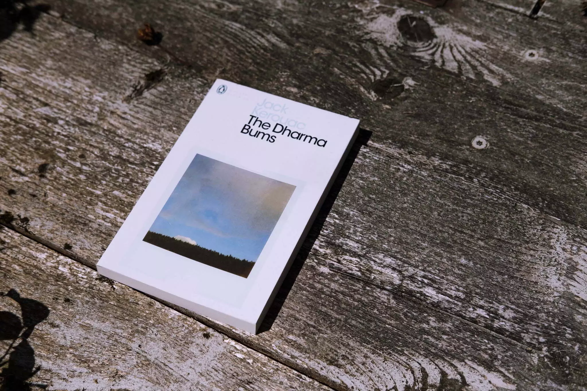

C'est l'été, vous êtes en vacances. Vous ne savez pas quoi lire. Laissez moi vous aider.

J’ai une habitude qui tient, c’est la lecture. Quasi quotidienne, elle me permet en fin de journée de me détendre. Mes lectures sont souvent liées à la nature. Il y a quelques années c’était plutôt des bouquins techniques. J'ai eu envie de partager quelques uns de mes coups de cœur avec vous. J'aime pas mal de bouquins donc attendez vous à en voir plus. Si vous voulez me suivre sur [goodreads](https://www.goodreads.com/bonjouryannick), je me suis fixé comme challenge de lire 35 livres cette année.

Voici trois bouquins que j’ai vraiment apprécié.

## [Les huit montagnes](https://amzn.to/2XWw3Xx) par Paolo Cognetti

Une super lecture recommandée par [Martin Dellicour](https://www.martindellicour.be). Une histoire d'amitié dans les montagnes italiennes. Une amitié qui évolue autour de vieilles pierres et de moments dans les montagnes. C'est aussi une histoire de solitude. Une histoire de père et fils, d'une certaine manière. Une histoire de deux garçons devenus hommes. Pour ceux qui me connaissent, cette lecture a plutôt fait mouche. J'ai adoré le style d'écriture. Son histoire pleine de contrastes, entre les hommes, la ville et la montagne, le passé et le présent. Ses souvenirs, sa vie. C'est un texte splendide récompensé du prix Médicis en 2017.

Paolo Cogneti est un de ces auteurs qui sortent des livres que je dévore. C'est une lecture simple mais pleine de vie. Je vous conseille aussi une autre histoire de Paolo Cognetti, [le garçon sauvage](https://amzn.to/32oJlLR). L'histoire prend aussi place dans les montagnes italiennes. Il a sorti [un nouveau roman](https://amzn.to/2Jsun02) que je n'ai pas encore eu le temps de lire. Il sera sans doute dans mes lectures de l'été.

## [Indian Creek Chronicles: A winter alone in the Wilderness](https://amzn.to/32pV8d9) par Pete Fromm

Un des premiers bouquins de nature writing que j'ai lu. L'histoire d'un étudiant qui passe l'hiver dans une tente. Son job sera de surveiller des œufs de saumons qui doivent just survivre à cet hiver. Une belle histoire de l'homme face à la solitude dans la nature. Je vous le recommande vivement. Une histoire pleine d'aventures, de petits moments de stress et de vie simple dans une tente. Des moments d'ennuis et de choix. Un livre plein d'humour et de sincérité. Ce bouquin m'a donné envie, de moi aussi, passer un hiver dans le grand froid des Rocheuses. Je comprend que cela soit un des premiers romans de la collection [Gallmeister](https://www.gallmeister.fr).

Il y a [une suite](https://amzn.to/2NNpgvs) où l'auteur est devenu père et espère emmener ses enfants avec lui dans une cabane pour surveiller des oeufs de poissons à nouveau dans le fin fond du Montana. Je vous le conseille aussi bien que un peu moins bien que ce premier opus. Il avait mis la barre assez haute.

## [The Dharma Bums](https://amzn.to/2XWJDdM) par Jack Kerouac

En partie spirituel, en partie nature. Une expérience bouddhiste où l'on suit l'alter ego de Kerouac, Ray Smith, entre la montagne et les clubs de jazz. On ne sait pas si toute l'histoire est vraie mais elle est clairement inspirée de sa vie. J'adore l'insouciance de cette génération et la beauté de leurs choix de vie. Ils étaient la contre culture de l'époque.

J'adore la plupart des histoires de Kerouac. J'aime son écriture et le mélange d'expériences personnelles mixées à la fiction. Il est amusant aussi de savoir que Kerouac est issue d'une famille Bretonne qui vivait dans le village de Huelgoat, petit bourg à 5 minutes en voiture de notre domicile. Il semblerait qu'il y ait une plaque en son honneur dans le village. Je devrais aller la chercher.

## Et vous?

J'adorerais entendre quels sont vos coups de cœurs du moment. N'hésitez pas à les partager avec moi. D'ailleurs, je m'en vais lire et me reposer jusque début septembre! Au plaisir de vous croiser pour papoter!
