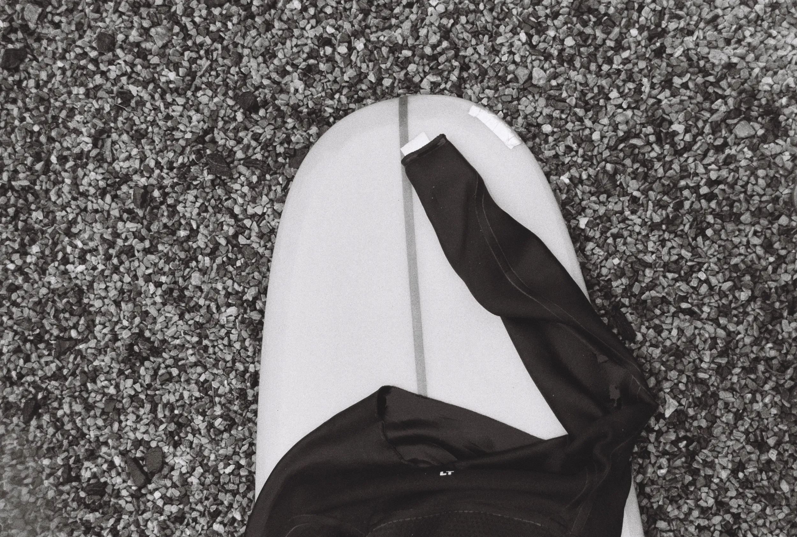
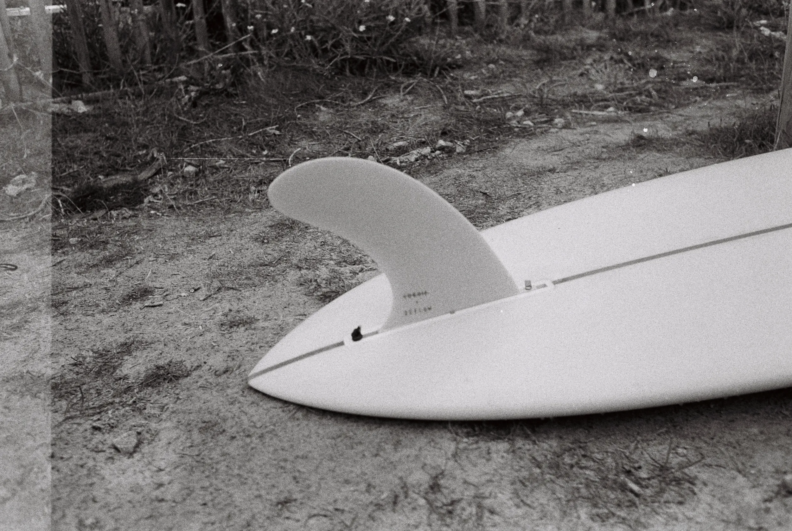

One day, you wake up before dawn. You are 40. You load up the car; it's raining, mid-winter. And yet you are excited to get out in that cold morning. You drive an hour and get to the beach. Staring at the waves, you see friends arriving. You share a few words, a coffee, and then up you go. Time to wetsuit up.

I wasn't meant to be a surfer, I guess. Being born east of Belgium and growing up there, I was surrounded by fields, not waves. It took us more than 3 hours to get to the Belgian coast. And unless you know the subculture there, it isn't the kind of beach known for surf. I was more of a skateboarder when I was a teenager. Got the whole culture kit: listening to punk rock, baggy jeans, holes in the shoes, and a board with stickers. I started a bit before Tony Hawk Pro Skater's release. Being able to mix skateboarding and video games got me hooked on the feeling and the culture.

I had a friend who surfed. I remember thinking he was weird for leaving a good party to drive to the coast early morning. Maybe I should have listened and followed. Nah, I was better having another drink and dancing to "Sunday Bloody Sunday." I don't know if it was the same everywhere, but there wasn't a single party without it. Anyway, this is to say that yeah, surfing wasn't part of my life until recently.

A few years ago, we moved to Brittany. That move made me want to try. Just trying at first. It sounded fun. I got lessons as a gift for Father's Day. Five lessons with my son. On the first wave I caught, I was hooked. Skipped the first winter, then I took more lessons. Bought my first foamie. Another winter. This time I surf. Then I bought my first longboard from Hugo, who was selling his 9'6 Mimosa board. And I haven't stopped since.

I still have a lot to learn. I still am not that good. I guess starting when you are totally not in shape makes it harder. So I started swimming more, doing yoga, bodyweight exercises. That part I am still failing at making a habit. But I keep coming back to it. Because I know it will help my surfing. Crazy how this drug is addictive.

It is not a grateful passion; it is often infuriating. But there I go, I keep coming back to the ocean. I would never have thought I would want to organize my life around a sport. But in the end, it is way more than just a sport. I guess it is my life now.

