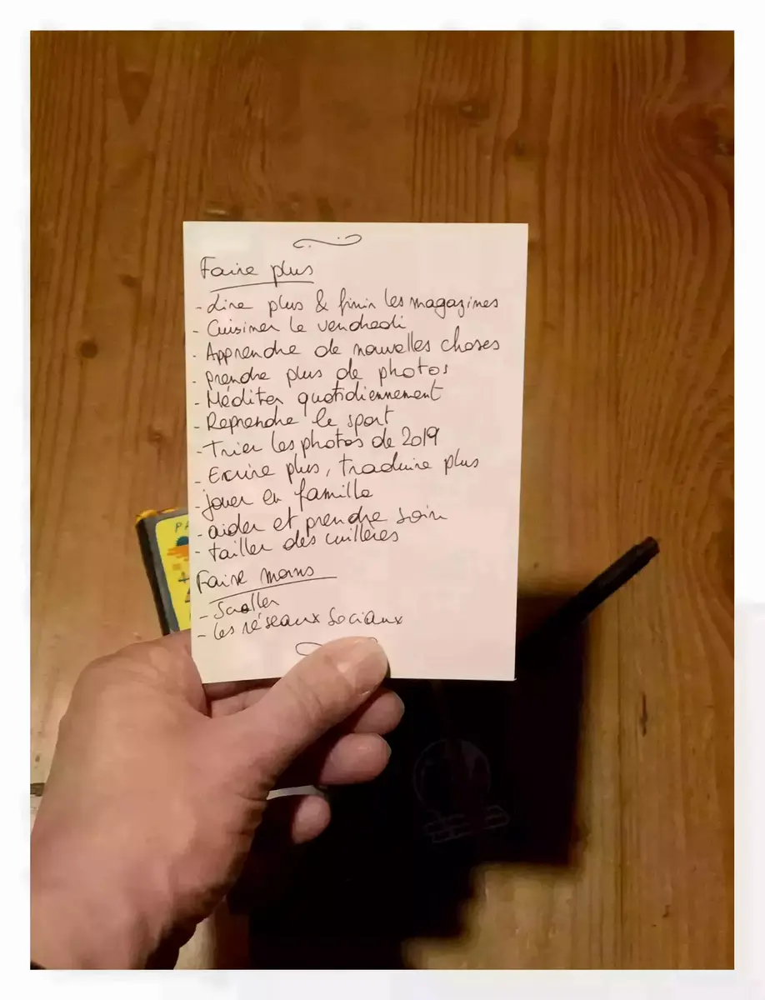

Moins de réseaux sociaux pour commencer l’année! Comme je vous l’ai dit, j’ai lu Digital Minimalism de Cal Newport pour finir/commencer l’année. Hier, je suis tombé sur un [blog post](https://thefocuscourse.com/doing-a-digital-declutter/) de « the focus course » sur leur disette numérique qu’ils ont lancé hier. Je me suis dit pourquoi pas, et c’est ainsi que ça a commencé. J’ai désinstallé Instagram et Twitter de mon iPad et iPhone. Puis, j’ai installé [NextDns](https://nextdns.io) et bloqué tous ces voleurs d’attention de réseaux sociaux.

Je commence donc 30 jours sans réseaux sociaux. On verra bien comment cela se passe. Vous pouvez toujours me contacter par email. Je serai heureux d’avoir de longs échanges avec vous! Je me demandais aussi si il existait un outil pour avoir les messages privés de Twitter et Instagram par emails. Si vous connaissez un plan, hésitez pas, hello@yannickschutz.com! Si vous préférez, demandez moi mon adresse et envoyez moi une lettre. Cela semble tellement plus personnel que un DM sur Twitter.

NextDNS est une app assez géniale pour votre vie privée et votre santé numérique. Vous pouvez bloquer plein de choses. Pour le moment c’est gratuit et en bêta mais je serais heureux de payer pour une tranquilité d’esprit. Vous pouvez décider ce à quoi vous avez accès. Vous bloquez tous ces trackers de pub. [Freedom](https://freedom.to) est une belle alternative mais la vision est renversée, vous bloquez des sites de temps en temps. Là où NextDNS est du genre vous autorisez de temps en temps. Cela et l’aspect sauvegarde de la vie privée en fait un mix parfait à mes yeux.

J’espère que vous ne me tiendrez pas rigueur de ce genre de sujets. Si cela peut rendre votre vie 1% meilleure, je suis entièrement pour. Je suis un supporter du minimalisme, de la consommation responsable et de la pleine conscience depuis un bon moment. Mais j’ai du mal à avoir une bonne hygiène numérique, donc voilà. Tout ceci fait de moi une personne meilleure qui se soucie des autres et de mère Nature. C’est ce qui me pousse à vous le partager. J’espère que cela vous aidera aussi et que vous apprécierez.

Chose importante, si vous partez dans une disette numérique, pensez à ce que vous allez faire à la place.

