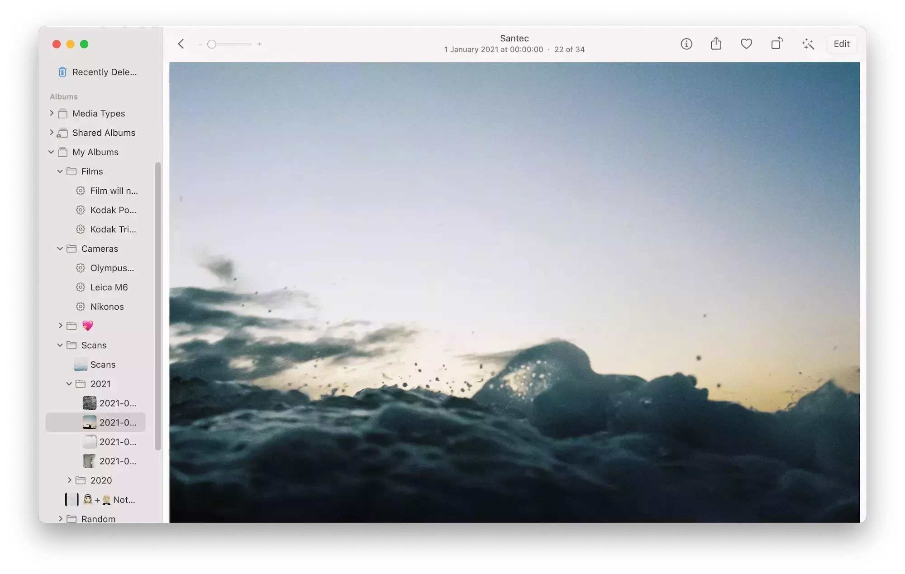
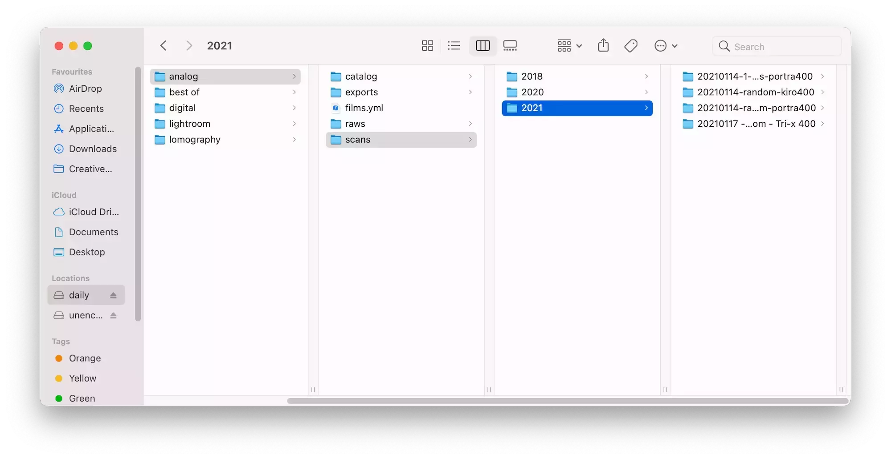
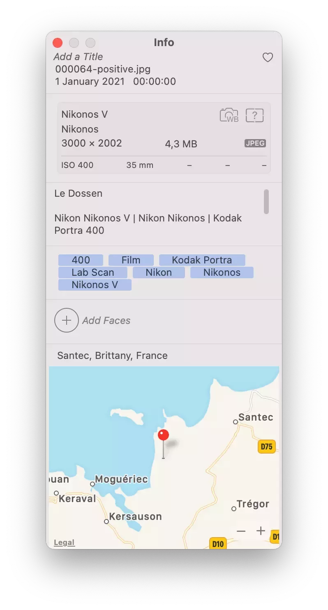

J'avais envie de vous parler workflow pour la photo argentique. En parler me permet de le figer dans le temps alors qu'il ne cesse de changer et qu'il rechangera avec et avant vos retours. J'en suis certain.

Pour cette recette, il vous faudra:
- Un frigo
- Des films photo
- Des sujets à photographier, intéressants ou non
- Un labo sympa
- Un ordinateur
- Lightroom Classic avec en option [Negative Lab Pro](https://www.negativelabpro.com)
- Une appli pour vos photos "développées", Google photos, photos.app, tout autre app photo de votre choix qui catalogue bien.

Ceci n'est que mon workflow actuel, elle n'engage que moi et marche pour le moment. Comme disent les américains, vos kilomètres peuvent varier. Cette recette va évoluer pour moi bientôt car je viens de commencer à scanner mes négatifs moi-même.

## Préparez les négatifs pour développement

- Chargez la pellicule dans votre appareil préféré. Prenez en photos vos sujets favoris dans des situations diverses et variées. Plus on est de fous, plus on rit.
- Une fois la pellicule terminée, stockez la avec les oeufs dans votre frigo. Rincez et répétez.
- Une fois le bac à oeufs rempli ou lors d'un excès de zèle, amenez ou envoyez vos pellicules à votre labo favori. Je peux vous conseiller [Nation Photo](https://nationphoto.com) ou [Mori Film Lab](https://morifilmlab.com).
- Une fois envoyé, patientez jusqu'à réception des fichiers ou du lien de téléchargement. Il se peut que le temps s'étende à l'infini une fois l'envoi fait. Vous venez de comprendre la relativité du temps. Merci Albert Einstein.

## Laissez reposer sur votre stockage local

- Laissez reposer le temps de l'arrivée des scans sur votre ordinateur.
- Une fois arrivés, utilisez votre outil favori pour les télécharger et rangez les dans un dossier de votre choix.

{}
En local, j'utilise une arborescence du type `scans/2021/2021-01-10-description-pellicule`.
En gros chaque roll est dans un dossier avec une petite description des photos et le type de pellicule utilisée.
C'est personnel, je pensais ajouter l'appareil mais ça allait devenir long.
En gros `Daily` est mon disque dur du quotidien. [Un SSD de 1To de chez Sandisk](https://www.digit-photo.com/SANDISK-Disque-Dur-SSD-Extreme-Portable-1Tb-V2-USB-3-1-rSANDISKSDSSDE611T0.html).
{}

## Petites élucubrations autour du backup

- Une fois cette copie en local, préparez votre disque de backup favori. Si vous n'en n'avez pas, prenez un NAS ou un simple disque USB selon vos besoin.
- Faites une seconde copie vers les internets, une copie qui ne reste pas chez vous au cas où. Si vous avez un NAS, il supporte sans doute pas mal de destinations connues telles que Amazon S3, Backblaze ou autre provider de votre choix.
- Ne négligez pas les backups, même si au final c'est comme les avocats. On consulte avant d'en avoir besoin en espérant ne jamais les utiliser. Ou les assurances comme vous préférez.

{}
Je suis un peu parano et j'ai donc en local sur deux disques séparés.
- `/Volumes/Daily/Photos/2021`
- `/Volumes/Backup/Photos/2021`
Sur un NAS que je n'allume que mensuellement, une copie complète via `rsync` de `/Volumes/Backup/Photos`.
J'ai un backup complet de ce disque aussi vers [Backblaze B2](https://backblaze.com) en utilisant [Arq](https://arqbackup.com) sur mac.
{}

## Traitement de la photo et ajout d'informations

- Importez dans Lightroom Classic. Pourquoi cet outil? Il permet de facilement travailler les images et de les enrichir de métadonnées (Les métadonnées sont des données sur les données, comme l'information de l'appareil, du type de prise de vue, sa géolocalisation, etc)
- Via l'outil de métadonnées des photos, ajoutez les informations du film, de l'appareil utilisé et tout ce qui vous semble nécessaire. Si vous utilisez Negative Lab Pro (ci-après nommé NLP), il ajoute des métadonnées spécifiques pour l'argentique (type de film, type de développement, type de scan, infos de l'appareil argentique et autres joyeusetés)
- Sélectionnez vos favorites dans le lot
- Retravaillez légèrement (ou non) vos favorites. Il n'y a pas de honte à modifier une photo argentique.
- Exportez les photos en laissant NLP écraser les données [EXIF](https://fr.wikipedia.org/wiki/Exchangeable_image_file_format) par les siennes et dans un format JPEG qui ne soit pas extrêmement encombrant.

{}
J'ai personnellement des "smart collections" par appareil et film dans Lightroom. D'où l'utilité du bon remplissage de ces métadonnées. Cela me permet de voir en un clin d'oeil les différentes photos prises au Portra ou Tri-X.
Pour en savoir plus sur les métadonnées avec NLP, allez voir sur [ce guide](https://www.negativelabpro.com/guide/film-metadata/).
Mon traitement personnel est centré sur le redressement de l'horizon, l'ajustement du cadre, de la balance des blancs et de la luminosité. Cela ne me prend pas plus d'une minute.
Je me suffit du bon scan fait par le labo pour les couleurs bien souvent.
Mon export fait en général 3000px sur le long côté.
{}

*Certes, Negative Lab pro a un certain coût, mais il est fait par un seul passionné et je m'en sert aussi pour convertir mes scans fait au DSLR.*

## Emballer les photos pour vos partages

- Une fois votre sélection exportée, ajoutez là à votre outil de gestion de photos préféré (Mes exemples seront liés à Photos.app)
- Créez y des smart albums par appareil et par film, même si ceux-ci ne seront pas partagés sur votre dumbphone.
- Ajoutez-les à un album ou plusieurs selon les photos ajoutées
- Appréciez vos métadonnées dans la recherche. Tout se trouve si facilement. C'est un peu vos contact sheets modernes si vous y pensez.
- Utilisez votre outil favori de pré-traitement avant de les partagez sur vos réseaux sociaux favoris. Ajoutez des bords blancs dans [Darkroom](https://darkroom.co) par exemple et copiez y vos hashtags favoris.

{}
Comme précisé, j'ai des albums intelligents se basant sur les EXIF et tags par appareil et par film. J'ai aussi un dossier Scans avec des albums par date qui copient un rien les dossiers physiques de mon disque.
Je n'utilise pas de cadre blanc sur Instagram pour le moment car une galerie devient horrible une fois le  mode nuit activé. Cela me faisait pleurer.
{}

Voilà, c'est à peu près ma recette complète de traitement de mes photos. Je vous ferai sans doute un article plus poussé sur la partie scan une fois que je la maîtriserai. Je vous ferai sans doute une petite intro à mon setup scans.
J'ai voulu écrire cet article comme une recette de cuisine, j'espère que cela vous à plu. J'espère que cela inspirera certains. Que cela soit à voler une partie, à partager son flow ou juste à échanger avec moi. D'ailleurs, n'hésitez pas à m'écrire pour me dire comment vous faites. J'adore ce genre d'articles un rien plus technique et geek.
