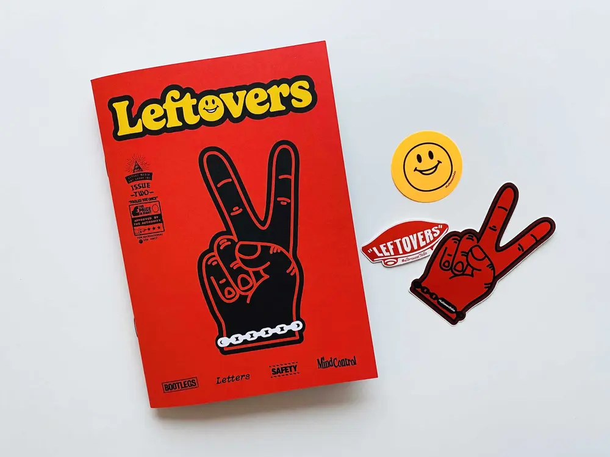
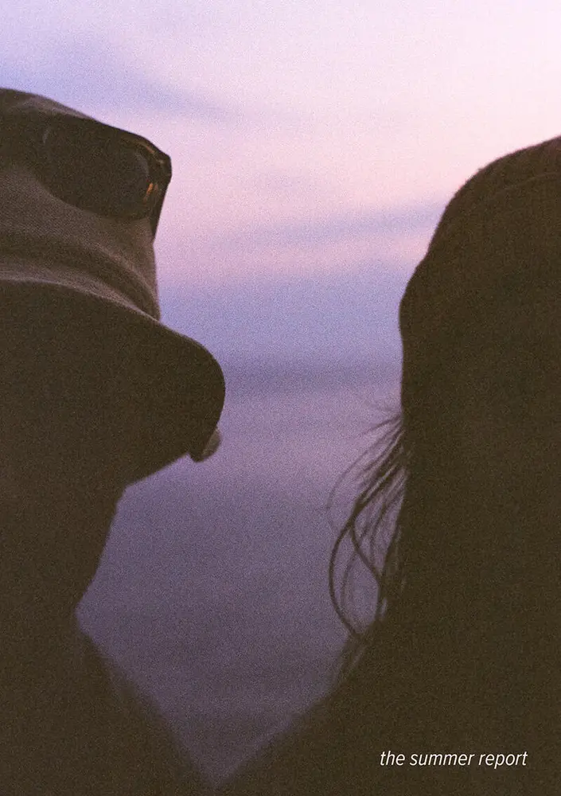
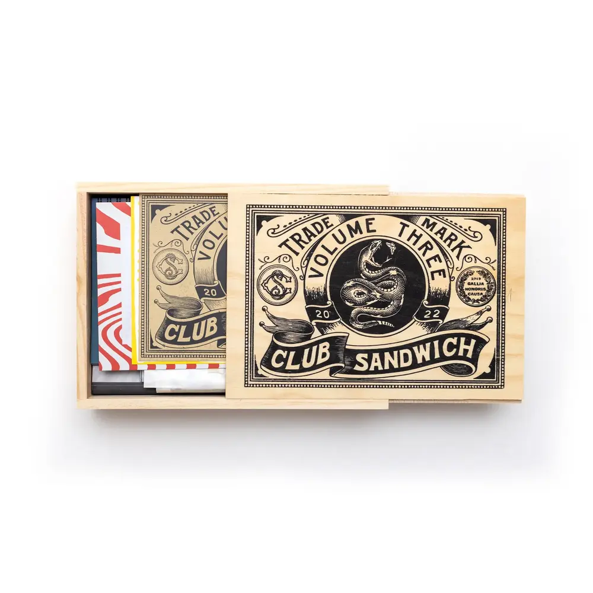

J'ai une passion papier. Je pense que je ne peux pas le cacher. Entre les carnets, les livres et les diverses photos imprimées, cette année est venue se loger une nouvelle impression. Après avoir commencé à vouloir éditer mon premier zine, je suis tombé dans un trou de lapin. Un trou sans réel fond. Un terrier aux milles couloirs. Le monde du zine est multiple divers et varié. Du print noir et blanc revendicateur aux magnifiques zines photos, il y en a pour tous les goûts pour tous les genres. Même de super zines sur la programmation ou l'informatique en général. 

Beaucoup partagent le DIY à divers niveaux. La mise en page, les dessins, le collage ou même l'impression. Ce sont de vraies oeuvres d'art. Que vous y soyez sensible ou non, cela ne tiens qu'à vous. Un Monet n'est pas au goût de tous, une chanson des Ramones non plus.

Ayant toujours eu un faible pour les livres à belles couvertures tissus, je rêve en ce moment d'éditer et de relier moi-même un zine à reliure singer. Coudre la reliure plutôt qu'un collage ou une agrafe donne, à mon goût, une finition plus premium, même avec un contenu pourri. C'est la beauté de l'objet. Si le fond est aussi beau que la forme, je pense que c'est encore mieux. 

J'ai plein d'idées en cours pour essayer des formats différents cette année. Un de mes projets qui je l'espère deviendra récurant, sera une série de zines dans le même type d'approche de volume en volume. Une mini collection qui ne restera pas en pixels mais qui deviendra vivante dans vos mains. 

Au final, c'est vraiment cet esprit du zine qui me plaît, mettre entre les mains l'art et le savoir de manière simple, belle et originale.

Je ferai peut-être des volumes plus prémium avec des coutures singer commère vous disait, mais j'essayerai toujours de contrebalancer avec quelque chose d'accessible ou de permettre à cette approche d'être elle aussi accessible. On verra bien.

J'ai eu quelques coups de coeur de cette année.
J'en ai plein d'autres, je commencer à ajouter tout ça dans [une liste](https://www.are.na/share/POqtDJm). Mais voici déjà un petit aperçu.



### [Leftovers #2](https://www.etsy.com/fr/listing/1359780283/restes-zine-numero-2)

Un super petit zine design au look vraiment sympa, une mise en page fun et qui part dans tous les sens. On aime le détail à la livraison: Une série de petits stickers détournés et le logo 

[Insta](https://www.instagram.com/leftoverstogo/) 

### [The summer report](https://summer.report/)

Une collaboration, des textes attrayants et une belle séries de photos, de la vanlife, de l'outdoor, du surf, du vélo. Plusieurs belles histoires ponctuent ce zine. Il me rappelle un projet que je n'ai pas encore fini. Je l'ai entamé, je vous en parlerai un jour sans doute.

[Midnowehere](https://www.midnowhere.co.uk/)

### [Club Sandwich vol03](https://clubsandwichstudio.bigcartel.com/product/club-sandwich-vol03)

Bien plus qu'un zine, une collection de zines qui tournent autour du snowboard. Reçu dans une boîte en bois magnifiquement décorée. Pleine de zines, de stickers et autres petites attentions. Un prix un peu plus gros mais un vrai plaisir. 

[Insta](https://www.instagram.com/clubsandwich.studio/)

